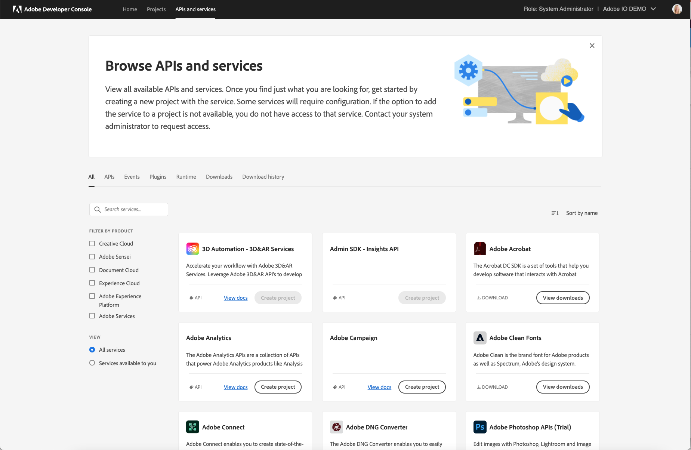
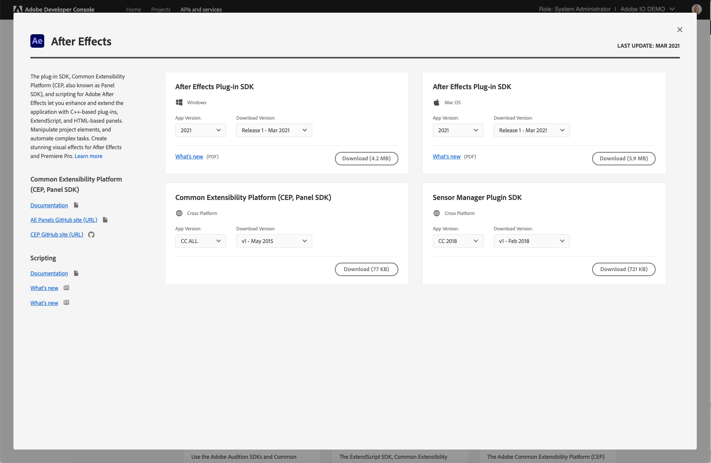
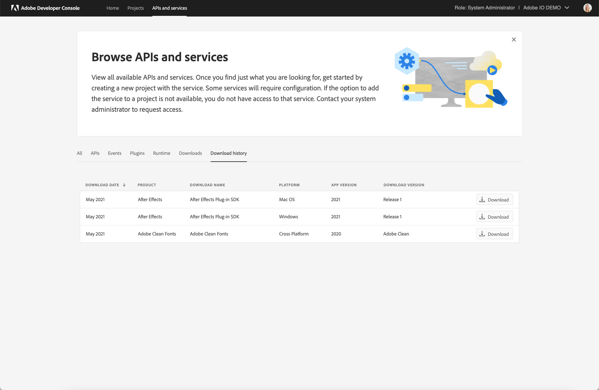

# APIs and services

Adobe Developer Console gives you access to a variety of APIs, Events, SDKs and other services for many of Adobe's most powerful and popular products and technologies. The *APIs and services* pages provides an easy way to browse all available services and create a project. 

## APIs

The *APIs* tab shows all currently available Adobe APIs. This list is updated on a regular basis, so keep an eye out for new offerings. Use Search, Filter by Product or View to narrow down the options. 

Many services require a license to use. If the option to add the service to a project is not available, you either do not have an active license or permissions to access to that service. Contact your system administrator to request access.

## Events

The *Events* tab shows Adobe and custom events available for your organization. Use  Search or Filter by Product to narrow down the options. To learn more about Adobe I/O Events, read the [events documentation](https://www.adobe.com/go/devs_events).

## Plugins

The *Plugins* tab shows those Adobe products that currently support plugin creation and submission via the Adobe Developer Console. To find out more, please visit the [plugin overview](plugins/).

## Runtime

Adobe I/O Runtime is Adobe’s serverless computing platform. Adobe I/O Runtime is only available for enterprise customers and requires a license. Please contact your Adobe sales representative for more details. 

## Downloads

The *Downloads* tab shows a listing of available SDKs for Adobe products and technologies. As new SDKs become available, the list is automatically updated.

When you select one of the product or technology cards, details regarding that SDK appear, including a brief description, links to documentation (where available), and configuration details.

To begin using an SDK, select the appropriate values from the options provided in order to configure the SDK for your needs. Note that the possible configuration values vary by SDK.

## Download history

In the *Download history* tab, you can view the history of SDKs that you have downloaded, as well as information related to the SDK configuration and the date of download.

