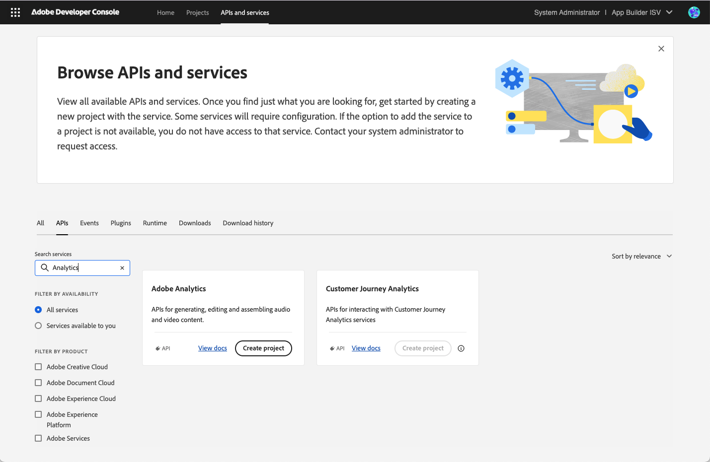
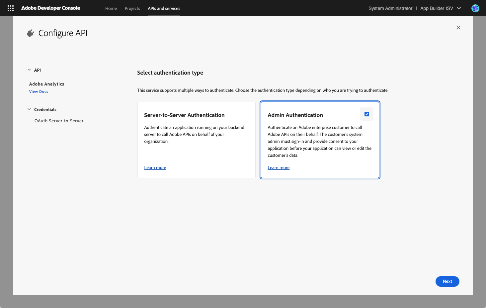
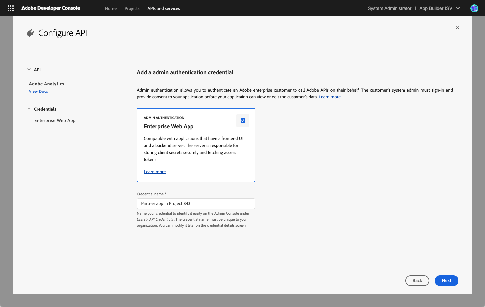
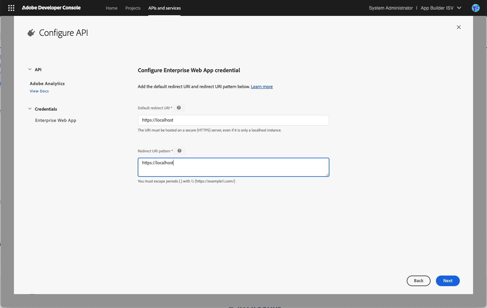
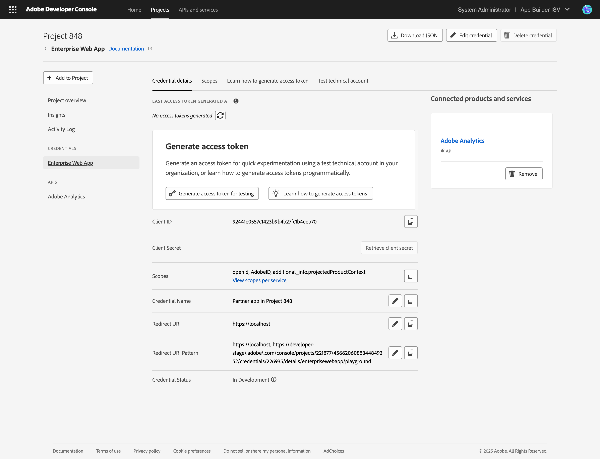
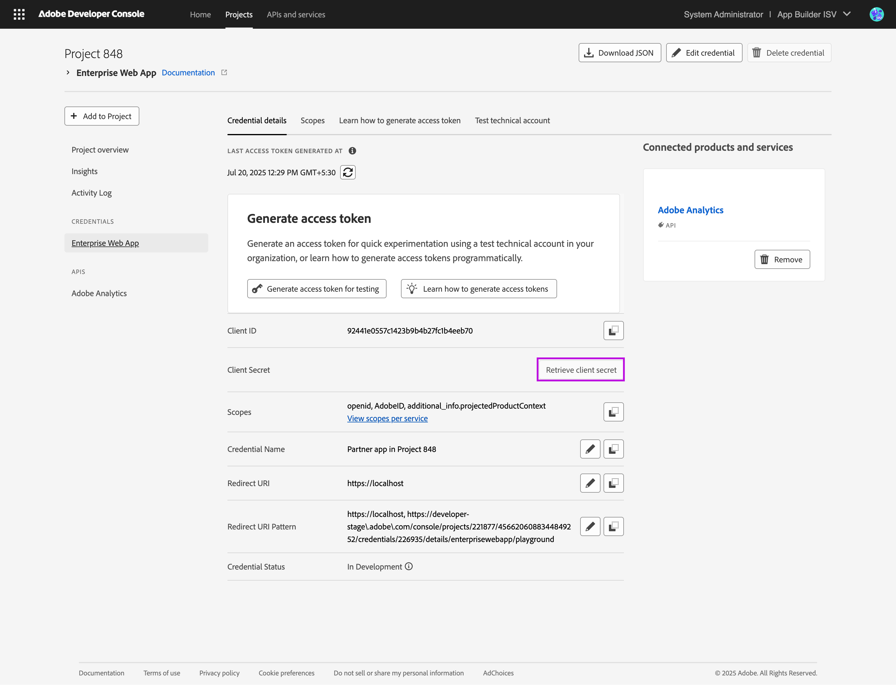
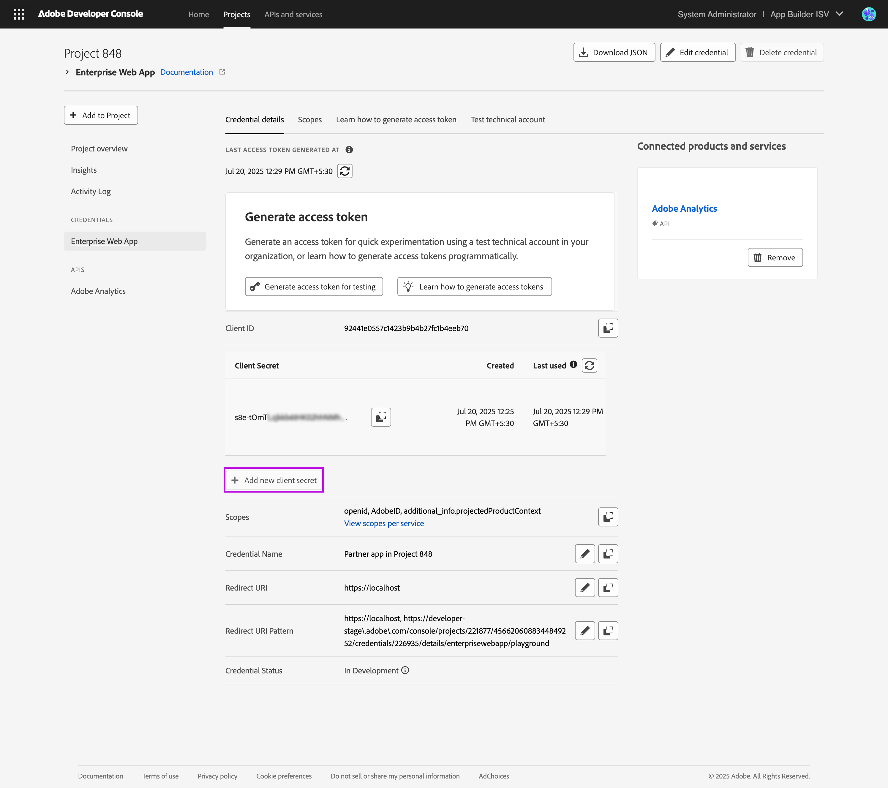
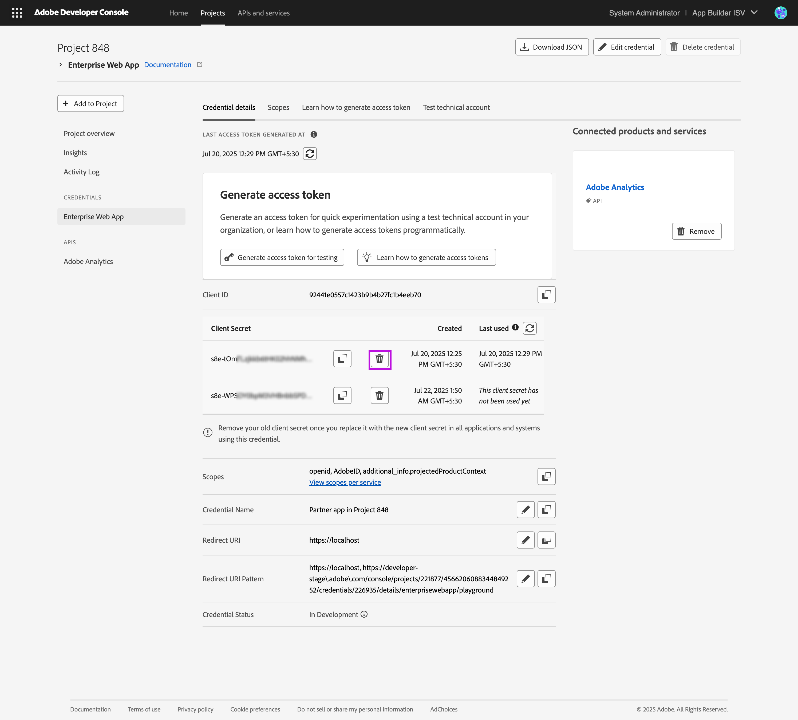

# Enterprise Web App credential implementation guide

The following guide goes over finer implementation details for the Enterprise Web App credential. Before you proceed, we recommend you become familiar with [admin authentication](index.md) and the [Enterprise Web App credential overview](index.md#enterprise-web-app-credential).

## Table of contents

+ [Prerequisites and set up instructions](#prerequisites-and-set-up-instructions)
+ [Implementing the consent worklfow](#implementing-the-consent-worklfow)
  + [Step 1: Building the consent URL](#step-1-building-the-consent-url)
  + [Step 2: Verifying the redirect](#step-2-verifying-the-redirect)
  + [Step 3: Generating access tokens after the admin consents](#step-3-generating-access-tokens-after-the-admin-consents)
+ [Rotating client secrets](#rotating-client-secrets)
+ [Understanding key concepts of the Enterprise Web App Credential](#understanding-key-concepts-of-the-enterprise-web-app-credential)
  + [Default redirect URI and redirect URI pattern](#default-redirect-uri-and-redirect-uri-pattern)
  + [Implementing security features during the redirect](#implementing-security-features-during-the-redirect)
  + [Refreshing access tokens](#refreshing-access-tokens)
  + [What happens when admin revokes consent](#what-happens-when-admin-revokes-consent)
  + [Testing the app before publishinig](#testing-the-app-before-publishinig)
  + [Restrictions after you publish the app](#restrictions-after-you-publish-the-app)


## Prerequisites and set up instructions

<InlineAlert slots="text"/>

Note: You must be an Adobe Technology Partner Program (TPP) partner to use the Enterprise Web App credential.

1. If you're a developer or system admin on an Adobe Technology Partner program partner org, you can log in to the [Adobe Developer Console](https://developer.adobe.com/console/) and visit the [APIs and Services](https://developer.adobe.com/console/41528/servicesandapis) page.



2. Find the API or service with which you wish to integrate and click on Create Project. If the API or service supports Admin authentication, you'll see the option to select Admin authentication. If not, please reach out to your Adobe representative to log an enhancement request.



// TODO fix screenshot (see left panel shows OAuth Server to Server)
   
3. Once you select Admin authentication, the Enterprise Web App credential will be automatically selected on the next screen. Here you can supply the name of your app as it will appear on the Consent screen during testing. You can change your app name later and also at the time of app submission.



4. On the next screen supply the default redirect URI and redirect URL patterns your app supports for the consent workflow. You can supply `https://localhost` or `https://localhost:<port>` for local development. You can change the redirect URLs later too. 



5. On the next screen you'll be shown the scopes available to your app. Once you hit save, a project will be created for you with an Enterprise Web App credential and the selected API. You can now begin implementing the consent workflow and access token generation.




## Implementing the consent worklfow

### Step 1: Building the consent URL

The consent workflow starts when the customer admin visits the partner app and clicks on the Connect with Adobe button. You must build the consent URL and embed it in the Connect with Adobe button. Here's how - 

1. The Adobe IMS consent screen for the Enterprise Web App credential is located at https://id.adobe.com/consent. (// TODO confirm) 
2. Append the query parameters `client_id`, `scope`, `state`, `nonce`, and `redirect_uri` (optional) to the above URL.
   1. You can find the value of `client_id` and `scope` on the Enterprise Web App credential overview page.
   2. You must generate cryptographically secure random strings for the value of `state` and `nonce` parameters and store these values in the user session on the backend. In order to retrieve the user's session later, you must also store the user's session ID in the browser (cookies or local storage).
   3. You can optionally specify a `redirect_uri` in the consent URL to redirect the admin to a URL different from your default redirect URI. The supplied URL must match one of the redirect URL patterns configured in the credential.
3. Embed the consent URL in the Connect with Adobe button for the admin to click.

### Step 2: Verifying the redirect

Once the admin provides consent and is redirected back to your app, a few query parameters will be appended to the redirect URL containing information on whether the admin consented to your app or not. The query parameters will also contain information critical to verifying the legitmacy of the redirect.

1. The `admin_consent` parameter is set to `true` if the admin provided consent to your application, and `false` if the admin cancelled the workflow. The `admin_consent` parameter will not be present in the redirect in cases of error. Instead the `error` parameter will be present and the error code will be supplied as the value. Look at the [API reference](ims.md#) (// TODO link to exact section) to view all error codes and what they mean.

2. The `state` query parameter will be appended to the redirect URL if you specified it in the consent URL. The `state` parameter is used to prevent Cross-site Request Forgery (CSRF) attacks. To validate it, you must send the `state` parameter and the user's session ID (stored in browser cookies or local storage) to your backend server. Your backend server must match the value of the `state` parameter in the redirect to the one stored in the user's session on your backend server. If the values do not match, you must terminate the consent workflow and not trust the redirect.
   
3. The `id_token` parameter is only present if the admin provided consent to your application. To validate it, you must send the `id_token` parameter and the user's session ID (stored in browser cookies or local storage) to your backend server. Your backend server must - 
   1. Inspect the `id_token` and validate its signature (view sample code here).
   2. Inspect the `id_token` and extract the value of the `nonce` claim from the token (view sample code here). Match the value of the `nonce` claim to what is stored in the user's session on your backend server. If the values do not match, terminate the consent workflow.
   3. If the singature of the `id_token` is not valid or the value of the `nonce` claim doe not match, you must terminate the consent worklow and not trust the redirect.

<InlineAlert slots="text"/>

Verifying the redirect is critical to the security of your application and Adobe customer data. View our [code samples](samples.md) (available in NodeJS, Python, and Java) to learn how to implement the verification logic in your application.
   

### Step 3: Generating access tokens after the admin consents

Once you have verified the redirect, you are ready to generate access tokens. Now, you can store the mapping of the customer account in your identity to the customer's Adobe org ID.

<InlineAlert slots="text"/>

While the Adobe customer org ID is easily available through other means, you must never trust an org_id value which was not extracted from a valid `id_token` received in the redirect. This attack vector can be exploited by a malicious customer to link their account to another customer's org and exchange data.


The customer `org_id` can be extracted from the `id_token` by inspecting it. The value of the `org_id`, along with your `client_id`, `client_secret`, and `scopes` can be used to then generate access tokens on behalf of the customer. 

The following cURL command generates access tokens for the technical account set up in the customer org. The HTTP response for the cURL request contains 
1. The `access_token` you can use to call Adobe APIs on the customer's behalf.
2. The `expires_in` value in seconds that determines how soon the access token will expire. 

```cURL
curl -X POST 'https://ims-na1.adobelogin.com/ims/token/v3'
-H 'Content-Type: application/x-www-form-urlencoded'
-d 'grant_type=client_credentials&client_id=<YOUR_CLIENT_ID>&client_secret=<YOUR_CLIENT_SECRET>&scope=<COMMA_SEPARATED_SCOPES>'
```

Sample response
```JSON
{
    "access_token": "ey.....",
    "expires_in": 3599
}
``` 

## Rotating client secrets

Rotating client secrets periodically is recommended because your application will deal with Adobe customer data. Furthermore, you must rotate your client secret immediately if you believe it has been compromised. 

Client secret for the Enterprise Web App credential can be rotated through the Dev Console UI. To rotate client secrets through the UI, follow the steps below on the Enterprise Web App credential overview screen - 

1. Add a new client secret to your credential.





1. Update your application to replace your old client secret with the new one you added.
2. Check the client secret last used timestamp to make sure your application is no longer using the old client secret.
3. Once sure that you have successfully replaced the client secret, you can delete the old client secret.



<InlineAlert slots="text"/>

Once a client secret is deleted, you cannot restore it. So be extra sure you have replaced the old client secret with the new one in all locations.

### Rotating client secrets programmatically 
Unfortunately, rotating client secrets programmatically for the Enterprise Web App credential is currently not possible. 

## Understanding key concepts of the Enterprise Web App Credential

### Default redirect URI and redirect URI pattern

Once the consent screen loads the admin can provide consent to your app or cancel the workflow. In either case and even in cases of error, the admin will be redirected back to your application. 

If a `redirect_uri` was not specified in the consent URL or in cases of error, Adobe will redirect the admin to the default redirect URI configured in your credential. The default redirect URI can be up to 256 characters. It must be a `https` URL and absolute URL without wildcards. For example: `https://localhost`, `https://localhost:8000`, `https://example.com/redirect`.

However, if a `redirect_uri` was specified in the consent URL and matches one of the redirect URL patterns configured in your credential, Adobe will redirect the admin to the specified redirect URL. 

The redirect URL pattern is a comma-separated list of URI path regexs used to validate any `redirect_uri` you request in the consent URL. The redirect URL pattern can be up to 512 characters. It must contain `https` URLs and supports wildcards to club multiple redirect URLs together. As each redirect URI pattern is treated as a regex, you must escape periods in the redirect URL patterns (**.**) with **\\**. Also for security reasons, wildcards are not allowed in subdomains or HTTP port, they're only allowed in the HTTP path. For example: `https://example\\.com/redirect/*`.

### Implementing security features during the redirect

Once the admin provides consent and is redirected back to your app, you must verify that the redirect is legitimate and triggered by Adobe. 

1. Read the section on Implementing the consent workflow, especially [Step 2: Verifying the redirect](#step-2-verifying-the-redirect) to understand verification steps in detail.
2. View the [sample code](samples.md) available in NodeJS, Python, and Java to implement the verification logic in your application.
3. Ensure the verification logic is implemented in the backend server.


### Refreshing access tokens

The Enterprise Web App credential enables partner apps to generate access tokens, however, no refresh tokens are generated. This is because the partner app can use its `client_id`, `client_secret`, `scope`, and the customer `org_id` at any time to generate another access token. Refresh tokens are simply not required.

### What happens when admin revokes consent

As soon as a customer admin revokes consent, the partner app can no longer generate access tokens on behalf of that customer. Furthermore, the technical account which was created in the customer org during the consent is also deleted.

Note: any existing access tokens may continue to work for up to an hour. However, since the technical account is deleted, they may not be of much use. The partner app will cease to have any access to the customer data within an hour of the admin revoking the consent.

### Testing the app before publishinig

After you have created a Project on the Developer Console and set up an Enterprise Web App credential, you can add a Test technical account to the credential.

Usually when a customer installs a partner built app, the partner owns the credential and the customer owns the technical account. However, for testing, the partner can "install" the app in their own organization and a test technical account will be created.

There are multiple ways to create a test technical account - 
1. Click on the Generate access token for testing button on the Enterprise Web App Credential overview page.
2. Use the credential playground - Learn how to generate access tokens tab on the Enterprise Web App Credential overview page.
3. Provide consent to your own application by triggering the consent workflow out of band. 

Once a test technical account is set up, you can assign product profiles to it by visiting the Test technical account tab on the Enterprise Web App Credential overview page. 

Note: Adding or removing product profiles to the test technical account has no effect on the product profiles customer admins assign to technical accounts in their org. Furthermore, removing the test technical account from the Enterprise Web App credential does not affect any technical accounts on customer orgs that were created when the customer admin consented to your app. 

### Restrictions after you publish the app

During development, Adobe does not allow customers to consent to your app since their data can be at risk. Adobe only allows customers to consent to apps that are reviewed by Adobe and are now in production.

So, once you finish developing your app and are ready to publish, you must fill out listing details and submit the app for Adobe review. See our [submission guide](https://www.adobe.com/go/dd_ExperienceCloud_Submissions) for instructions.

After you submit the app for review or once it is published, a few restrictions are applied to the Enterprise Web app credential in the Project. 

1. You cannot add or remove APIs connected to the Enterprise Web App credential.
2. You cannot remove the Adobe Exchange redirect URL pattern added to the list of patterns.