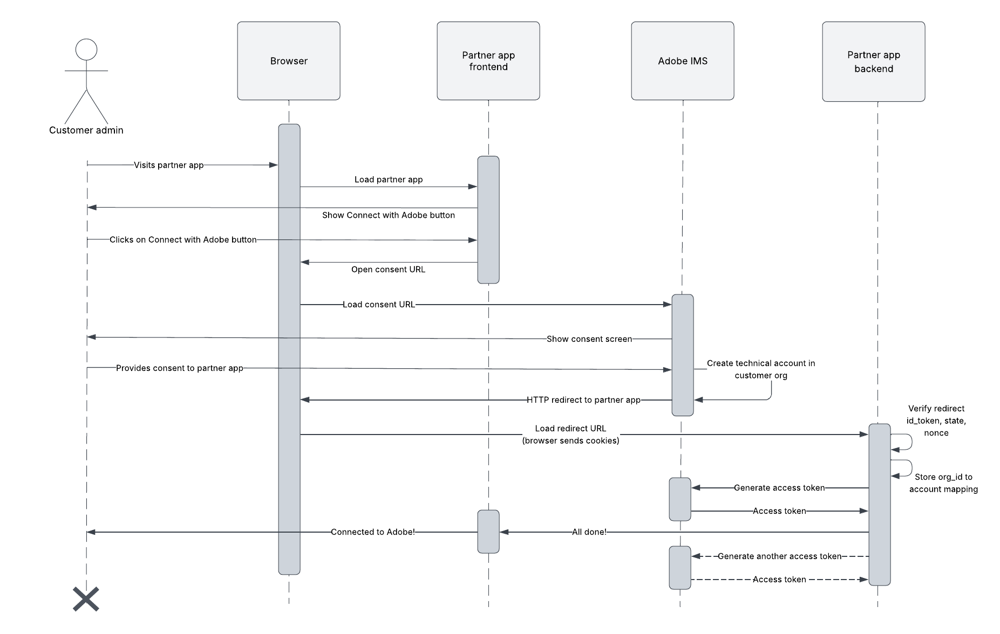

# Admin authentication

If you are an Adobe Technology Partner Program partner and your application needs to read or modify the data owned by an Adobe enterprise customer organization, you can do so using an admin authentication credential. Before your application can view or edit the customer's data, a customer admin would need to provide explicit 'consent' to your application.

<InlineAlert slots="text"/>

Note: Admin authentication and the Enterprise Web App credential is only available to Adobe Technology Partner Program (TPP) partners.

## Whose data can you access with Admin authentication?

Admin authentication enables partner-built apps to read and modify Adobe enterprise customer data. Previously, enterprise customer data could only be manipulated through server to server authentication. Therefore, a customer had to build the app themsleves or plug in their server-to-server credentials in partner-built apps. 

With Admin authentication a partner application can now have a single set of credentials and multiple customers could install the app easily by providing consent to it. The customer no longer needs to supply their credentials to partner apps, thereby, strenghting their security posture.

To better understand the differences and similarities of admin authenticaton, let's compare it to other supported authentication types.

|                                 | Who builds the app?              | What data can the app access?  | How is data access governed?                                                                                                                                                      |
|---------------------------------|----------------------------------|--------------------------------|-----------------------------------------------------------------------------------------------------------------------------------------------------------------------------------|
| Admin authentication            | Adobe Technology Partner Program partner | Adobe enterprise customer data | Customer admin can limit data access using product profiles. The customer admin needs to consent to the app first. The customer admin can revoke consent at any time.             |
| Server to server authentication | Adobe enterprise customer        | Adobe enterprise customer data | Admins and developers can limit data access using product profiles. Data access can be removed at any time by removing product profiles or deleting the project.               |
| User authentication             | Adobe partner                    | Adobe end user data            | The app requests access to data by requesting specific scopes. The Adobe end user needs to consent to the app and the list of scopes to grant access to the app. The user can revoke consent at any time. |

## Enterprise Web App credential

Adobe supports the Enterprise Web App credential to perform admin authentication, enabling partners to build click-to-install applications that work with Adobe enterprise customer data.

Once a customer admin installs the app and provides consent to it, a technical account is set up in the customer org and linked to the partner app. The customer admin can control what data the partner app can access by managing the product profiles assigned to the technical account. Meanwhile, the partner app can generate access tokens for this technical account by using its own client id and secret.

To safeguard customer data, the Enterprise Web App credential requires the partner app to have a secure backend server. The backend server is responsible for implementing the security features of credential and generating access tokens.

### How does it work?

The following diagram depicts the high level workflow through which a partner app can generate access tokens for the technical accounts in customer orgs.

1. The workflow starts when the customer admin visits the partner app and clicks on the Connect with Adobe button to connect their Adobe organization to the partner app.
2. The customer admin is redirected to the Adobe IMS consent screen to provide consent to the partner app. Once the admin consents to the partner to app to access his org's data, a technical account is created in the customer organization.
3. After the admin provides consent, the admin is redirected back to the partner app. The redirect URL was supplied by the partner during Enterprise Web App credential set up. 
4. The partner app receives the redirect and verifies that it came from Adobe by validating the `id_token`, `state`, and `nonce` parameters in the redirect. 
5. If verification passes, the partner app maps the customer org to the logged in account. At this point, the partner app can use its `client_id` and `client_secret` and the customer `org_id` to generate access tokens.
6. Finally, the customer admin has completed the consent workflow and connected their Adobe org to the partner app. The customer admin can now navigate to the [Adobe Exchange manage page](https://exchange.adobe.com/manage) and assign product profiles to the newly set up technical account.

<InlineAlert slots="text"/>

Note: The customer admin can visit the [Adobe Exchange manage page](https://exchange.adobe.com/manage) to revoke consent to the partner app at any time. After the admin revoked consent, the partner app can no longer generate access tokens on this customer's behalf. All existing tokens will stop working within an hour.

## Development Next Steps

1. Read the [implementation guide](implementation.md) to start implementing the Enterprise Web App credential.
2. Read the [API Reference](ims.md) to view the HTTP request to generate access tokens and supported query parameters and error codes in redirect.
3. Visit the [FAQ page](faq.md) for conceptual questions, troubleshooting your app, and advanced scenarios.
4. Read our [submission guide](TODO) to submit you app for Adobe review.