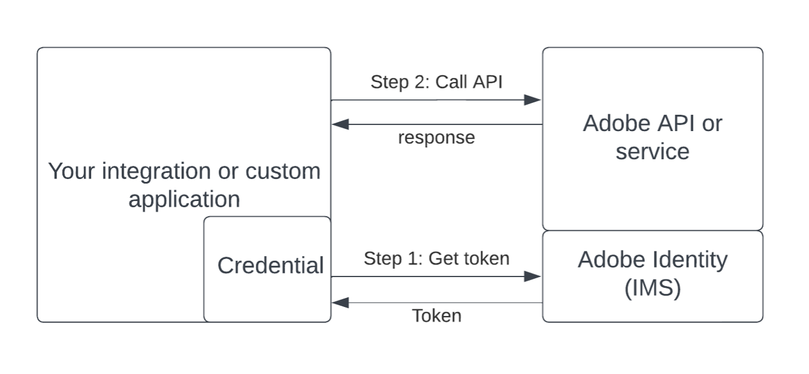

# Deprecation of Service Account (JWT) credentials FAQs

## Table of contents
+ [General FAQs](#general-faqs)
+ [Benefits of the new credential](#benefits-of-the-new-credential)
+ [Migration next steps](#migration-next-steps)
+ [Migrating vendor applications](#migrating-vendor-applications)
+ [Adobe assistance](#adobe-assistance)

## General FAQs

### What's happening?  
In May 2023, Adobe announced the deprecation and end of life of Service Account (JWT) credentials. This means that any of your integrations or custom applications using a Service Account (JWT) credential will need to migrate to the new OAuth Server-to-Server credential before January 27, 2025. 

### What is a credential? 
While building an integration, developers need to call Adobe APIs from their application. To call Adobe APIs, their integration must uniquely identify itself to Adobe. This ensures that only your application can retrieve your data from us.  

A credential is used to uniquely identify your integration to Adobe. To use an API in an integration, a developer first generates a credential for the API on the Developer Console. She then embeds the credential within her application to generate access tokens. And then finally uses those access tokens to make API calls to Adobe.  

### Will my Adobe integrations or applications stop working immediately?

No. Any integration or application using the Service Account (JWT) credential will continue to work until January 27, 2025. See [deprecation timelines](./migration.md#deperecation-timelines). See section on [migration next steps](#migration-next-steps).

### What is the deadline to migrate to the new credential? 
You must migrate your application to use the new OAuth Server-to-Server credential before January 27, 2025, to ensure your application does not face any downtime. See [migration guide](./migration.md).

### What happens if we do not migrate our application by Jan 27, 2025? 

Projects on the Developer Console still containing any Service Account (JWT) credentials will be 'frozen' after January 27, 2025. This will disable certificate rotation for your application or any other action to modify the Project or the credential. The ability to migrate will, however, still be available. Once you migrate your application, the Project will be 'unfrozen' again.

### We can currently create new Service Account (JWT) credentials even though they are marked as deprecated. Is it recommended? 
No. Creating any new Service Account (JWT) credentials is not recommended. All Service Account (JWT) credentials, whether old or new, will stop working after January 27, 2025. We recommend you avoid migrating your application again and use the new OAuth Server-to-Server credential from the beginning. See our [implementation guide](./implementation.md).

## Benefits of the new credential

### What are the benefits of using the OAuth Server-to-Server credential? 
You can read more about OAuth Server-to-Server credentials in our [implementation guide](./implementation.md). You can view the comparison between the OAuth Server-to-Server credential and the Service Account (JWT) credential [here](./migration.md#why-oauth-server-to-server-credentials).

### Can I programmatically rotate certificates for Service Account (JWT) credential? 
No such ability is currently available. There are no plans to add such ability either. 

Instead, we recommend switching to the new credential that does not use expiring certificates and allows you to [rotate client secrets](./implementation.md#rotating-client-secrets) through the UI and API ([programmatically](./implementation.md#rotating-client-secrets-programmatically)).

### Can I programmatically rotate client secrets for OAuth Server-to-Server credentials? 
Absolutely. View our guide on rotating client secrets programmatically [here](./implementation.md#rotating-client-secrets-programmatically).

### What should I do if my client secrets get leaked? 
We recommend immediately [rotating your application's client secret](./implementation.md#rotating-client-secrets) and contacting Adobe customer support if you wish to invalidate any existing tokens.

## Migration next steps

### Which integration or custom application are we talking about, that must be migrated?
There are primarily three categories of integrations and custom applications that must be migrated. 

1.	**Integrations or applications provided by Adobe** 
    
    These are integrations provided out-of-the-box by Adobe that require a Service Account (JWT) credential to function. Example: Integration between AEM and Adobe Target, Integration between AEM and Adobe Stock, User sync tool, etc.
    
    For these integrations Adobe already supports the OAuth Server-to-Server credentials and allows you to migrate. Apart from our general-purpose [migration guide](./migration.md), you can also refer to the migration guide for [AEM customers](https://experienceleague.adobe.com/en/docs/experience-manager-cloud-service/content/security/jwt-credentials-deprecation-in-adobe-developer-console) and [User Sync tool customers](https://github.com/adobe-apiplatform/user-sync.py/blob/user-guide-wip/en/user-manual/connect_adobe.md).

2.	**Integrations developed by vendors**

    These are integrations that you may have acquired from a vendor that integrate with Adobe APIs or services. Only those integrations that use the Service Account (JWT) credentials are impacted. 

    For assistance on how to migrate these integrations, you must contact the vendor to get software updates supporting the OAuth Server-to-Server credentials.

3.	**Custom integrations or applications**

    These are integrations or application custom developed by an IT/development team in your organization. You are responsible for migrating these integrations. See our general-purpose [migration guide](./migration.md).

### How can I identify all of my impacted integrations or applications?
Any integration or custom application that is impacted will have a corresponding Project on the Developer Console containing the Service Account (JWT) credential used in the integration.

To view all the Projects with a Service Account (JWT) credential, 
1. Go to the [Adobe Developer Console](https://developer.adobe.com/console) and navigate to the Projects tab. 
2. Apply the filter 'Attention Required' > 'Has Service Account (JWT) credential' on the list of Projects screen.
3. Note: Any Projects that are marked 'auto-generated' are not impacted. 

A good rule of thumb is, if your company has received an email on Service Account (JWT) deprecation, you are impacted.

### How can I identify the developer/admin in my organization who set up the Project or the Service Account (JWT) credential? 
A good starting point to identify the developers/admins who worked on a Project is by looking at who created or last modified the Project on the Project overview screen.

In addition, because the Project Activity Logs are retained for up to a year, they show a more granular view of who made what changes to a Project. Note: Information about the Project's creator may be missing for historical Projects.

### How can I verify if the Project on the Developer Console is being used? 
There are a few ways to see if a Project is actively being used: 

1. Open an impacted Project and view the 'Last service activity' date on the overview page. You can also see this information on the list of Projects page. 
2. Visit the Service Account (JWT) credential overview page and look at the last access token generated at timestamp. This will tell you when this Project was last used to generate an access token. 
3. Visit the Insights tab in a Project to see recent activity (API calls, Events Delivered, etc.) involving the credentials contained in the Project. See our documentation on [Insights](../../insights.md) to know more. 

### How can I find out which applications are using which projects? 
Unfortunately, Adobe cannot tell which custom integration or application uses a given project. This information is solely available to the customer. Each project was created by a developer/admin within the customer's organization. The same developer/admin is best positioned to identify which application uses the given project.

### How can I check which APIs are being used in my Project?
You can view this information by opening your Project on the Developer Console. All the APIs added to the Project visible on the overview screen, are being used in the Project. 

## Migrating vendor applications

### We are using the Service Account (JWT) credential in a 3rd party integration we did not develop. How should we migrate those integrations? 
The company or organization that developed the integration must add support to use the new OAuth Server-to-Server credential. Please reach out to them for updates and assistance. You can also ask the Adobe community a question on our [developer forums](https://www.adobe.com/go/developer-console-forums) to see if anyone else has already migrated the same application.

### We are a company or organization that develops applications using Service Account (JWT) credentials that Adobe customers install. What do we need to do? 
Until June 3, 2024, customers can still create Service Account (JWT) credentials to use your application. However, any existing or new customers of your application must switch to using the new OAuth Server-to-Server credentials before January 27, 2025.

Therefore, we recommend enhancing your application before June3, 2024. You must add support to use the new credential and support for customers to migrate from the old credential to the new credential.

## Adobe assistance

### Can Adobe migrate applications for us? 
Adobe has no information on or access to your integrations or custom applications. Therefore, we cannot migrate the applications on your behalf. Instead, you must carry out the activity to identify and migrate your applications.

### Can Adobe help me identify the application that uses a given Project? 
Unfortunately, Adobe cannot tell which custom integration or application uses a given Project. This information is solely available to the customer. Each Project was created by a developer/admin within the customer's organization. The same developer/admin is best positioned to identify which application uses the given Project. 

To identify impacted Projects and their owners, see [Migration Next Steps](#migration-next-steps) in this document. 

### Who can I contact if I still need help? 
Reach out to your Adobe representative, customer support, or ask a question on our [developer forums](https://www.adobe.com/go/developer-console-forums).
