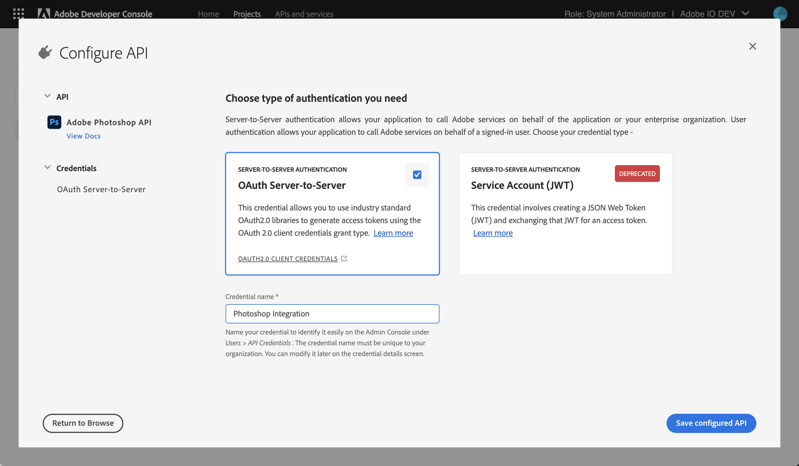
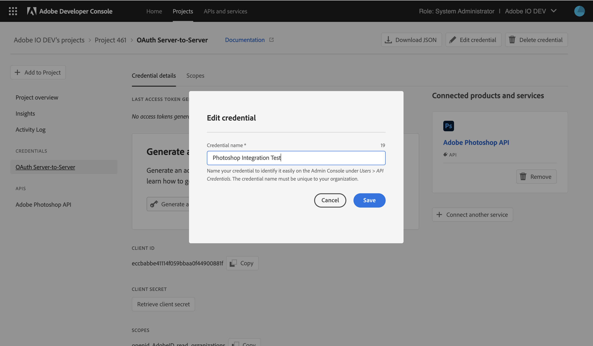
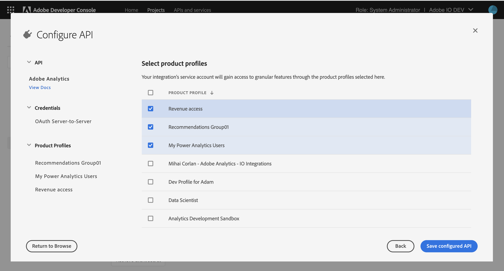
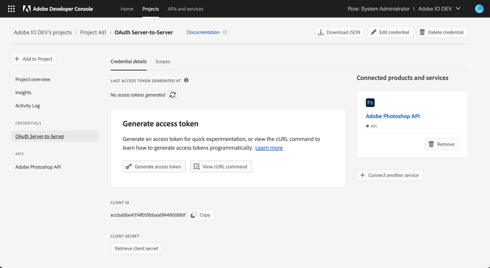
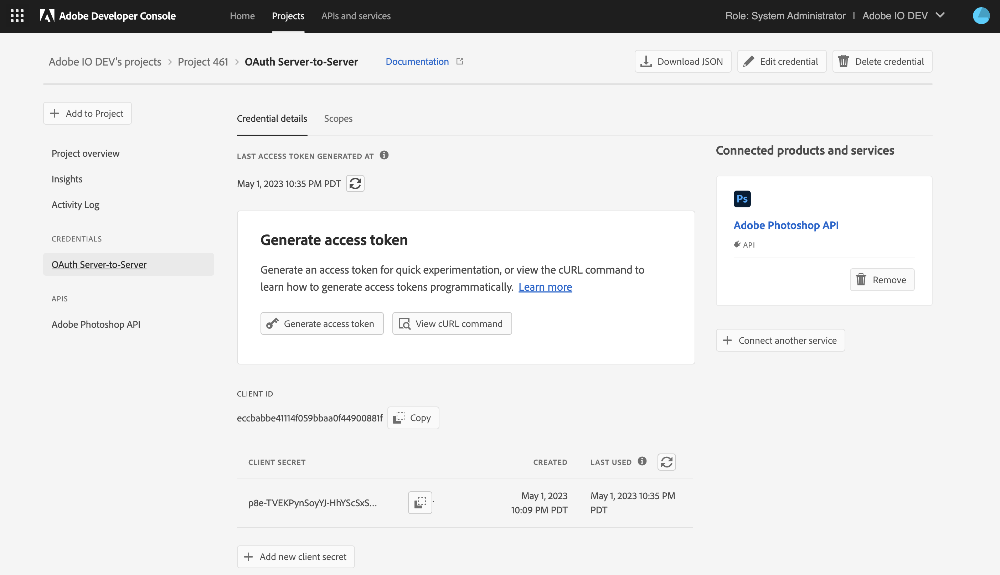
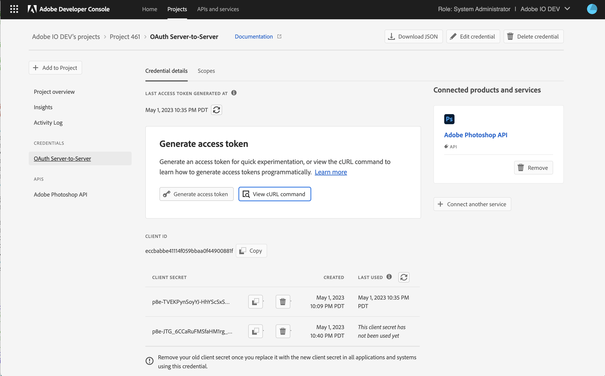
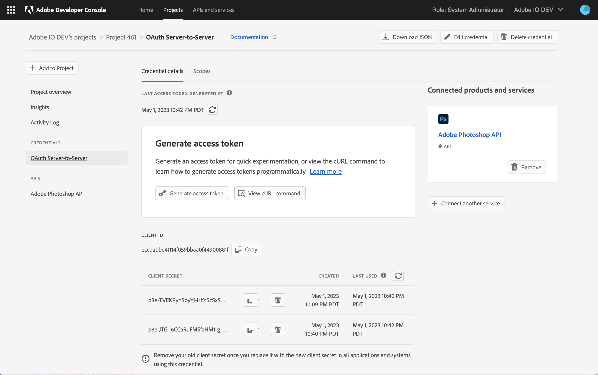
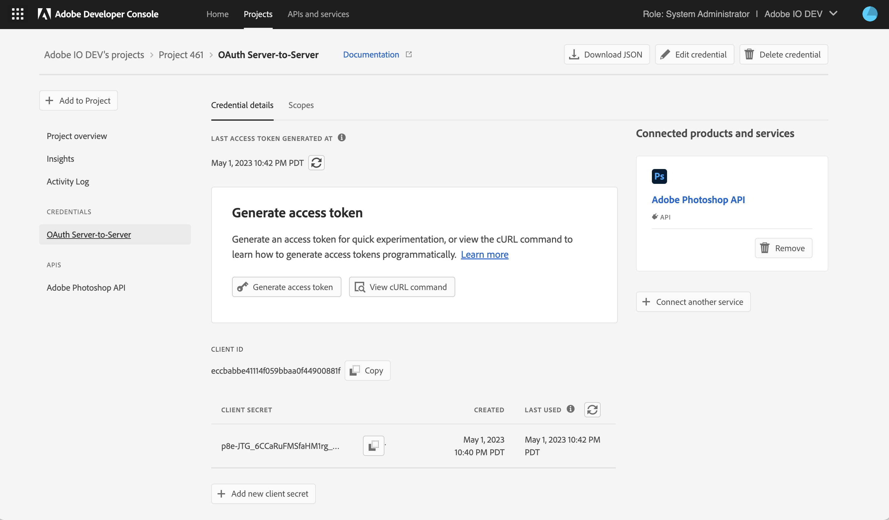

# OAuth Server-to-Server credential implementation guide

The following guide goes over finer implementation details for OAuth Server-to-Server credentials. At the end of the guide is a list of recommended industry-standard OAuth2 libraries. Before you proceed, we recommend you become familiar with the server to server authentication credentials in our [server to server authentication guide](./index.md)

## Table of contents
+ [Setting up the OAuth Server-to-Server credential](#setting-up-the-oauth-server-to-server-credential)
+ [Generate access tokens](#generate-access-tokens)
+ [Generating access tokens programmatically](#generating-access-tokens-programmatically)
+ [Generating access tokens using standard OAuth2 libraries](#generating-access-tokens-using-standard-oauth2-libraries)
+ [Rotating client secrets](#rotating-client-secrets)
+ [Rotating client secrets programmatically](#rotating-client-secrets-programmatically)

## Setting up the OAuth Server-to-Server credential

Depending on the API or an Event to your project on the Adobe Developer Console, you can select the OAuth Server-to-Server credential. The OAuth Server-to-Server credential is available for all APIs and Events supporting the [Service Account (JWT) credential *(deprecated)*](./index.md#service-account-jwt-credential-deprecated).

### Credential Name

An admin in your organization can manage all OAuth Server-to-Server credentials by visiting the [Adobe Admin Console](https://adminconsole.adobe.com) > Users > API credentials. To find the correct API credential easily on the Admin Console, you can provide your OAuth Server-to-Server credential a name during credential setup.



This name can be modified later in your project by visiting the OAuth Server-to-Server credential overview page.



### Selecting Product Profiles

Depending on the API or Event you add, you may be asked to select product profiles to assign to your credential. These product profiles govern what data your application can/cannot access in your organization. 



The product profile selection works the same way as it does for Service Account (JWT) credentials.

## Generate access tokens

Generating access tokens for experimentation with the OAuth Server-to-Server credential is straightforward. You can use the 'Generate access token' button on the credential overview page or copy the cURL command and use the command line to generate an access token for quick use.



### Generating access tokens programmatically

See this cURL request to understand how your integration or application can generate access tokens programmatically. 

```
curl -X POST 'https://ims-na1.adobelogin.com/ims/token/v3' \
  -H 'Content-Type: application/x-www-form-urlencoded' \
  -d 'client_id={CLIENT_ID}&client_secret={CLIENT_SECRET}&grant_type=client_credentials&scope={SCOPES}'
```

Your integration can generate access tokens when needed. However, it is a good practice to cache access tokens for reuse until they expire. Integrations should avoid generating a new access token when a previously generated access token has not expired and can be reused. Adobe can throttle your integration if it generates too many access tokens.

Access tokens usually expire in 24 hours. To check the expiry time of an access token, see the `expires_in` field in the API response returned by the above cURL request. Note: The `expires_in` time is in seconds. See [API reference](./ims.md#fetching-access-tokens).

### Generating access tokens using standard OAuth2 libraries

We recommend using a standard OAuth 2.0 library to implement your application's access token generation logic. The  OAuth community site https://oauth.net has a huge list of community-maintained OAuth2 libraries. Some widely known and maintained OAuth2 libraries from that list are -

1. [PassportJS](https://github.com/jaredhanson/passport) (Node.js)
2. [Spring Security](https://spring.io/projects/spring-security) (Java)
3. [Authlib](https://github.com/lepture/authlib) (Python)
4. View more libraries at [https://oauth.net/code/] (https://oauth.net/code/)

<InlineAlert slots="text"/>

Using industry-standard libraries is the quickest and most secure way of integrating with OAuth. We recommend developers diligently pick the OAuth 2.0 library that works best for their application.

## Rotating client secrets 

The OAuth Server-to-Server credentials provide freedom from automatically expiring certificates used in the Service Account (JWT) credential that must be updated annually. Instead, the OAuth Server-to-Server credential allows you to rotate your client secret as needed. 
  
Rotating your application's client secrets is highly recommended in case of a leak or unauthorized access. Furthermore, rotating client secrets periodically is an industry-standard practice that strengthens your application security posture. 

You can rotate secrets for your credential through the Dev Console UI and [programmatically through the API](#rotating-client-secrets-programmatically).

To rotate client secrets through the UI, follow the steps below on the credential overview screen - 

1. Add a new client secret to your credential .

     

     

2. Update your application to replace your old client secret with the new one you added.

3. Check the client secret last used timestamp to make sure your application is no longer using the old client secret.

     

4. Once sure that you have successfully replaced the client secret, you can delete the old client secret.

     

<InlineAlert slots="text"/>

Once a client secret is deleted, you cannot restore it. So be extra sure you have replaced the old client secret with the new one in all locations.

### Rotating client secrets programmatically

Follow the steps below to rotate client secrets programmatically for the OAuth Server-to-Server credential.

1. Add I/O Management API to your project: This API allows your credential to read, add, and delete its client secrets.

2. Go to the OAuth Server-to-Server credential overview page and grab the URL. For example - 

     ```curl
     https://developer.adobe.com/console/projects/23294/4566206088344958295/credentials/436084/details/oauthservertoserver
     ```

3. Grab the value of `org id` and `credential id` from the URL by comparing it to the templated URL below.

     ```curl
     https://developer.adobe.com/console/projects/{orgId}/{projectId}/credentials/{credentialId}/details/oauthservertoserver
     ```

4. Construct the secrets request endpoint by substituting the value of `org id` and `credential id` in the URL below. 

     ```curl
     https://api.adobe.io/console/organizations/{orgId}/credentials/{credentialId}/secrets
     ```

     ```curl
     https://api.adobe.io/console/organizations/23294/credentials/436084/secrets
     ```

5. Generate an access token using the existing client secret (see the section on [generating access tokens](#generate-access-tokens)).  Make sure to include scopes that the I/O Management API requires: 

     ```curl
     AdobeID, openid, read_organizations, additional_info.projectedProductContext, additional_info.roles, adobeio_api, read_client_secret, manage_client_secrets
     ```

6. Call the API to list all existing client secrets. Note: you can grab your `client_id` from the OAuth Server-to-Server credential overview page. 

     ```curl
     curl -X GET 'https://api.adobe.io/console/organizations/{orgId}/credentials/{credentialId}/secrets' \
          -H 'Authorization: Bearer {ACCESS TOKEN GENERATED IN STEP 5}'
          -H 'x-api-key: {CLIENT ID FROM STEP 6}'
     ```

7.  Call the API to add another client secret to your credential. The API response contains the `client_secret` that was added and its `uuid`. This `client_secret` will never be returned in plain text by any other API response. However, you can still find it on the Developer Console UI.

     ```curl
     curl -X POST 'https://api.adobe.io/console/organizations/{orgId}/credentials/{credentialId}/secrets' \
          -H 'Authorization: Bearer {ACCESS TOKEN GENERATED IN STEP 5}'
          -H 'x-api-key: {CLIENT ID FROM STEP 6}'
     ```

8.  Update your application to use the new client secret.

9.  Call the API to list all client secrets for your credential. You can confirm that you have successfully updated the client secret in your applications by comparing the last used timestamps for the secrets. Grab the value of the `uuid` field for your older secret that you wish to delete.

10. Call the API to delete the old client secret from your credential by passing the `uuid` in the URL

     ```curl
     curl -X DELETE 'https://api.adobe.io/console/organizations/{orgId}/credentials/{credentialId}/secrets/{uuid from step 9}' \
          -H 'Authorization: Bearer {ACCESS TOKEN GENERATED IN STEP 5}'
          -H 'x-api-key: {CLIENT ID FROM STEP 6}'
     ```
