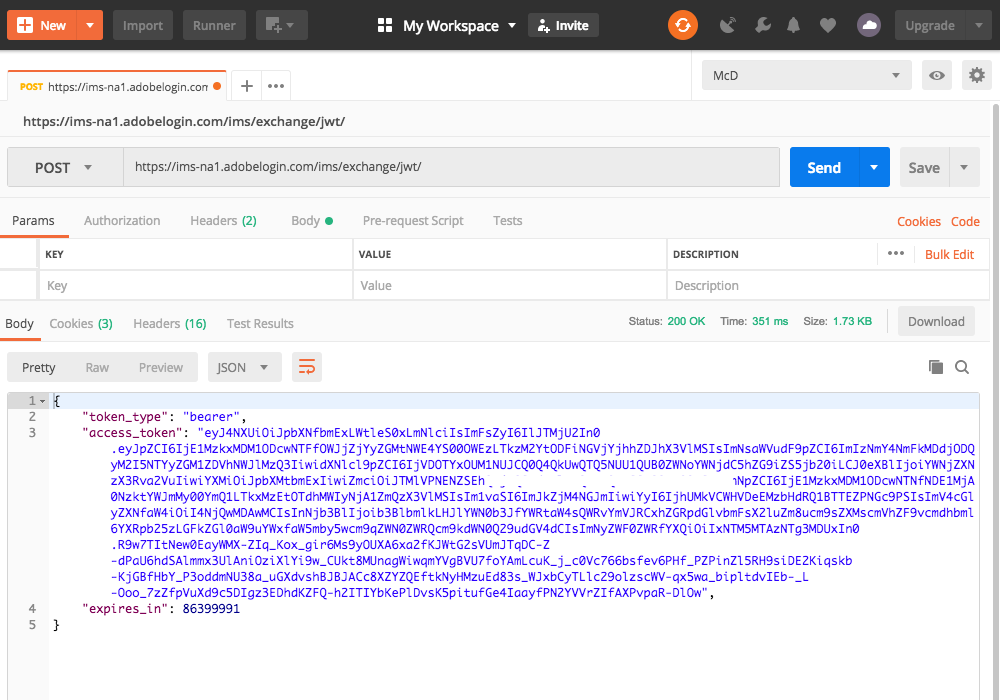

# Service Account Connection

<InlineAlert slots="text"/>

Service Account (JWT) credentials have been deprecated in favor of the OAuth Server-to-Server credentials. Your applications using the Service Account (JWT) credentials will stop working after Jan 27, 2025. **You must migrate to the new credential by Jan 27, 2025 in order to ensure your application continues to function. View our [migration guide](../serverToServerAuthentication/migration.md) to know more.**

A Service Account connection allows your application to call Adobe services on behalf of the application itself or on behalf of an enterprise organization.

For this type of connection, you will create a JSON Web Token (JWT) that encapsulates your credentials and begin each API session by exchanging the JWT for an access token. 

The JWT encodes all of the identity and security information required to obtain an access token and must be signed with the private key that is associated with a public key certificate specified on your integration.

This article walks you through the steps to set up a **Service Account** connection.

## Service Account connection workflow

### Step 1: Create a project in Adobe Developer Console

Integrations are now created as part of a "project" within Adobe Developer Console. For complete steps to creating a project in Console, begin by reading the [Adobe Developer Console getting started guide](../getting-started.md) and [projects overview](../projects/index.md). 

Once you have created a project, you will be able to add services including APIs, Adobe I/O Events registrations, and Adobe I/O Runtime.

### Step 2: Add an API to your project using Service Account authentication

To add an API that uses Service Account (JWT) authentication, follow the steps outlined in the guide for [adding an API to a project using Service Account authentication](../services/services-add-api-jwt.md).

During the API configuration process, you will be able to generate a key pair and download the private key.

When the API has been successfully connected, you will be able to access the newly generated credentials including Client ID and Client Secret, as well as generate an access token using the private key that you generated during configuration.
    
### Step 3: Try It

In order to try out the connection, follow the steps in the [Adobe Developer Console credentials guide](../credentials.md) for generating a JWT token and copy the *Sample cURL command* provided.

Next, open Postman and select Import &gt; Paste Raw Text and paste the copied curl command. Select **Import** to continue.

With the command imported, select **Send** to execute.

The example curl sends a POST request to [https://ims-na1.adobelogin.com/ims/exchange/jwt](https://ims-na1.adobelogin.com/ims/exchange/jwt) using the parameters outlined in the table below. 

The response body includes your newly generated access token (`access_token`). 

| Parameter | Description|
|---|---|
| `client_id` | The Client ID provided in Console as part of the *Credential details*. |
| `client_secret` | The Client Secret provided in Console as part of the *Credential details*. |
| `jwt_token` | A base-64 encoded JSON Web Token that encapsulates the identity of your connection, signed with a private key that corresponds to a public key certificate attached to the connection. This token can be generated in Console from the *Generate JWT* tab within *Credentials*. Note that this token has the expiration time parameter `exp` set to 24 hours from when the token is generated. | 

<InlineAlert slots="text"/>

Check the documentation for the specific API service for which you’re hitting authenticated endpoints to find what other parameters are expected. Most of them need an `x-api-key`, which will be the same as your `client_id`.

