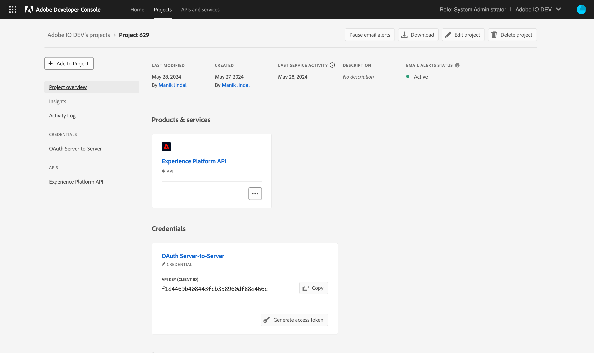
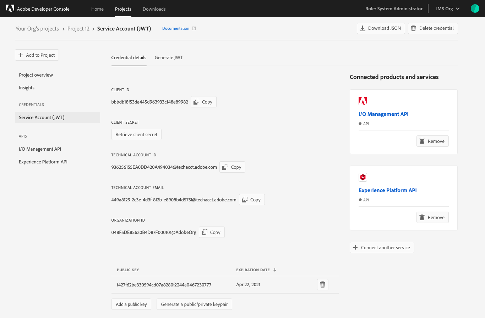
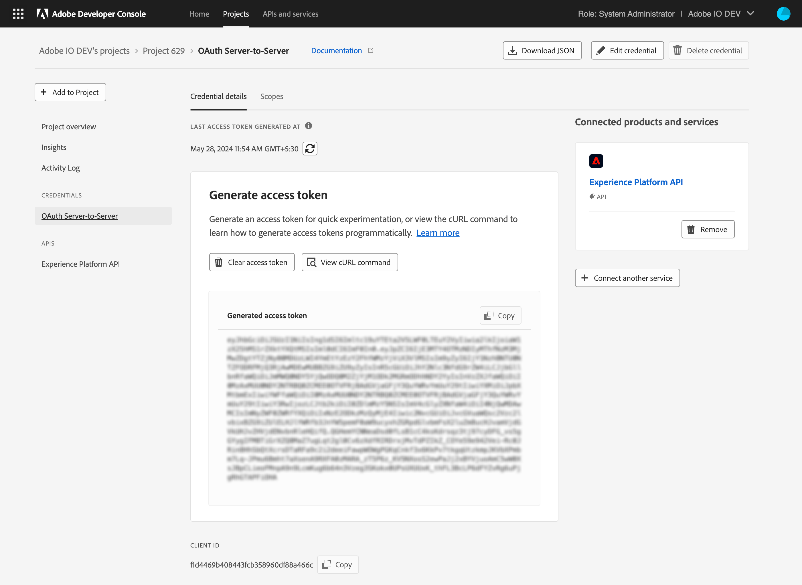
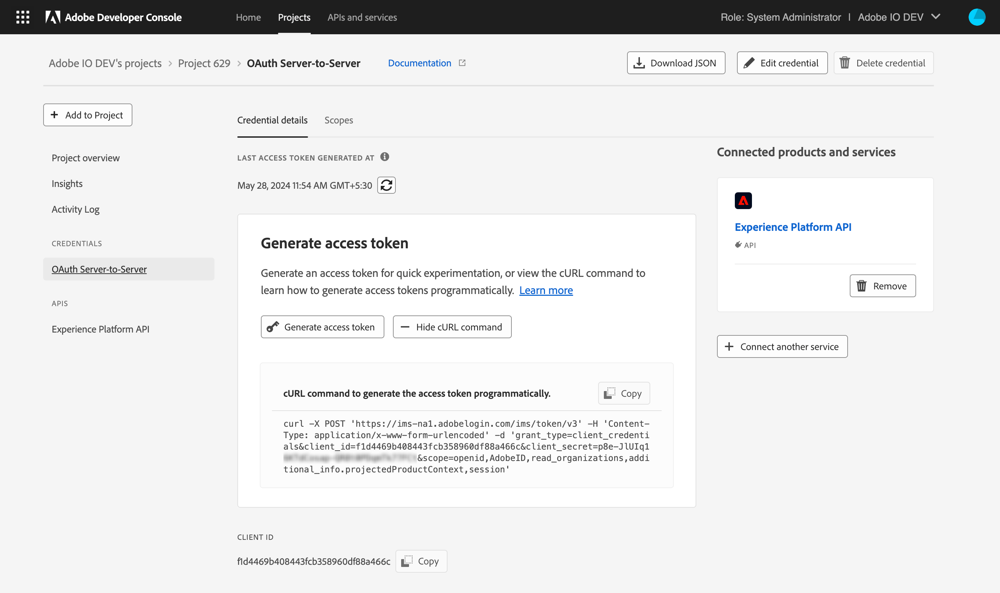
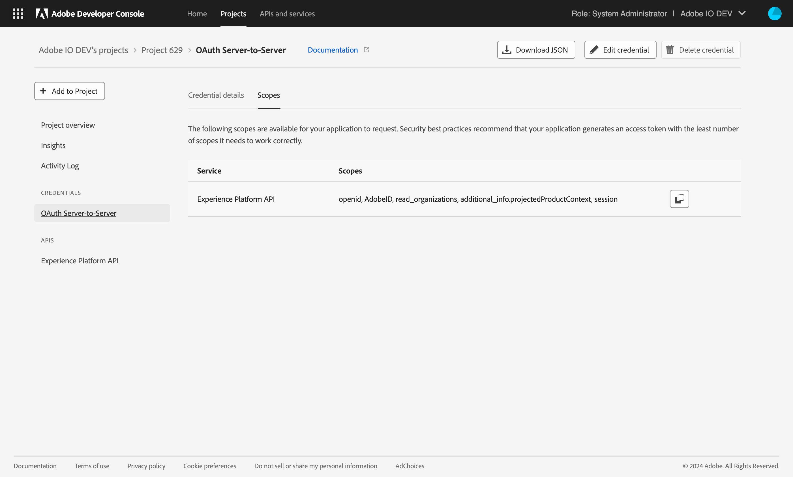
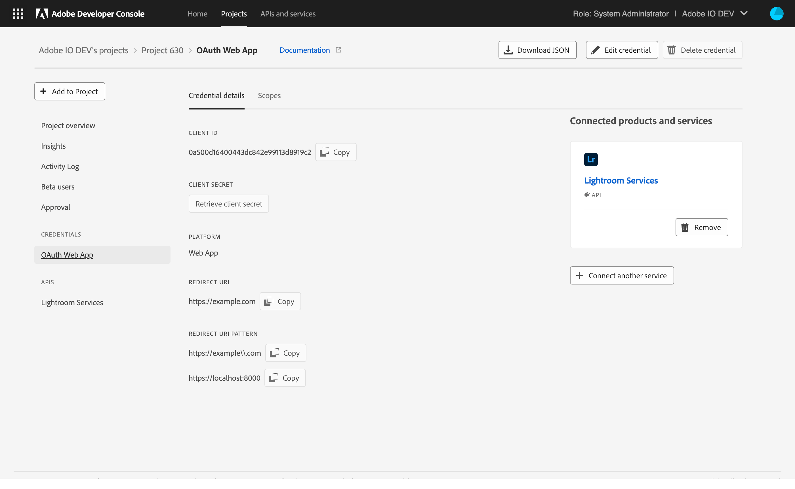
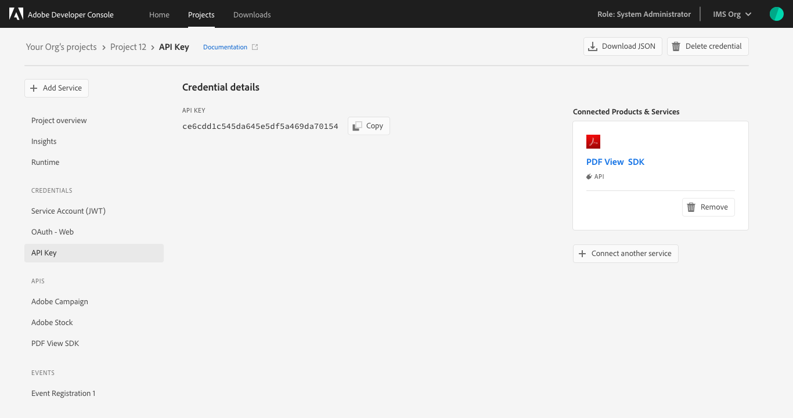

# Credentials

Once you have successfully added APIs to your project or workspace, you can return to the *Project overview* (or *Workspace overview* in a templated project) at any time to view the details for that API and any other project services you may have added. 

<InlineAlert slots="text"/>

To view credentials for events, select the specific event registration from the left navigation and then select the *Credentials* tab. For more information on working with events, including viewing event credentials, follow the [guide for adding events to a project](services/services-add-event).

## Credential details

You can select a specific API from the left navigation to view its details or you can select a credential type under *Credentials* in the left navigation in order to view the *Credential details* and perform other actions (generate access tokens, copy credential details, retrieve client secrets, etc.) as needed. 

If multiple services have been added to the project or workspace using the same credentials, they will each be listed under the *Connected products and services* on the right-hand side of the details tab.

For example, selecting **OAuth Server-to-Server** under *Credentials* will open the *Credential details* for all products and services connected using this credential.

## Generate Access token

If you selected **OAuth Server-to-Server** under *Credentials* you will be presented with the *Credential details* for all products and services connected using this credential.

To generate a token, click on the button "Generate access token"

You can also view the cURL command you could use to generate access tokens programmatically.

You can also view the scopes per service to generate an access token that only works for a subset of services in your project.

## OAuth User authentication

By selecting an OAuth User authentication credential under *Credentials*, you will be shown all products and services connected to your project using OAuth 2.0 authenication and authorization.

From here, you can view and copy the *Client ID*, retrieve the client secret, and view the *Platform* type as well as the *Redirect URL*. 

Within the *Credential details* screen you can also choose to download the OAuth JSON file, edit the credential, or delete the credential using the buttons provided in the top-right corner of the screen.

## API key

The API key *Credential details* display any products or services connected using an API key for authentication, as well as the API key itself and the ability to copy it for use.

## Next steps

To add additional services to your project or workspace, please visit the [services overview](services/).