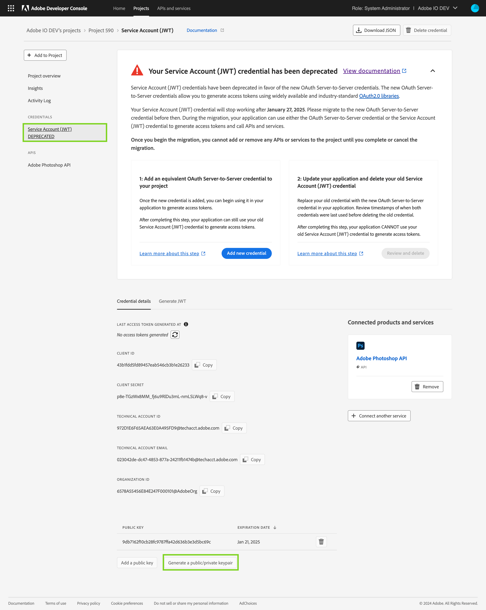
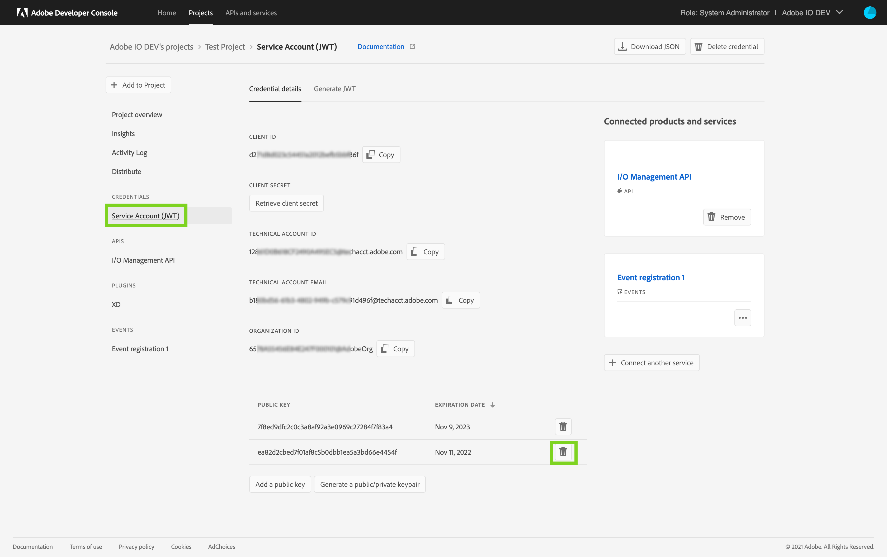

# Certificate Expiry Overview

Several services on the Adobe Developer Console require using the Service Account (JWT) credential for service-to-service authentication. The Service Account (JWT) credential utilizes a public certificate and a private key pair in order to authenticate your custom integration or application.

Custom integrations and applications need to use the certificate key pair to sign and generate a JWT token which is then exchanged for an Adobe IMS access token. Once exchanged, the application can then use the Adobe IMS access token to make calls to Adobe's APIs.

Due to security considerations, certificate key pairs are set with a definite expiry time when created. Once the expiry time elapses, the certificate key pair is rendered invalid and can no longer be safely used to authenticate your custom integration or application.

The certificate key pairs generated on the Developer Console expire after a year; therefore, you need to replace them with fresh ones every year. To this end, the Developer Console also notifies customers via email about the certificate key pairs expiring within the next 30 days.

**The Developer Console sends weekly email alerts about all your certificate key pairs expiring within the next 30 days. Furthermore, daily email alerts are also sent if a certificate key pair in your organization expires within the next 3 days.**

Upon receiving the email alert, you need to replace the expiring certificate key pair with a new pair in a timely fashion to ensure all your custom integrations and applications continue to work. See this step-by-step guide on replacing certificate key pairs for more detailed instructions.

<InlineAlert slots="text"/>

Service Account (JWT) credentials have been deprecated in favor of the OAuth Server-to-Server credentials. Your applications using the Service Account (JWT) credentials will stop working after Jun 30, 2025. **You must migrate to the new credential by Jun 30, 2025 in order to ensure your application continues to function. View our [migration guide](../../authentication/ServerToServerAuthentication/migration) to know more.**

## A step-by-step guide to replacing expiring certificate key pairs

### Step 1: Identify application and Project maintainers

Upon receiving the email alert, you must identify the custom integration or application using the expiring certificate key pair. However, this information is unavailable to Adobe because a developer/admin in your organization had set up these custom integrations or applications. 

To identify the developer/admin who may have set up the custom integration or application, you can check who created or last modified the Project on the Developer Console. You can also check the Project activity logs to view all the developers/admins who made changes to the Project within the last year.

<InlineAlert slots="text"/>

**Pro tip:** Add details about the custom integration or application to the Project description for posterity. 

### Step 2: Generate new certificate key pair

Once the custom integration or application is identified, you will need to generate a new certificate key pair to replace the expiring one. You can generate the certificate key pair on the Developer Console. To do so, 

1. Visit the Project on the Developer Console with the expiring certificate key pair
2. Go to the Service Account (JWT) tab
3. On the Credential Details tab, scroll down and click on the `Generate a public/private keypair` button
4. Save the zip file containing the public certificate and the private key pair to your machine.

### Step 3: Replace the expiring certificate key pair

Unzip the zip file you downloaded in the previous step. It would contain the public key certificate and the private key pair. Use this certificate key pair to replace the expiring certificate key pair in your custom integration or application. 

The exact steps to replace the certificate key pair would be specific to each custom integration or application, and Adobe does not have more information about the steps. However, this information may be available to the developer/admin who set up the custom integration or application identified in step 1.

Once you replace the certificate key pair in your custom integration or application, verify that it continues to work correctly before proceeding to the next step.

### Step 4: Remove the expiring certificate key pair

Once you have successfully replaced the expiring certificate key pair, visit the Project on the Developer Console and remove the old certificate. To do so,

1. Visit the Project on the Developer Console with the expiring certificate key pair
2. Go to the Service Account (JWT) tab
3. On the Credential Details tab, scroll down and click on the delete button next to the old certificate key pair.

<InlineAlert slots="text"/>

You would stop receiving email alerts about the Project only after you remove the old certificate key pair.

## FAQs

### Q. How can I find where a given project's certificate key pair is being used?
A. Unfortunately, Adobe cannot tell which custom integrations or applications are using a given certificate key pair - this information is solely available with the customer. Each expiring certificate key pair was created by a developer/admin within the customer's organization. The same developer/admin is in the best position to identify where a given certificate key pair is used.

### Q. How can I identify the developer/admin in my organization who set up the Project or the certificate key pair?
A. A good starting point to identify the developers/admins who worked on a project is by looking at who created or last modified the Project on the Project overview screen. Furthermore, the Project Activity Logs, retained for up to a year, show a more granular view of who made what changes to a Project. Note: Information about the Project's creator may be missing for historical projects.

### Q. How can I verify if the Project on the Dev Console is actually being used?
A. A. Visit the Service Account (JWT) credential overview page and look at the last access token generated at timestamp. This will tell you when was this project and credential last used to generate an access token. You can also visit the Insights tab in a Project to see recent activity (API calls, Events Delivered, etc.) involving the credentials contained in the Project. See our documentation on [Insights](../insights) to know more.

### Q. Can Adobe replace the certificate key pairs for us?
A. Unfortunately, these certificate key pairs are used in your custom integrations and applications, which Adobe has no information on or access to. Therefore, the customer needs to carry out the activity to refresh the certificate key pairs.

### Q. How can I set up automation to refresh the certificates programmatically?
A. Unfortunately, such a programmatic method is not available at this time and is not planned for Service Account (JWT) credentials. To utilize programmatic secret rotation, we recommend you migrate your application to use the new OAuth Server-to-Server credential. Learn more about the [migration](../authentication/ServerToServerAuthentication/migration).

### Q. Why do I keep receiving email alerts about the old certificate key pair even though I replaced the expiring certificate key pair?
A. Once you successfully replace the expiring certificate in your custom integration or application, be sure to remove it from the Developer Console. The email alerts would stop only once the expiring certificate key pair is removed from the Project on the Developer Console.

### Q. How can I look at all the Projects that have expiring certificate key pairs?
A. To view all the Projects with certificate key pairs that are expiring within the next 30 days, apply the filter 'Expiring public certificates' on the list of Projects screen.

### Q. Can email alerts be sent to developers in my organization so that they can act on these alerts directly?
A. Yes, developers and other users in the organization can be added as email alert recipients. Once added to the list of email alert recipients, the Developer Console will notify them too. Furthermore, all system administrators will also be notified and cannot be removed from the list of recipients. See the section on [adding users as email alert recipients](./#adding-an-email-alert-recipient) for more information.

### Q. I receive too many email alerts about expiring certificates. Can I turn off these emails?
A. We understand that not all Projects are production critical; some may be created by developers for experimentation or demoing purposes. For non-critical Projects, we recommend going to the Project overview screen and clicking on the `Pause email alerts` button to turn off email alerts for a Project. See the section on [pausing email alerts](./#pausing-email-alerts-for-a-project) for more information.

