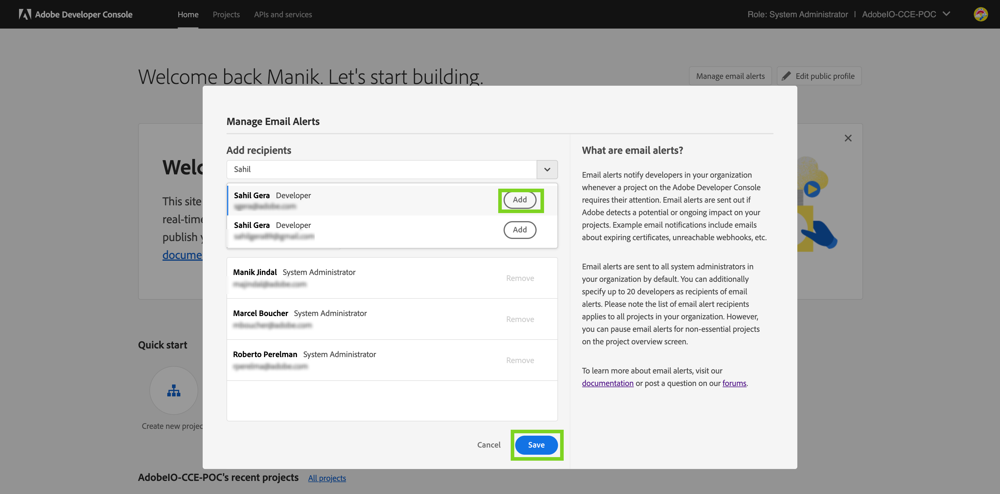
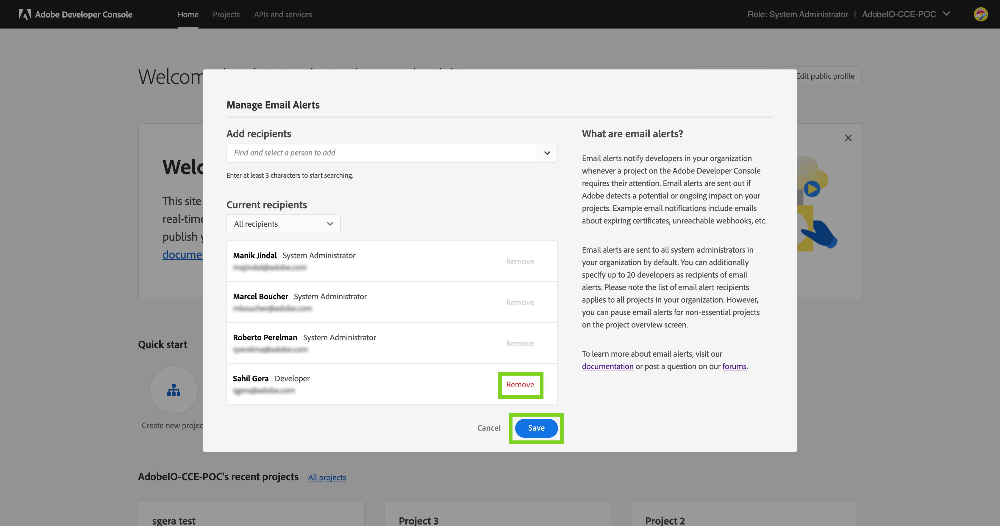
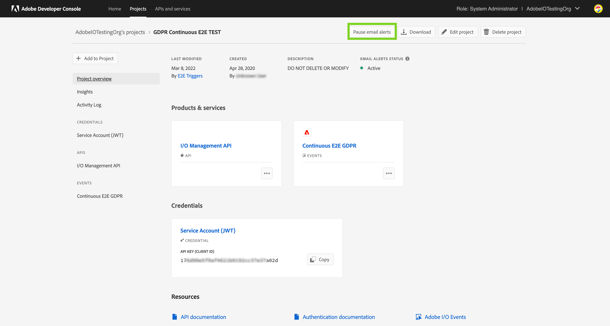

# Email alerts

Based on the APIs, Events, and other services added to your Project on the Developer Console, Adobe can sometimes detect a potential or ongoing impact on the application using those services. For instance, Adobe can detect when a webhook subscribed to Events in your Project   becomes unreachable or when a certificate key pair used in your application will expire soon. In such cases when a Project requires your attention, email alerts are used to notify you and your organization.

## Managing email alert recipients in an enterprise organization

Email alerts are always sent to system administrators in an organization. However, developers and other users can also be added as email alert recipients to notify them directly.

**Note:** Adding more users as email alert recipients is unavailable to personal developer organizations.

<InlineAlert slots="text"/>

The email alert recipient list applies to **all Projects** in your organization.

### Adding an email alert recipient

A developer or a system administrator can add up to 20 additional users in your organization as email alert recipients. 

**Note:** You can only add user accounts who have been added to your organization and not any email address. Follow this [guide](https://helpx.adobe.com/in/enterprise/using/manage-users-individually.html) to add a user to your organization.

To add more users as email alert recipients:

1. Log in to the [Adobe Developer Console](https://developer.adobe.com/console).
2. Ensure you have selected the correct organization in the org switcher on the top right.
3. On the Home screen, click on the `Manage email alerts` button.
4. Search for the user you wish to add by their name or email address and click on `Add` once they appear in the dropdown.
5. Repeat for as many users as you want to add, and then click `Save`.

### Removing an email alert recipient

Any user who was added as an email alert recipient can also be removed if they don't wish to receive the alerts.

**Note:** System administrators cannot be removed as email alert recipients.

To remove any user from the email alert recipients list:

1. Log in to the [Adobe Developer Console](https://developer.adobe.com/console).
2. Ensure you have selected the correct organization in the org switcher on the top right.
3. On the Home screen, click on the `Manage email alerts` button.
4. In the list of recipients shown, find the user you wish to remove and click the `Remove` button against their name.
5. Repeat for as many users as you want to remove, and then click `Save`.

## Managing noisy email alerts

Email alerts are sent out whenever a Project requires your attention. Often, these alerts are often critical notifications, and not acting upon them could cause an impact on your custom applications using Adobe services.

However, not all Projects on the Developer Console are used in your Production environment. You may be using some of the Projects for Stage or Dev environments or just for demoing and experimentation purposes. In such cases, the email alerts may be less critical and can contribute to noise.

Therefore, for non-critical Projects, you can pause the email alerts to reduce the number of emails you receive. 

**Note:** Email alerts are enabled by default for all new Projects.

### Pausing email alerts for a Project

Pausing email alerts for non-critical Projects is recommended. To Pause alerts

1. Log in to the [Adobe Developer Console](https://developer.adobe.com/console) and go to the Projects screen.
2. Find and open the Project for which you wish to pause the email alerts.
3. On the Project overview screen, click on the `Pause email alerts` button.
4. Confirm that you want to pause email alerts.

### Activating email alerts for a Project

To activate email alerts - 

1. Log in to the [Adobe Developer Console](https://developer.adobe.com/console) and go to the Projects screen.
2. Find and open the Project for which you wish to activate the email alerts.
3. On the Project overview screen, click on the `Activate email alerts` button.
4. Confirm that you want to activate email alerts.

