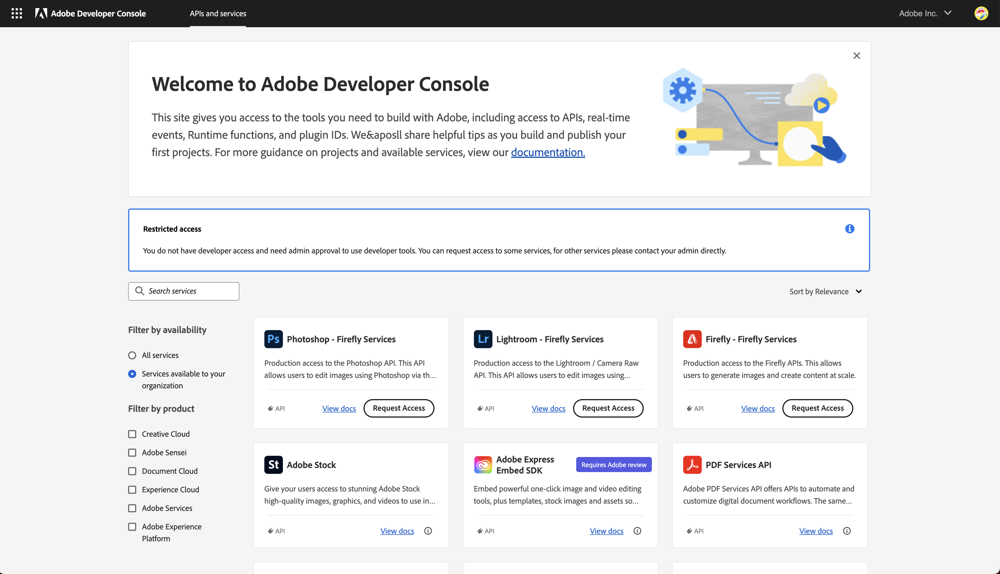
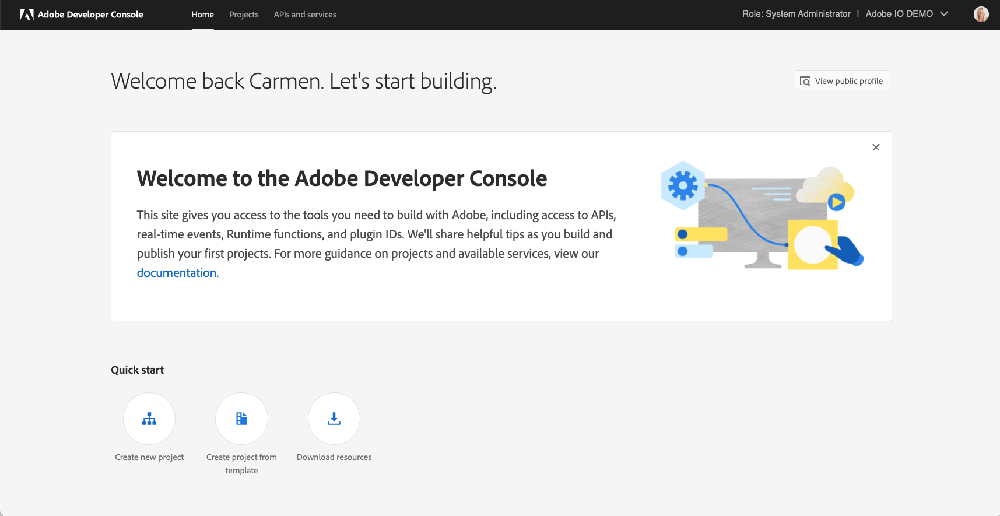
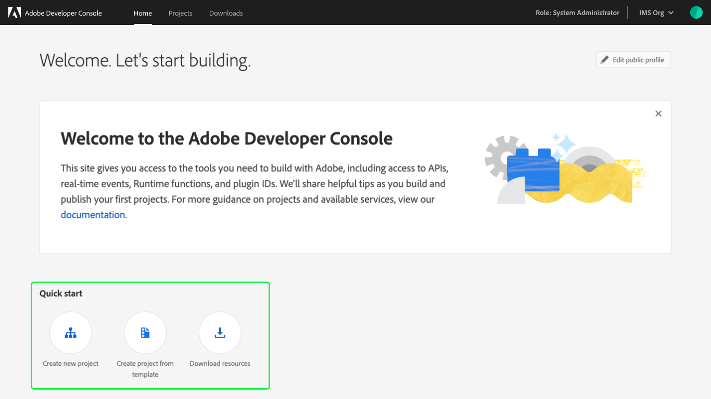
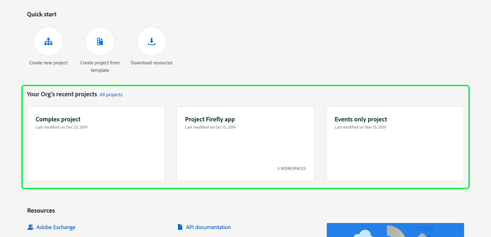
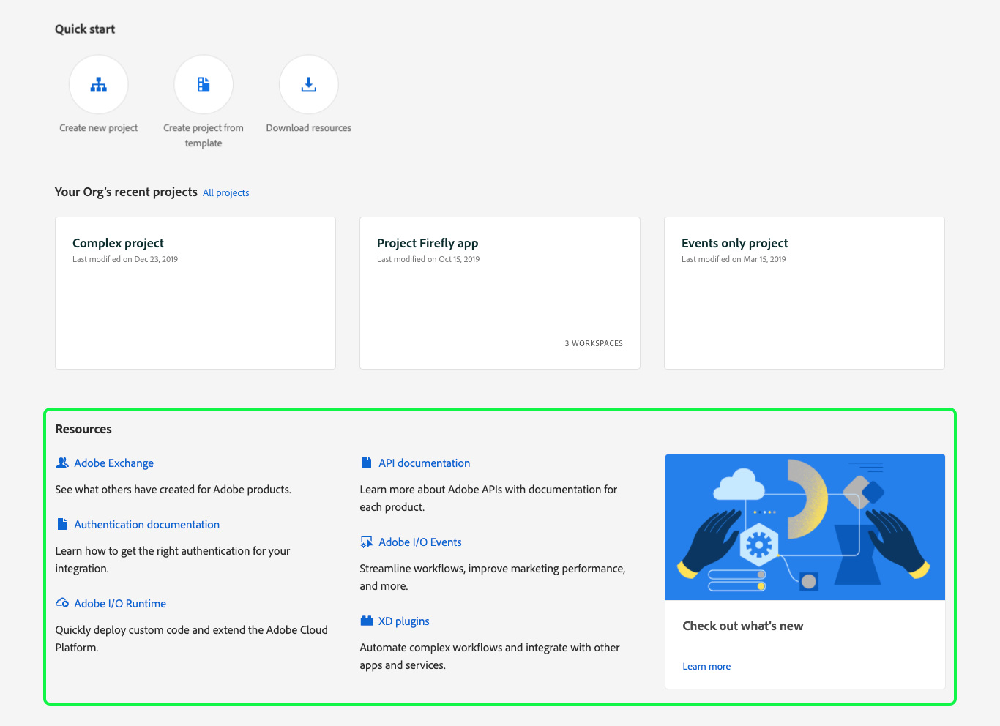
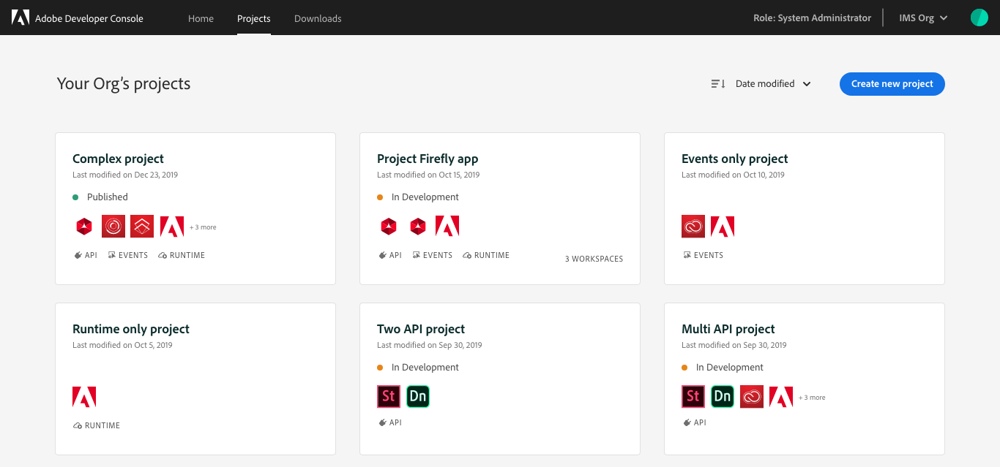

# Accessing the Adobe Developer Console

To start building your application that integrates with Adobe products and services you would first need to log in to the Developer Console and then [create a project](./projects/).

## Logging in to the Developer Console

To login to the [Adobe Developer Console](https://developer.adobe.com/console) you need an Adobe Account. When you visit the Developer Console, you'd be redirected to the login page where you could sign up for a new account or sign in using an existing account.

### Logging in with a company or school account

When you use your company or school acccount to login, you can see all the projects your organization has on the Developer Console. However, before you can see any projects or can begin creating a new project, an administrator on your organization would need to grant you developer role permissions. If you login without the developer or system administrator permissions, you will only be able to view the list of APIs and services Adobe has.

Depending on what your organization has purchased from Adobe, you can request your Admin developer access to an API by clicking the request access button. But to gain access to other services, you will need to contact your organization administrator yourself. 

To contact an administrator on your organization, view our documentation [here](https://helpx.adobe.com/enterprise/kb/contact-administrator.html). If you're an administrator, check out our documentation on [managing developers](https://helpx.adobe.com/enterprise/using/manage-developers.html).

### Logging in with a personal account

You can also use your personal account to login and access the Developer Console. When you login using your personal account, you are automatically provided a personal developer organization. You can create and manage projects under this organization.

### Switching between your organizations

If you are a developer or a system administrator on multiple organizations, you can access those organizations using the organization switcher ('org switcher').

The org switcher is located on the top right corner of the UI. Next to the org switcher, you can always check which organization you are using currently and what role you have in that organization. To change the organization you are using, simply click on the org switcher dropdown and select the desired org from the list. 

<InlineAlert slots="text" variant="info"/>

The projects in an organization belong to that organization. When you are working with multiple organization, be sure to check which organization you have selected in the org switcher.

## Introduction to the Developer Console UI

In order to create and manage projects easily, this section introduces key areas of the Adobe Developer Console user interface (UI).

### Home

After successfully logging in to [Adobe Developer Console](https://developer.adobe.com/console), you will arrive at the _Home_ screen. 

The _Home_ screen is where you can easily find information and quick links, including top-navigation links to Projects and Downloads.

#### Quick start

The _Home_ screen also provides "quick start" links to help you get started with some of the most common Console actions. _Quick start_ links are available for: creating an empty project, creating a project using a template, and downloading resources.

#### Recent projects

If your organization has created projects, the most recent projects are displayed on the _Home_ screen, enabling you to easily continue working or see work that has been done.

Only the three most recent projects will be shown, therefore to view additional projects for your organization, select **All projects** or choose _Projects_ in the top navigation. See the [Projects](#projects) section that follows for more information.

#### Resources

The _Resources_ section provides helpful links to related documentation, guides, and services to support you in your work.

The resources that appear are influenced by where you are in your workflow, updating to ensure you are provided with the most relevant information at the most appropriate time.

### Projects

The _Projects_ screen provides an overview of the projects that have been created by your organization. If you are part of an enterprise organization, this includes all projects that you have access to, not just projects that you have created.

Each individual project is shown on a card that includes the title of the project, the last modified date, the products included in the project and whether the project includes APIs, events, runtime, or a combination.

You can use the sort functionality to change the order in which projects are displayed, and you can begin working on a new project by selecting **Create new project**.

For more information on projects, being by reading the [projects overview](projects/).

### APIs and services

The _APIs and services_ screen provides access to all available APIs, Events and services for Adobe products and technologies, with which you can develop applications. It can be accessed by selecting selecting **APIs and services** in the top navigation.

To learn more about available APIs and services, read the [APIs and services overview](apis-and-services).

