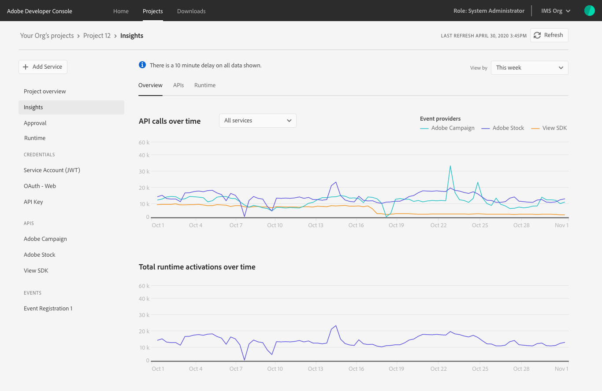
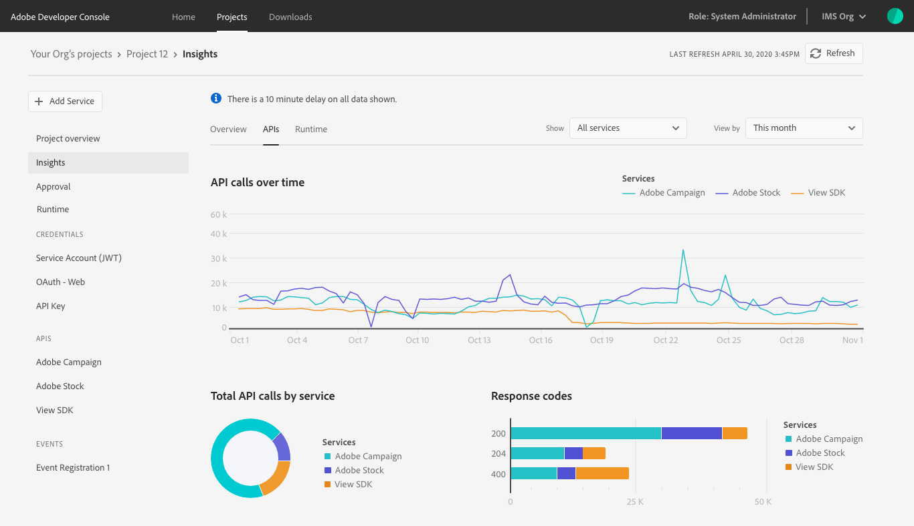
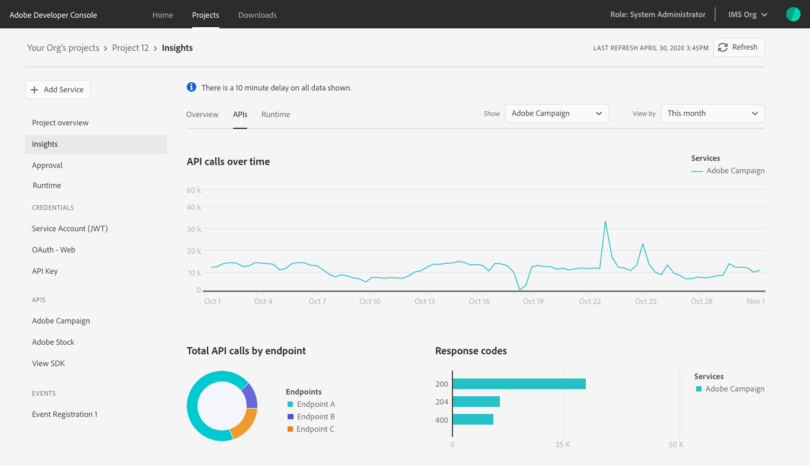
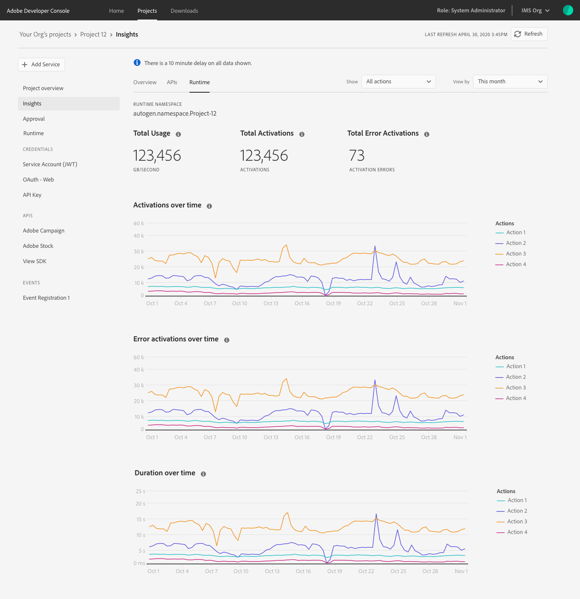
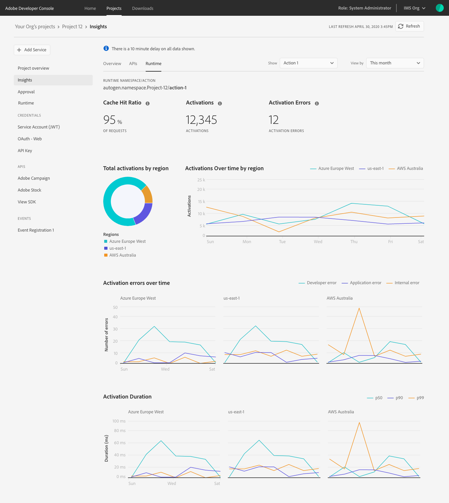

# Insights

Adobe Developer Console automatically generates valuable insights related to API and runtime usage for each enterprise project (or for each workspace when working in a templated project). 

API insights are also generated for personal projects, however because Runtime cannot be added to personal projects, there are no runtime usage insights available.

## Access insights

From within the *Project overview* (or individual *Workspace overview*), select **Insights** in the left navigation.

This opens the *Overview* tab showing graphs displaying *API calls over time* and *Total runtime activations over time*. 

<InlineAlert slots="text"/>

If Runtime has not been enabled for the project or workspace, runtime data will not appear.

Also on the *Overview* tab, the **View by** dropdown allows you to select a preferred timeframe by which to view this information. The date and time of the last refresh of the data is provided in the top-right corner of Console, and you can trigger a data refresh by selecting the **Refresh** button.

<InlineAlert slots="text"/>

There is a 10 minute delay on all data shown.

By default, the information shown on the *Overview* tab is for all APIs that have been added to the project or workspace. You can use the **All Services** dropdown to select a specific API that you would like to focus on. Alternatively, to see more insights related to APIs, you can select **APIs** from the insights navigation.

## API insights

Selecting **APIs** from the insights navigation opens the *APIs* tab, showing *API calls over time*, as well as *Total API calls by service*, and a graph that breaks down the *Response codes* from those calls.

By default, this information is shown for all APIs that have been added to the project or workspace. Similar to the insights overview, you can use the **All Services** dropdown to select a specific API that you would like to focus on. 

When a specific API is selected, the *API calls over time* graph adjusts to show only those calls related to the selected API. The *Total API calls by service* circle graph is redrawn to illustrate *Total API calls by endpoint* from within the selected API.

The *Response codes* graph is also redrawn to show only the response codes from the specified API.

## Runtime insights

Selecting **Runtime** from the insights navigation allows you to view specific insights for the runtime namespace associated with the project or workspace. For reference, the runtime namespace is provided immediately below the insights navigation.

The *Runtime* tab also provides default insights such as counts showing *Total Usage*, *Total Activations*, and *Total Error Activations*. The tab also displays graphs showing *Activations over time*, *Error activations over time*, and *Duration over time* broken down by actions.

You can use the **View by** dropdown to select the timeframe you wish to review. You can also see the last refresh of the data in the top-right corner of Console and trigger a data refresh by selecting the **Refresh** button.

<InlineAlert slots="text"/>

There is a 10 minute delay on all data shown.

By default, the *Runtime* tab shows all actions, but you can use the **Show** dropdown to select a specific action to view in more detail.

Once a specific action has been selected using the **Show** dropdown, the *Runtime* tab adjusts to display information specific to that action. Note that the runtime namespace updates to include "runtime namespace/action" and that the counts now show totals for *Cache Hit Ratio*, *Activations*, and *Activation Errors*.

The breakdown of action-specific information also includes *Total activations by region*, as well as graphs showing *Activations over time by region*, *Activation errors over time*, and *Activation Duration*, each broken down by regions.

