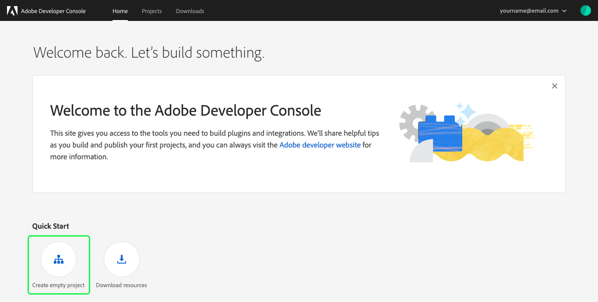
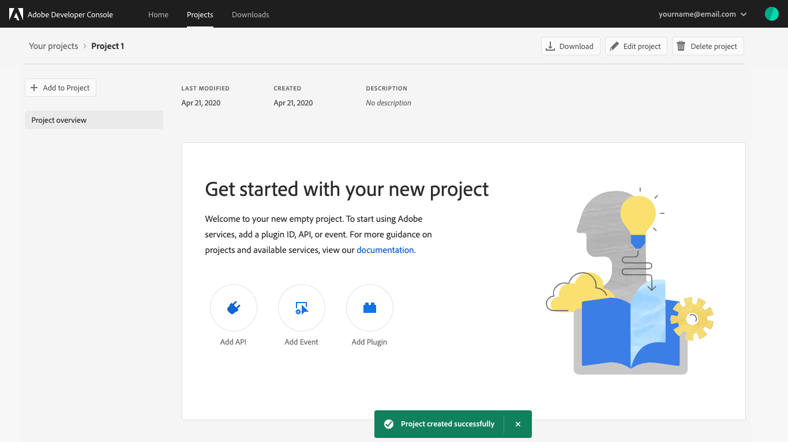
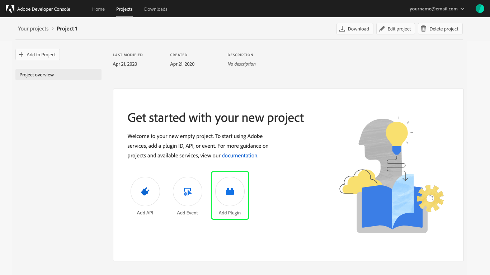
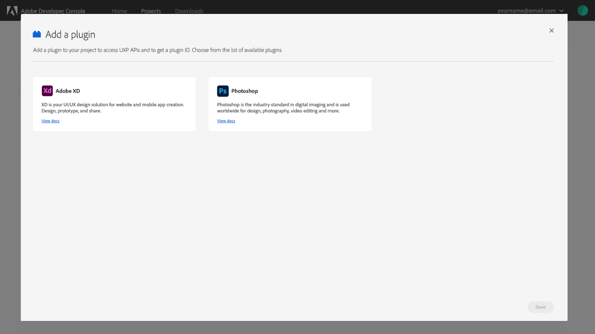
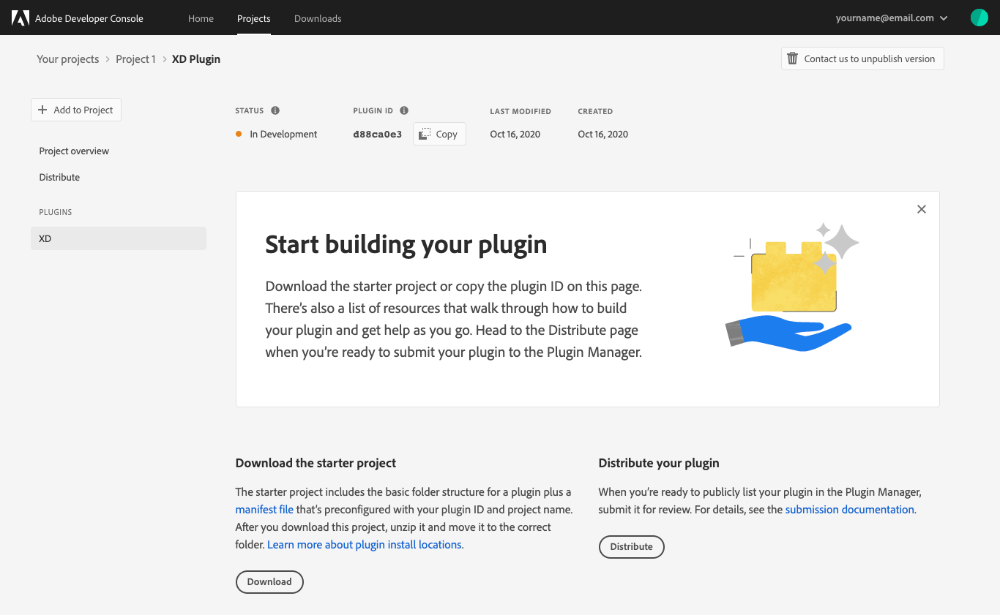
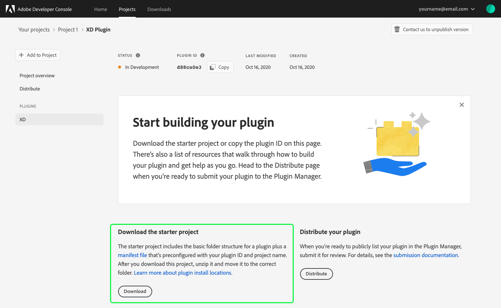
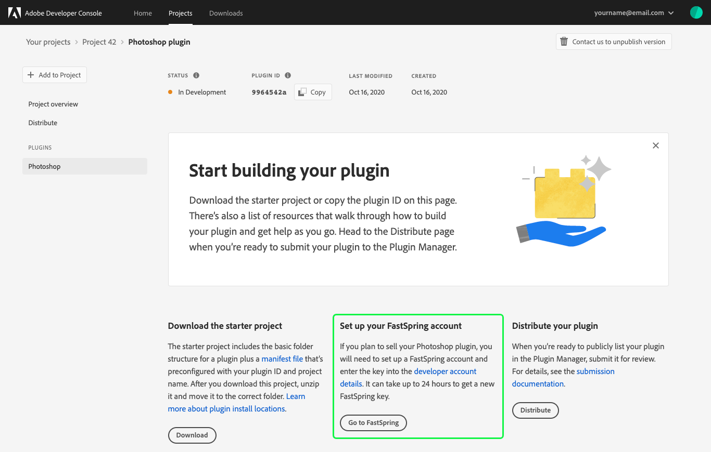
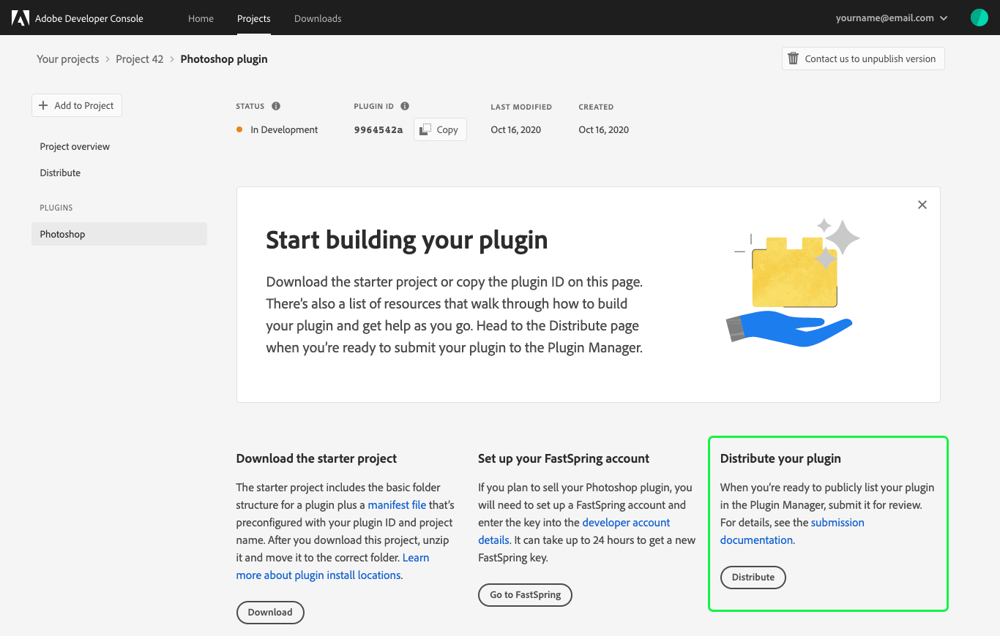

# Plugins overview

Adobe Developer Console enables you to create plugins for Adobe XD, Adobe's interactive prototyping tool, and Photoshop, the industry standard in digital imaging. 

Plugins extend the capabilities of Adobe products by adding new features to the app, automating workflows, connecting the app to external services, and more.

This guide provides instructions to help you begin building plugins within Adobe Developer Console.

## Create a plugin project

To create a plugin, begin by selecting the quick start button to **Create an empty project** on the Console home screen.

When the project overview opens, it will briefly display a success banner ("Project created successfully").

## Begin building your plugin

Select **Add Plugin** to add a new plugin to your project.

On the **Add a plugin** screen, you can select the type of plugin that you would like to add to your project: Adobe XD or Photoshop. After choosing the type of plugin you would like to add, select **Save** to save your changes and return to the plugin overview.

**Note:** You can add multiple plugins to a single project by following this workflow more than once.

After the plugin type has been selected, you are taken to the landing page for your plugin. This landing page includes the **Status**, **Plugin ID**, **Last modified** date, and **Created** date for your plugin, as well as navigation options to return to the **Project Overview** or **Distribute** your completed plugin.

### Download starter project

To begin development for your plugin, locate the **Download the starter project** section and select **Download**. 

The starter project includes the basic folder structure for a plugin as well as a manifest file that is pre-configured with the correct plugin ID and project name.

### Create FastSpring account (optional)

If you plan to sell your Photoshop plugin, you will need to set up a FastSpring account and enter the key into your public profile. For more information, please read the [public profile overview](../public-profile).

## Distribute plugin

When you have finished building your plugin, it is time to submit the plugin for review and distribution. For detailed instructions on how to submit your plugin for distribution, please see the [plugin distribution](plugin-distribution) guide.

## Project overview

At any time you can return to the overview for the project by selecting **Project overview** in the left navigation. The overview includes information about the plugin project, including **Products & services** which lists the plugin that you created (in this example, an Adobe XD plugin). While you continue to work on your plugin it will appear as "In Development".

