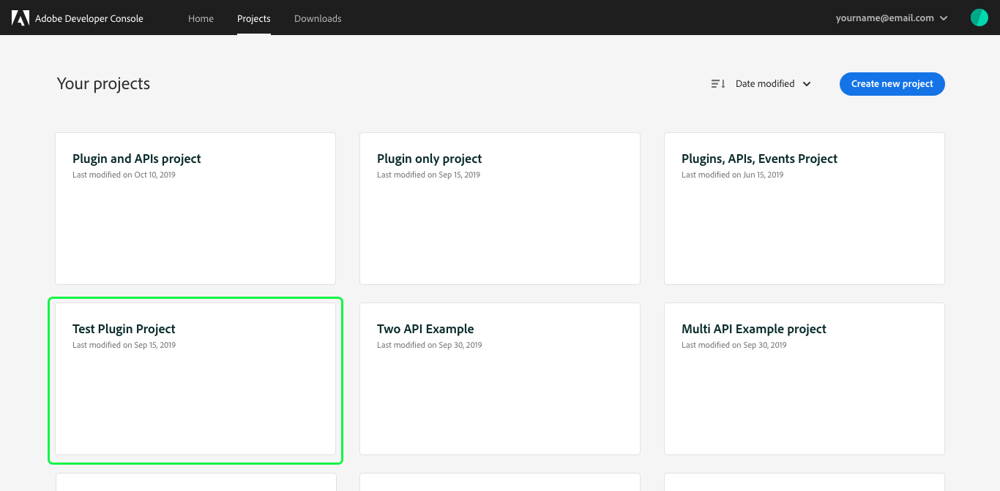
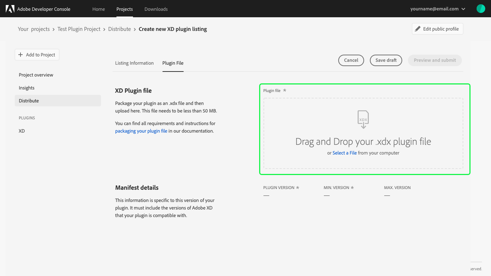
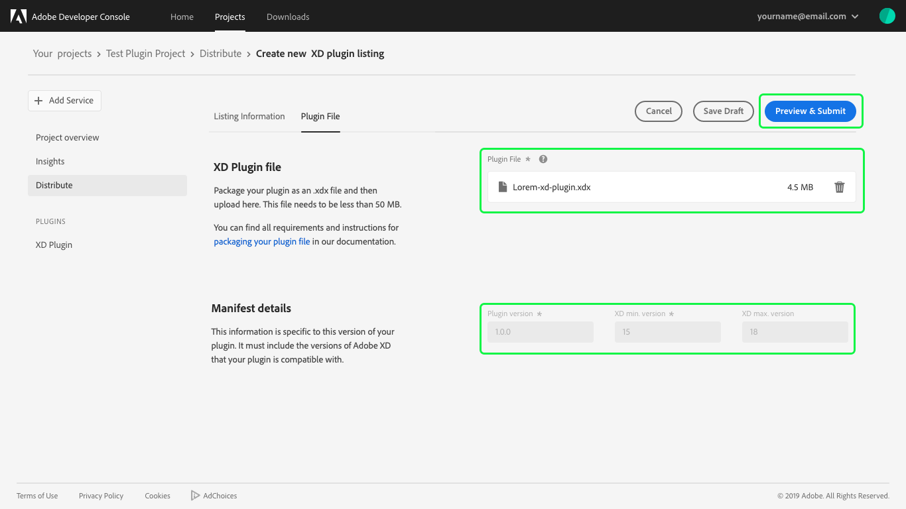

# Distribute a plugin

This guide provides instructions for distributing a Plugin created in Adobe Developer Console.

For information on how to build a plugin, please being by reading the [plugin overview](../plugins/index.md).

## Select plugin project

When you have finished developing your plugin, it is time to submit the plugin for review and distribution. To begin, select the plugin project from the project list.

## Project overview

Selecting the project opens the **Project overview** that provides information about the project including the **Last Modified** date, **Created** date, and **Description** you provided when creating the project.

Under **Products & services** you can confirm that this is a plugin project and its status is currently "In Development".

## Begin distribution process

To begin the distribution process, select **Distribute** from the left navigation.

### Public profile

Distributing a plugin requires you to complete a public profile before you can submit your plugin listing. The information in your public profile tells users about who created your plugin. A commerce account can also be set up for paid plugins. If you have not already created a public profile, select **Complete your public profile** and read the [public profile overview](../public-profile) for more information.

### Distribution resources

The **Distribute** tab also includes **Resources** to help you with the distribution process:

* **[Submission Guidelines](https://adobexdplatform.com/plugin-docs/distribution/how-to-submit-to-plugin-manager.html):** Read the Creative Cloud Developer submission guidelines before submitting your plugin for review by the CC Integrations Review team.
* **[Submission Checklist](https://adobexdplatform.com/plugin-docs/distribution/submission-checklist.html):** Go through a checklist of common reasons for plugin rejections before you submit. Doing this may save you an extra step or two on your way to publishing.
* **[Brand Guidelines](https://partners.adobe.com/content/dam/tep_assets/public/public_1/documents/Adobe-Creative-Cloud-Developer-Brand-Guide.pdf):** Read the Adobe branding guidelines to ensure that the marketing of your plugin follows Adobe standards.

## Create listing

Once you have gathered your files and created your public profile, you're ready to create your listing. To get started, select **Create XD plugin listing** (or **Create Photoshop plugin listing**) on the **Distribute** screen.

### Listing Information

**Note:** Previously listings included a Publisher Information tab. This tab has been replaced by the public profile. To learn more about creating a public profile, please visit the [public profile overview](../public-profile).

The **Listing Information** tab requires you to complete the details related to your plugin, including the plugin name and description, plugin categories, supported languages, and version details (in the event that you later decide to release an update to your plugin).

**Note:** If your plugin supports multiple languages, you can customize your listing information into multiple languages using the **Add listing information for language:** dropdown. Adding additional languages allows you to localize fields such as the plugin name, subtitle, description, and release notes.

The listing information is also where you are able to upload plugin icons and screenshots to improve your plugin listing. Once you have completed all of the required fields, you can continue with your plugin submission by selecting **Upload Plugin File** at the end of the listing information form or by selecting **Plugin File** from the top navigation.

### Commerce information

If you are submitting a Photoshop plugin, the listing information includes a **Commerce** section, requiring you to define how users can get your plugin. Using the **Purchase method** dropdown, you can select **Free** or **Paid** for your plugin. Selecting **Paid** also requires you to specify a price.

**Note:** If you select **Paid** as the purchase method, you must complete the commerce information in your public profile. For more information on completing your public profile, read the [public profile overview](../public-profile).

### Plugin File

After ensuring that your plugin is packaged in the correct file format (`.xdx` for Adobe XD plugins and `.ccx` for Photoshop plugins), you can drag and drop your plugin file to begin uploading or use **Select a File** to navigate to the appropriate file and select it for upload.

**Note:** Plugin files must be less than 50 MB.

Once the plugin file has been successfully uploaded, the name of the `.xdx` (or `.ccx`) file will appear in the **Plugin File** field and the manifest will populate values for the following fields:

* **Plugin version** (Required)
* **Min. version** (Required): You are required to include the minimum version of Adobe XD (or Photoshop) with which your plugin is compatible.
* Max. version (Optional): You may optionally provide a max version of Adobe XD (or Photoshop) with which your plugin is compatible.

You can now select **Preview & Submit** to preview your listing and submit your plugin for approval.

### Preview and submit

The final step in the distribution process is to preview your plugin listing and submit it for approval. Before submitting, you can preview your listing by selecting **Preview in Adobe XD** (or **Preview in Photoshop**).

You can add a **Note to Adobe Reviewers**, such as login information that may be required in order to properly review your plugin.

You also have the option to **Delay Publishing** to a later time. By default the plugin will **Publish immediately after approval**, but you can select to **Manually publish later**.

**Note:** If you select to manually publish your plugin later, it may take a few moments to see your plugin live in the plugin manager once you manually publish it.

After reviewing your plugin listing, adding notes to Adobe reviewers, and selecting your publishing time, you can **Submit** your plugin for review.

## Plugin review

Upon successful submission on your plugin, you return to the **Distribute** page where the **Version Number** ("v0.0.1"), **Status** ("In Review"), and other details of your submitted plugin are now available. 

The distribute screen now also displays **+ Add new version** in the top-right corner of the screen. 

**Note:** Adobe Developer Console supports versioning for plugins, but attempting to add a new version while the current plugin is "In Review" will result in a "Plugin already in review" warning. Any new versions that are submitted will replace the version currently in review, moving your submission to the back of the queue. To lear more about versioning, see the documentation on [updating plugins](plugin-update).

## Next steps

Plugin submissions are reviewed by Adobe and a response is provided within 10 business days. Once your plugin has been approved, it will be published and available for installation by users (unless you selected to publish your plugin manually at a later date). 

Now that you have successfully created and distributed a plugin, you can repeat the creation and distribution steps to create additional plugins or you can update an existing plugin by submitting a new version for review. To learn more, refer to the documentation for [updating an existing plugin](plugin-update).