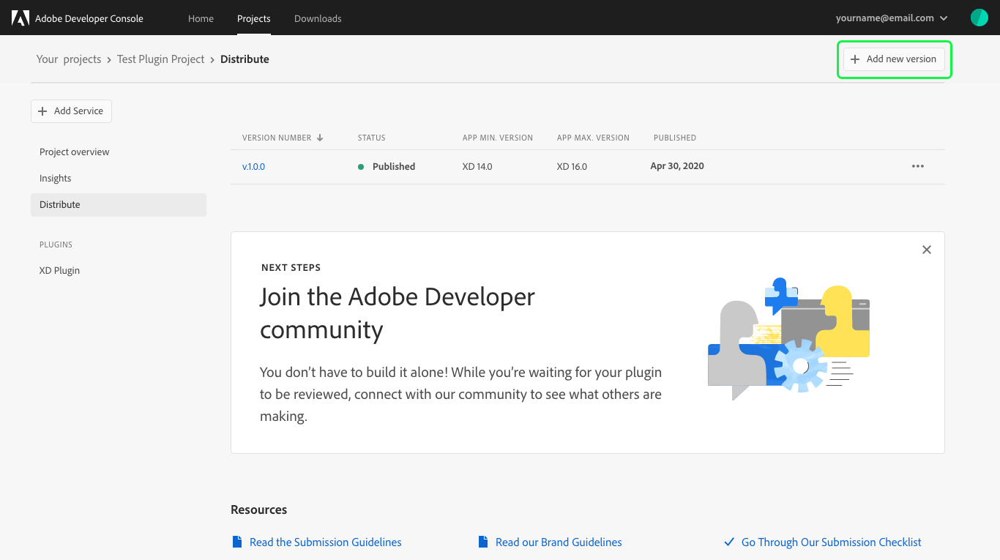
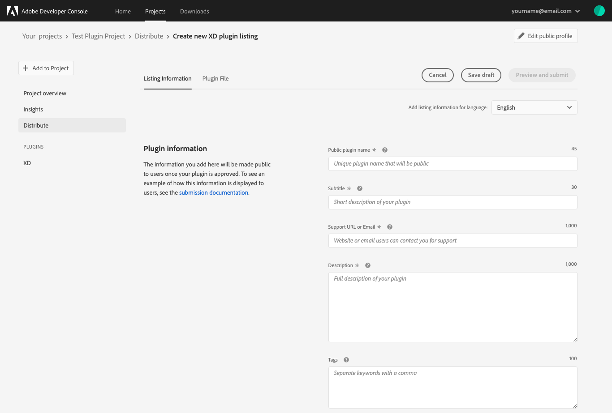
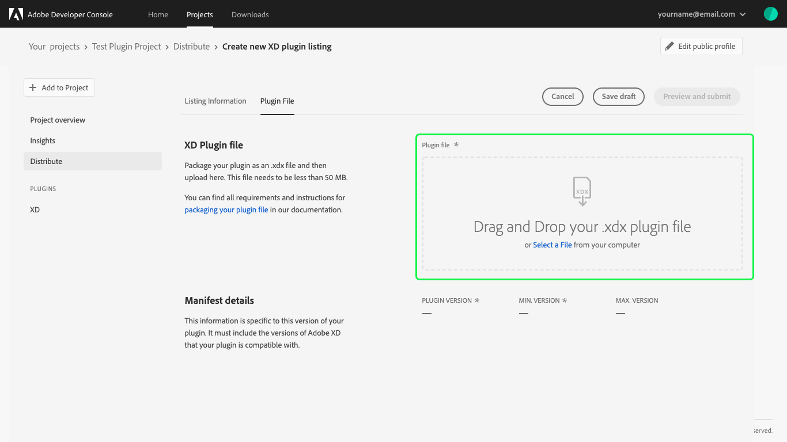
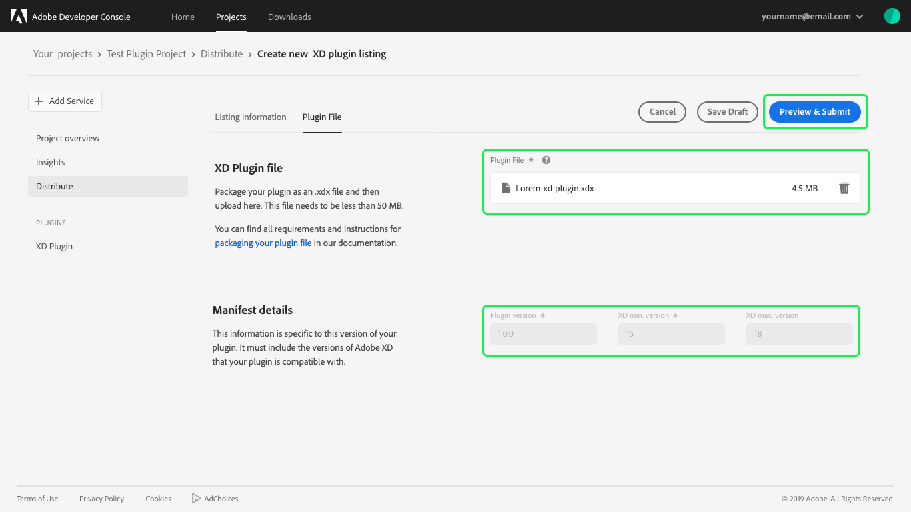
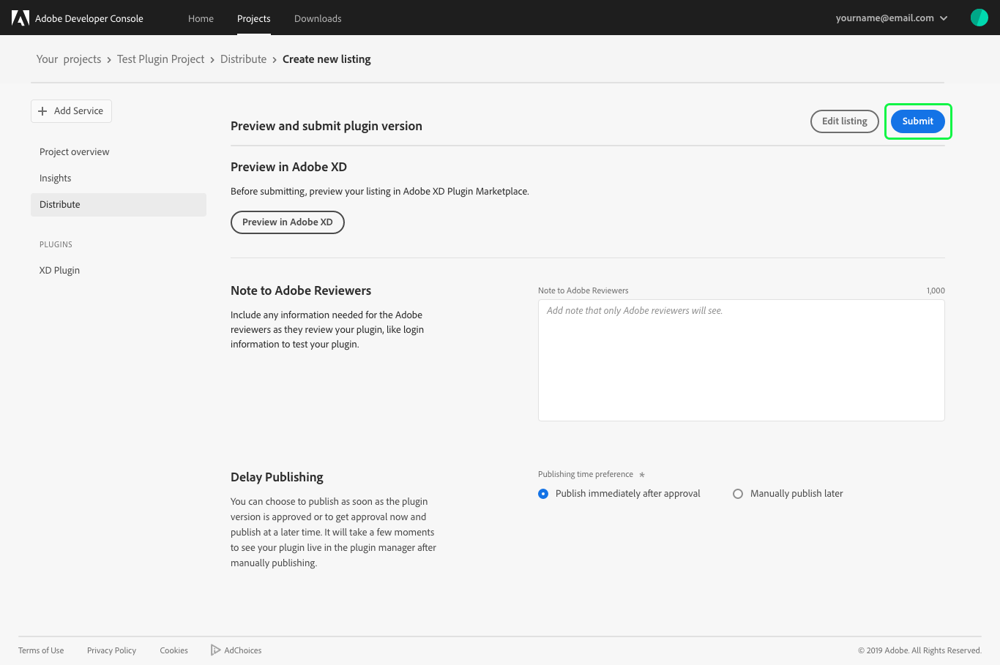
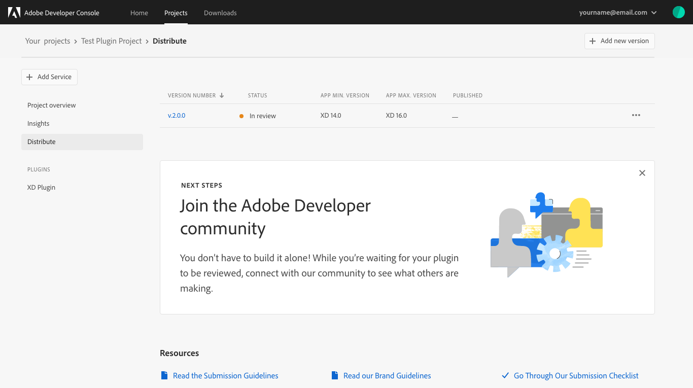

# Update a plugin

Adobe Developer Console supports versioning of plugins, allowing you to continue development on your existing plugin and release an updated version for users. 

## Add new version

To submit a new version of your plugin for review, navigate to the plugin project that you would like to update and select **Distribute**.

On the distribution tab, are details pertaining to your current plugin, including **Version Number**, **Status**, and **Published** date.

To add a new version, select **Add new version** in the top-right corner of the screen.

## Update listing information

At this time you can update the **Listing Information**, including the categories your plugin should be listed in, languages your plugin supports, and version details for your new plugin version.

## Plugin file

After ensuring that your listing has been updated properly, you can drag and drop your new plugin file or use **Select a File** to navigate to the appropriate file on your computer and select it for upload.

Once the plugin file has been successfully uploaded, the name of the file will appear in the **Plugin File** field and the manifest will populate the new **Plugin version** (Required), **Min. version** (Required), and **Max. version** (Optional). 

You can now select **Preview & Submit** to continue.

### Preview and submit

The final step in the distribution process is to preview your plugin and submit it for approval. Before submitting, you can preview your listing by selecting **Preview in Adobe XD** (or **Preview in Photoshop**).

You can add a new **Note to Adobe Reviewers** and you again have the option to **Delay Publishing** to a later time.

After reviewing your plugin listing, adding notes to Adobe reviewers, and selecting your publishing time, you can **Submit** the new version of your plugin for review.

## Plugin review

Upon successful submission on your Plugin, you will return to the **Distribute** page where the **Version Number** will have updated to the new version of your plugin, and the **Status** will once again be "In review".

## Next steps

Plugin submissions are reviewed by Adobe and a response is provided within 10 business days. Once your plugin has been approved, it will be published and available for installation by users (unless you selected to publish your plugin manually at a later date). 

Now that you have successfully updated and resubmitted a plugin, you can repeat the creation and distribution steps to create additional plugins or create other applications using Adobe Developer Console. To learn more about creating projects within Console, please begin by reading the [projects overview](../projects/).