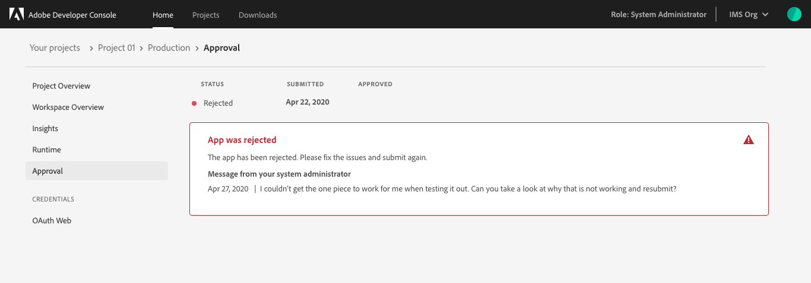
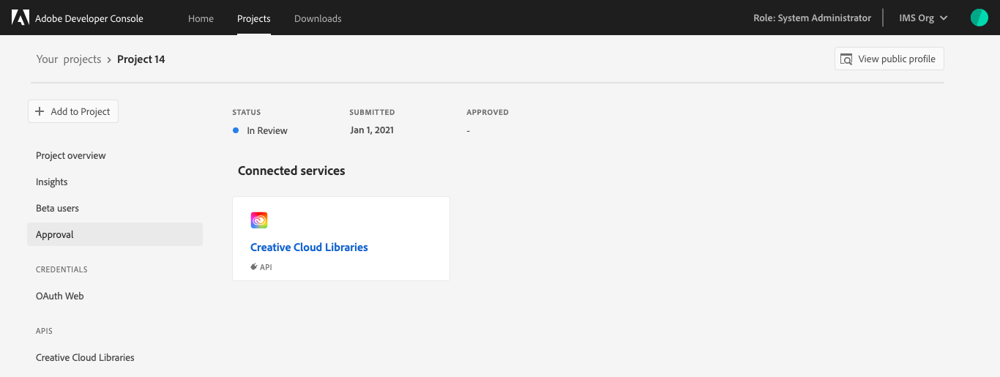

# Project approvals

Once you have completed development on your project, your application is ready for approval. 

There are three different approval processes within Adobe Developer Console, depending on the type of application that you have built:

1. **App Builder applications:** Projects built using the App Builder template are built by an organization for use within that organization. Therefore, App Builder applications require approvals by the enterprise organization administrator only. Please follow the approval process for [App Builder applications](#app-builder-applications-approval-process) outlined in this document.

2. **Applications for publication:** Building an application for distribution to general users on the Adobe Exchange requires approval from the Adobe Review team before it can be published. Please refer to the [applications for publication](#applications-for-publication) approval process outlined in this document.

3. **Plugin distribution:** Plugins must be submitted for review and approval before they can be published to the plugin marketplace. For detailed instructions on how to submit a plugin for approval, follow the steps provided in the [plugin distribution guide](../plugins/plugin-distribution).

## App Builder applications approval process

Once you have completed development on an App Builder application, it is time to submit the application to your administrators for review and approval. The final app is based on the **Production** workspace, therefore it is important to ensure that the production workspace contains all of the necessary APIs, Events, and Runtime code that it needs before submitting for approval.

To begin the approval process, navigate to the **Production** workspace and select **Submit for approval** in the top-right corner of the screen or select **Approval** in the left navigation.

On the *Approval* screen you will be presented with the **App Submission Details** form. These details will be visible to people using your app and administrators reviewing your application.

Once the submission details have been completed, select **Submit** to begin the approval process.

You will be returned to the *Approval* screen, where the *Status* of your application should now be "In Review".

Following a review by your organization administrators, your application will either be approved and published or rejected. If the application is rejected, your admin will be able to include a note telling you what went wrong, allowing you to fix the error and submit for approval again.

If your application is approved, you are ready to move on to the [next steps](#next-steps) found at the end of this document.

## Applications for publication

In order for an application to be available to public users, it must first be approved by the Adobe Review team. To begin, navigate to the **Project overview** for the project containing the application that you want to publish.

Select **Approval** from the left navigation to view the submission details. These details include information about the application that will be shown to end users and the Adobe Review team. 

**Note:** You will need to complete a public profile before you can submit your app or integration for approval. If you have not already completed a public profile, you will be prompted to do so before completing the approval process. The information from this profile will appear on the consent screen that users will view when using your app. To learn more about creating a public profile, please visit the [public profile overview](../public-profile).

Once the submission details have been completed, select **Submit for approval** to continue the approval process.

After submitting, your application status will be updated to **In Review** and the details that you filled in previously will be visible, however they will be greyed out and you will not be able to edit them. 

## Next steps

Once an application has been approved, either by internal reviewers or the Adobe Review team, its status will be updated to **Published** and the application will be available for use either by employees within your enterprise organization (for App Builder applications) or for the general public through Adobe Exchange.

