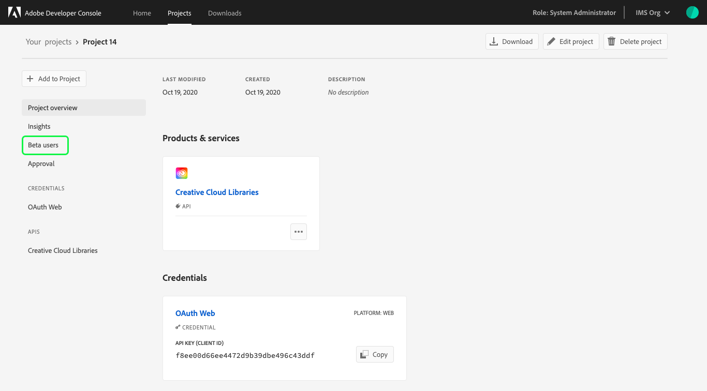
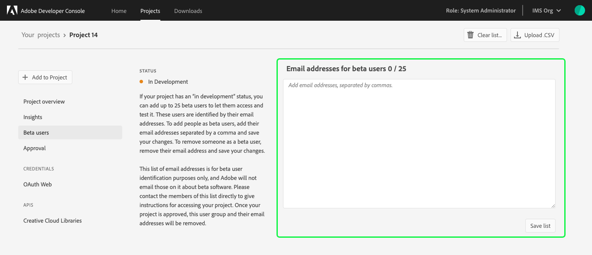
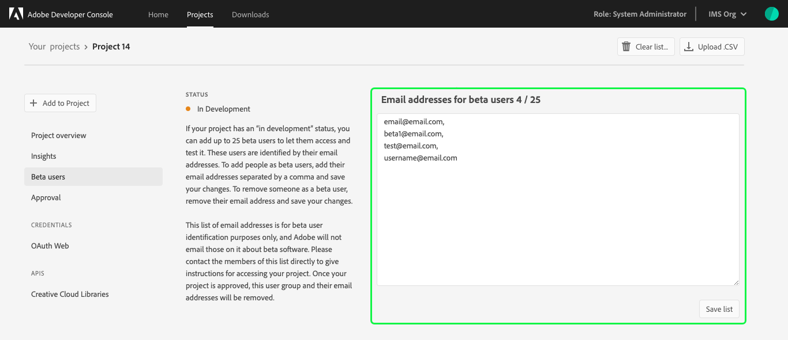
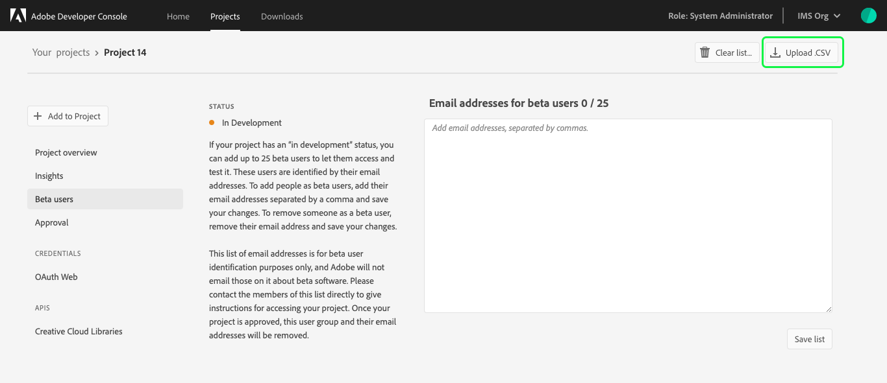
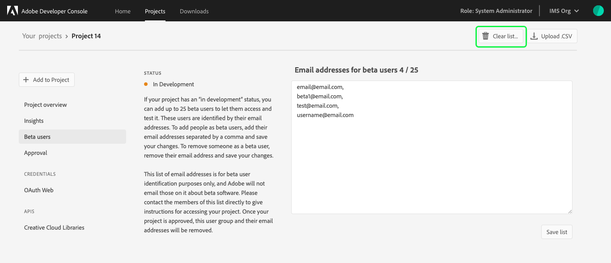
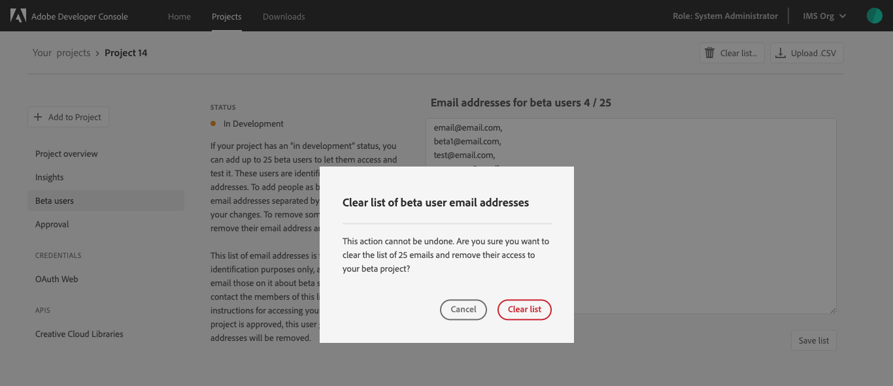

# Beta users overview

Adobe Developer Console enables you to select and manage a group of beta users, giving them access to your integration while it is still in development.

**Note:** Adobe will not contact beta users on your behalf. All communication, including set-up instructions and providing access to your project for testing, must be done by you or members of your organization.

## Getting started

To begin working with beta users, visit the **Project overview** of the project you want to engage beta users on and select **Beta users** from the left navigation.

**Note:** The ability to select beta users is available only for certain APIs. If your project does not include one of these APIs, the beta users feature will not be visible.

## Add beta users

The **Beta users** screen displays the status of your project as well as a text field where you can enter email addresses for your beta users.

If your project status is **In Development** or **In Review** (or if your project has been **Rejected** and requires further development work), you can add up to 25 beta users and provide them with access to test your application. Beta users are identified by their email addresses and can either be [added manually](#add-users-manually) using the text box or [uploaded via CSV](#upload-csv) file. Both methods are described in the following sections.

### Add users manually

To add a user to the list manually, input their email addresses into the text box, separating multiple email addresses with commas (`,`). Once you have entered all of the email addresses, select **Save list** to save your changes. 

After you save the list, the count (`0/25`) will update to show the current number of beta users.

### Upload CSV

To add beta users using a CSV file, select **Upload .CSV** and choose the file you wish to upload. 

After locating the file you wish to use, select **Open** to open the file and you should see the email addresses, separated by commas (`,`) in the text field.

**Note:** The CSV file should contain only the email addresses of the beta users to be added. Any additional information in the CSV will result in errors when trying to save your beta user list.

If the list of email addresses looks correct, select **Save list** to save your changes.

After you save the list, the count (`0/25`) will update to show the current number of beta users.

## Remove beta users

To remove a beta user, simply remove their email address from the list and save your changes. You can also remove all beta users at once by selecting **Clear list**. 

Before the list is cleared you will be asked to confirm your selection. Selecting **Clear list** from the dialog will remove all beta user email addresses and return the count to `0/25`.

## Engaging your beta users

The list of email addresses provided is for beta user identification purposes only. Adobe does not contact beta users directly regarding beta software. 

In order to engage your beta users, please contact the members of the list directly to provide instructions for accessing your application. 

**Note:** Once your project is completed and has been approved, the beta user group and their email addresses will be removed from Console automatically.

