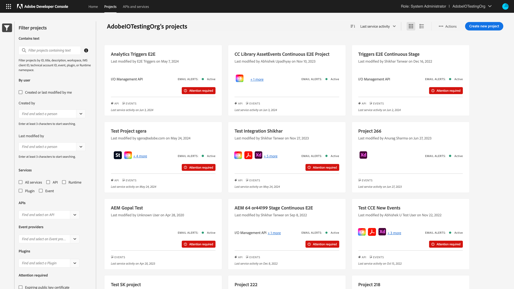
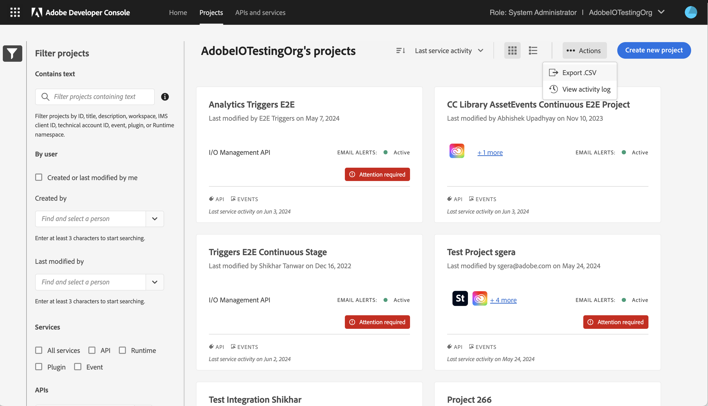
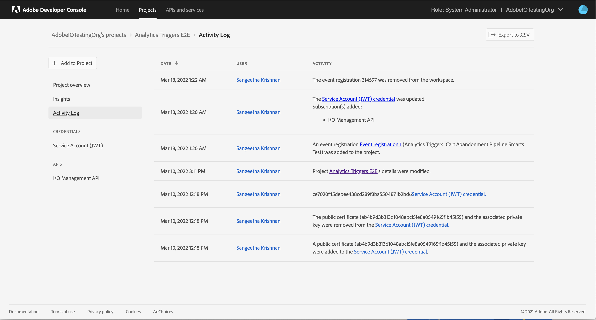

# Projects Overview

All development work in Adobe Developer Console is done as part of a Project. The concept of a Project corresponds to an application you are building. To use any APIs and services in your application, you must add them to the Project. The Project may include one or multiple products, and a combination of APIs, I/O Events, I/O Runtime, and Plugins.

+ [Projects Overview](#projects-overview)
  + [Projects in an enterprise organization vs personal developer organization](#projects-in-an-enterprise-organization-vs-personal-developer-organization)
  + [View all Projects](#view-all-projects)
    + [Export all Projects details](#export-all-projects-details)
    + [Read Only Projects](#read-only-projects)
    + [Auto-Generated Projects](#auto-generated-projects)
  + [Create a New Project](#create-a-new-project)
    + [Empty Projects](#empty-projects)
    + [Templated Projects](#templated-projects)
  + [View and manage a Project](#view-and-manage-a-project)
    + [View a Project's Activity Log](#view-a-projects-activity-log)
    + [Last service activity in a Project](#last-service-activity-in-a-project)
    + [Project approval](#project-approval)
    + [Beta users](#beta-users)
  + [Delete a Project](#delete-a-project)
    + [Find deleted Projects](#find-deleted-projects)

## Projects in an enterprise organization vs personal developer organization

Projects are a common framework within enterprise and personal developer organizations. Projects created under an enterprise organization are owned by the organization and are visible to other organization members. In contrast, Projects belonging to a developer organization are visible only to you.

If you are a developer or a system administrator on multiple organizations, you can view the Projects that are owned by those organizations. The Projects you see on the Developer Console depends on the organization you have currently selected in the [org switcher](../getting-started#switching-between-your-organizations). Use the org switcher to view the organizations to which you belong to and easily switch between them.

<InlineAlert slots="text"/>

To create Projects for enterprise organizations, you must have a system administrator or developer role. For information on managing developers in the admin console, see the documentation on [managing developers](https://helpx.adobe.com/enterprise/using/manage-developers.html).

## View all Projects

The [list of Projects](https://developer.adobe.com/console/projects/) page provides an overview of your organization's Projects. If you are part of an enterprise organization, the list of Projects will include all Projects in the organization (and not just the ones you created).

On the page, you can view the Projects as cards or rows in a table. You can view the following details about a Project at a glance here 
+ Project title
+ Services and workspaces added to the Project
+ Who last modified the Project and when
+ Project's last service activity
+ If the Project requires your attention
+ If the Project is Read-only or Auto-Generated

Furthermore, you can sort the Projects based on created date, last modified date, and last service activity date. Sorting the Projects by last service activity will show your active Projects first.

### Filter Projects

You can filter down the list of Projects to find your Projects quickly. You can filter the list of Projects using the following filters:

1. By Text: You can filter Projects by ID, title, description, workspace, IMS client ID, technical account ID or email, event registration id, plugin id, or Runtime namespace.
2. By who created or modified the Project
3. By what a Project Contains (APIs, Event Providers, and Plugins)
4. By whether a Project requires your attention

### Export all Projects details

All the details available on the list of Projects page can be exported as a CSV file. To do so, 
1. Go to the list of Projects page
2. Click the Actions overflow menu (three dots) and select Export CSV

### Read Only Projects

As a member of an enterprise organization, you may not have access to all of the services licensed by your organization. For this reason, you may see a *Read Only* tag on certain Projects or workspaces within a templated Project.

Although, Projects or workspaces marked as *Read Only* are still visible to you, but certain actions, such as downloading, editing, copying client secrets, or initiating the approval workflow, will be greyed out and inaccessible.

If you believe you are seeing a *Read Only* tag in error, or want access to certain services and product profiles, please work with your organization's administrators for access.

### Auto-Generated Projects

Sometimes Adobe products automatically create Projects in your organization so you don't have to. In such cases, the Projects are marked Auto-Generated Projects.

These Projects are shown to you for transparency, but cannot be modified or deleted by any user in the organization (even the system administrator). The Adobe product that created the Project automatically manages the Project and owns its lifecycle. 

<InlineAlert slots="text"/>

Auto-generated Projects containing Service Account (JWT) credentials will be migrated by Adobe and customers don't have to migrate such Projects.

## Create a New Project

### Empty Projects

Think of an empty Project as an open canvas or "blank slate" into which you can add events, runtime, plugins, APIs, and more to create custom applications.

To get started, follow the steps provided in the guide for [creating an empty Project](projects-empty).

### Templated Projects

To streamline the creation of Projects, Adobe Developer Console provides templates that you can use to get started quickly. 

**Note:** Templated Projects are currently only available for enterprise organizations.

To get started, follow the steps provided in the guide for [creating a templated Project](projects-template).

## View and manage a Project

Once you select a Project on the list of Projects page, you will land on the Project overview page. This page shows you details about the Project.

+ Project title and description
+ Services and workspaces added to the Project
+ Who last modified the Project and when
+ Who created the Project and when
+ Project's last service activity
+ Email alerts status
+ If the Project requires your attention
+ If the Project is Read-only or Auto-Generated

On the left nav, you can access more information about the Project. 
+ The insights page shows API and service activity recorded by Adobe.
+ The activity log page contains a log of modifications done to the Project.
+ The credential overview, API overview, event registration overview, Runtime overview, and workspace overview pages.
+ And, the Project Approval and Beta users pages, when applicable.

### View a Project's Activity Log

Any user in your organization who has access to the Developer Console and has access to the set of product profiles used in a Project can view, edit, and delete that Project.

However, all modifications to a Project on the Developer Console are captured in the Project's activity log. The activity log serves as a record of "who did what and when?", enabling an organization to track changes made to a Project. 

Changes made to a Project are retained as activity logs for **1 year**. You can also export the activity log records as a CSV file, if you wish to store them for longer. 

<InlineAlert slots="text"/>

Note: Activity logs are currently unavailable in personal developer organizations.

### Last service activity in a Project

At a glance, the last service activity date informs you when Adobe last recorded activity from your integration or application. This information helps ascertain whether the integration or application using this Project has been active. 

Currently, the Developer Console only records service activity when
1. Your integration or application generates access tokens to call Adobe APIs. 
2. Your event registration receives events from I/O Events

We do not yet track service activity when
1. Your App Builder app action is invoked, nor any other activities of App Builder apps. 
2. Your integration calls Adobe APIs. However, you can find this information under the [Insights](../insights) tab in a Project. 

Also, we do not yet track any service activity for 
1. Any Creative Cloud app plugins (Adobe Express add-ons, UXP apps, or ZXP apps)
2. The API key credential

<InlineAlert slots="text"/>

The Developer Console only records the date of the service activity. Furthermore, the tracked information is approximate and only serves to inform you about which of your Projects were in use and when. Historical data for service activity before April 15, 2024 is unavailable.

### Project approval

Once you have completed development on your Project and your application is ready for approval. There are four different approval processes within Adobe Developer Console, depending on the type of application that you have built. 

1. Self-service push to production for OAuth credential
2. Approval process for OAuth credentials
3. Approval process for App Builder applications

To read more about the approval process, visit the [Project approvals](approval) documentation.

### Beta users

When building a Project containing OAuth credentials, Console enables you to select and manage a group of beta users, giving them access to your integration while it is still `In Development`. To learn more, read the [beta users overview](beta-users).

## Delete a Project

Deleting a Project is **permanent** and will remove all entites contained within the Project - APIs and services, credentials, and workspaces. You can delete a Project by visiting the Project overview page.

While most Projects can be deleted, sometimes a Project is related to an application you have published and, therefore, cannot be deleted. 

1. If a Project contains an API that was submitted for approval (status: In Review or Approved), then the Project cannot be deleted.
2. If an App Builder Project has been submitted for approval (status: Pending or Published), then that Project cannot be deleted. However, you can always revoke a published app and then delete the Project. 

<InlineAlert slots="text"/>

Projects containing plugins cannot be deleted yet. 

### Find deleted Projects 

Once you delete a Project, you will be unable to access its Activity Log. However, you can view who deleted a Project and when on the Activity log shown on the [list of Projects](https://developer.adobe.com/console/projects/) page. 

To navigate to the Projects Activity Log, 
1. Go to the list of Projects page
2. Click the Actions overflow menu (three dots) and select Activity Log

<InlineAlert slots="text"/>

Note: Activity logs are currently unavailable in personal developer organizations.

