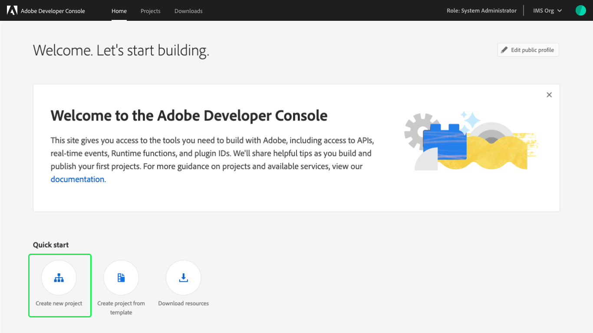
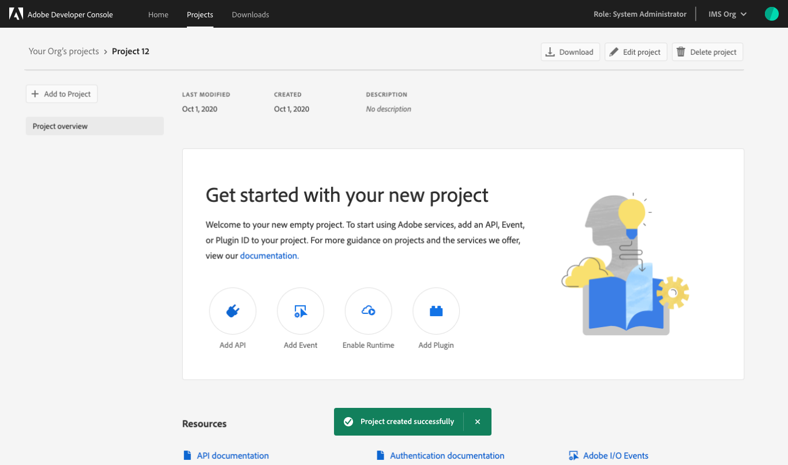
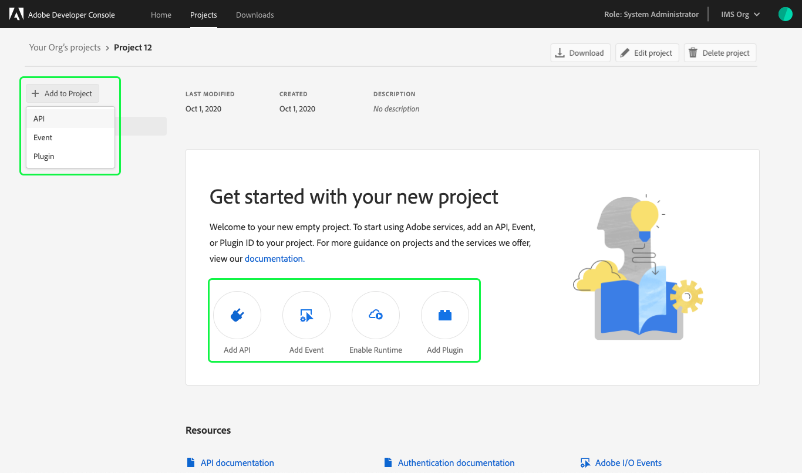

# Create an empty project

This guide provides step-by-step instructions for creating an empty project in Adobe Developer Console.

**Note:** To create a project using a template, please follow the steps in the guide for [creating a project using a template](projects-template).

## Select organization

Before creating a project, ensure that you are working in the correct organization. To view and select an organization, use the org switcher located in the top-right corner of Console.

## Quick start

Next, select **Create new project** from the **Quick start** menu on the **Home** screen.

**Note:** When accessing Console using a developer organization, only two Quick start options appear: "Create new project" and "Developer downloads".

## Project overview

After selecting to create a new project, the **Project overview** opens, showing the details of your project and an alert confirming that a new project has been created successfully.

A project name is automatically generated for your project ("Project 12" in the top-left corner of the screen) and is an internal name that can be edited using the **Edit project** button.

**Note:** When creating multiple projects within an organization or working collaboratively with other developers, it is best practice to choose a project name that is descriptive and makes it easy to distinguish your project from others.

The project overview screen also includes the last modified date of the project, the project created date, and the project description.

## Download project

From the project overview, you can download a JSON file containing project information by selecting **Download** in the top-right corner of the overview. Selecting this button automatically begins a download of a JSON file that you can then open and edit in your preferred editor.

## Delete project

You can delete a project from the project overview screen by selecting **Delete project** in the top-right corner. In order to confirm that you wish to delete the project, you must type the project name exactly as shown in the top-left corner of the overview (in this example, *"Project 12"* without quotation marks). Once the project name has been entered, select **Delete project** to delete the project.

Once the project has been deleted, you are returned to the project list and an alert appears confirming that the project has been successfully deleted.

**Note:** Once Runtime has been enabled for a project, the project can no longer be deleted and the **Delete project** button will not appear in the project overview. You can select to start over with a new project or edit your existing project, but you cannot remove Runtime nor can you delete a project containing a Runtime namespace.

## Next Steps

With a new project created, you can start using Adobe services, adding APIs, events, or plugins, and enabling Runtime using the **Add to Project** button on the left-side of the overview or the quick action buttons provided in the center of the screen.

To learn more about working with services including steps for adding APIs, events, and runtime, please begin by reading the [services overview](../services/).

If you are interested in building a Plugin, please visit the [plugins overview](../plugins/) for a complete guide to creating, updating, and distributing plugins.

