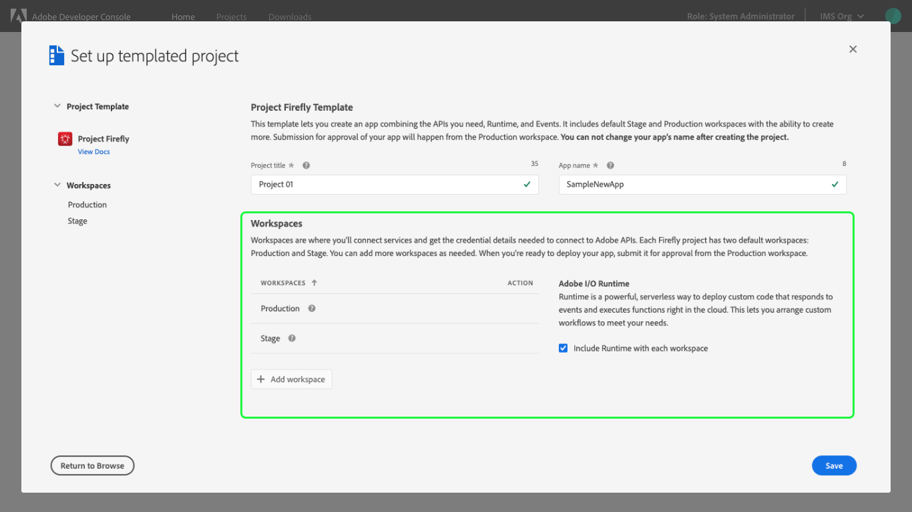

# Create a templated project

In order to streamline the creation of projects, Adobe Developer Console provides templates that you can use to get up and running quickly.

This guide outlines the steps necessary to create a project using a template. 

**Note:** If you do not wish to use a template and would like to create an empty project, please follow the steps in the [empty project guide](projects-empty).

## Select organization

Before creating a project, ensure that you are working in the correct organization. To view and select an organization, use the organization switcher located in the top-right corner of Console.

## Quick start

To create a new project, select **Create project from template** from the **Quick start** menu on the **Home** screen.

## Select template type

Next, select the template type that you would like to use from the **Browse templates** dialog.

Currently there is only one template type available: **App Builder**. The App Builder template provides all of the developer tools you need to build Single Page Applications with Adobe's UI toolkit, create microservices, and orchestrate APIs in Adobe Experience Cloud. For more information, read the [App Builder documentation](https://www.adobe.com/go/devs_cna).

**Note:** Additional templates will be released in the future to support the streamlining of other workflows and creation of applications.

## Set up templated project

After a template has been selected, it is time to set up the project. The following sections provide detailed information and best practices for setting up a new templated project.

**Note:** Please pay special attention to the [App Name](#app-name) as this value cannot be changed once project set up is complete.

### Project title

A project title is generated automatically ("Project 01"), but you can change the title by deleting the auto-generated title and providing a new one. 

**Note**: This project title is only visible internally and can be changed later if required.

It is recommended that if you are working in collaboration with multiple developers, you provide a project title that is meaningful and makes the project easy to distinguish from other projects in the organization.

### App Name

The app name is the public-facing name of the application and is used for setting up environments and determining the app URL, therefore it **cannot be changed once the project is created**. It is important to consider the name of the application as it cannot be altered beyond the set up screen.

**Note:** The app name is publicly visible, will be submitted for approval, and must be unique. You cannot change your app's name after creating the project.

### Workspaces

Templated projects include multiple workspaces, which can be thought of as individual working sub-folders for each developer on the project. Workspaces are where you will connect services and get the credential details needed to connect to Adobe APIs.

Two workspaces are provided automatically: Production and Stage. 

Since most custom applications are created with the intent of being distributed, the Production workspace is the workspace that will be used for the submission and distribution flow. This means that the application that will be used by end-users is that which is built in the Production workspace. When you are ready to deploy your app, submit the Production workspace for approval.

You can create additional workspaces for each individual developer working on the project. These workspaces are editable and can be added as needed.

### Adobe Runtime

When setting up a new project, you can automatically include Runtime with each workspace. Runtime is a powerful, serverless way to quickly deploy custom code to respond to events and execute functions right in the cloud, allowing you to orchestrate custom workflows that meet your unique business needs.

When the "Include Runtime with each workspace" checkbox is checked, each workspace that is created is automatically provisioned with a unique Runtime namespace allowing each developer to work within their own Runtime environment.  

**Note:** Most use cases require the use of Runtime, therefore the checkbox is checked by default.

Additional notes on including Runtime in workspaces:
  * If you deselect the checkbox and do not opt for automatic inclusion of Runtime, you can enable it later. The downside is that you will need to enable it manually for each individual workspace. You cannot auto-add Runtime to all workspaces after the initial set up is complete.
  * You cannot remove Runtime from workspaces once enabled nor can you delete a workspace containing a Runtime namespace.
  * You cannot delete a project once Runtime has been enabled. You must create a new project without Runtime.
  * ***Example where Runtime may not be needed:*** If you are building an application that is UI-only, you may not require Runtime.

To learn more about Adobe Runtime, visit the [Runtime documentation](https://www.adobe.io/apis/experienceplatform/runtime/docs.html).

## Project overview

With all of the set up details complete, you can select **Save** to save your project. This opens the **Project Overview**, showing the details of your newly created project.

From here you can view and select all available workspaces, as well as see various details for the project related to the template, created and modified dates, and project description.

**Note:** Because we elected to "Include Runtime with each workspace", the "Delete project" button is disabled.

## Add a workspace

You can add additional workspaces to a project during creation, or after a project is created you can use the **Add workspace** button on the project overview screen. Multiple workspaces can be created to test features and functionality or to provide an individual workspace for each developer on the project. 

These workspaces appear alongside the default Production and Stage workspaces as individual cards. These additional workspace cards include an ellipses button ("...") that, when selected, allows you to Edit the workspace.

## Select a workspace

Now that your templated project is set up, you can begin to develop against it by adding services such as APIs and events. To begin development, select the workspace you wish to work on by either clicking the name of the workspace in the center of the project overview or selecting the workspace from the **Workspaces** dropdown on the left-hand side of the project overview.

Once a workspace is selected, the **Workspace overview** opens showing information regarding the selected workspace as well as any **Products & services** added to the project. 

**Note:** If you selected to "Include Runtime with each workspace" during set up, you will see the unique Runtime namespace for the workspace listed under *Products & Services*.

## Add services

To begin adding services to your project, you can use the **Add service** button in the left navigation or select one of the quick start buttons. (If you have added Runtime to your workspace, the Runtime option will appear greyed out in the dropdown and the quick start buttons will not be shown.) 

For detailed information on working with services, please read the [services documentation](../services/).

## Insights

Adobe Developer Console automatically generates valuable insights related to API and runtime usage for each workspace within a templated project. 

To learn more about accessing insights, read the [insights overview](../insights).

## Approval

Once you have finished developing your project, you can begin the approval process to publish your app to production. 

For more information, please read the [guide on project approval](approval).

## Delete project

You can delete a project from the project overview screen by selecting **Delete project** in the top-right corner. In order to confirm that you wish to delete the project, you must type the project name exactly as shown in the top-left corner of the overview (in the example shown below, *"Project 12"* without quotation marks). Once the project name has been entered, select **Delete project** to delete the project.

After the project has been deleted, you are returned to the project list and an alert appears confirming that the project has been successfully deleted.

**Note:** If Runtime has been enabled for a project, or a workspace within a project, the project can no longer be deleted and the **Delete project** button will not appear in the project overview. You can select to start over with a new project or edit your existing project, but you cannot remove Runtime nor can you delete a project containing a Runtime namespace.

