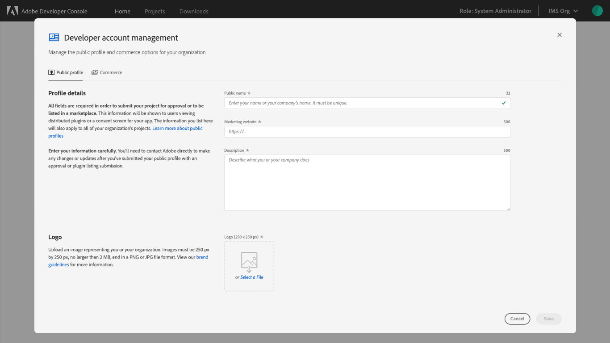
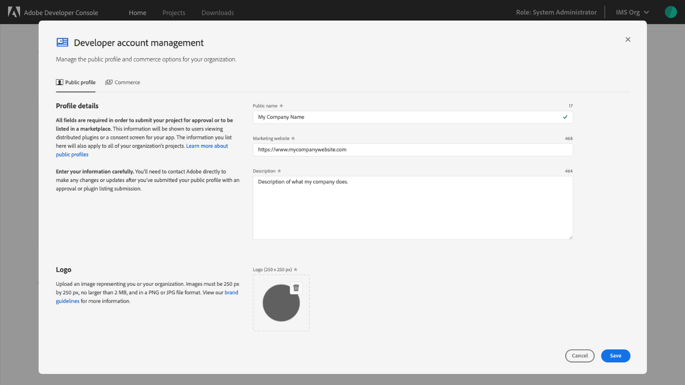
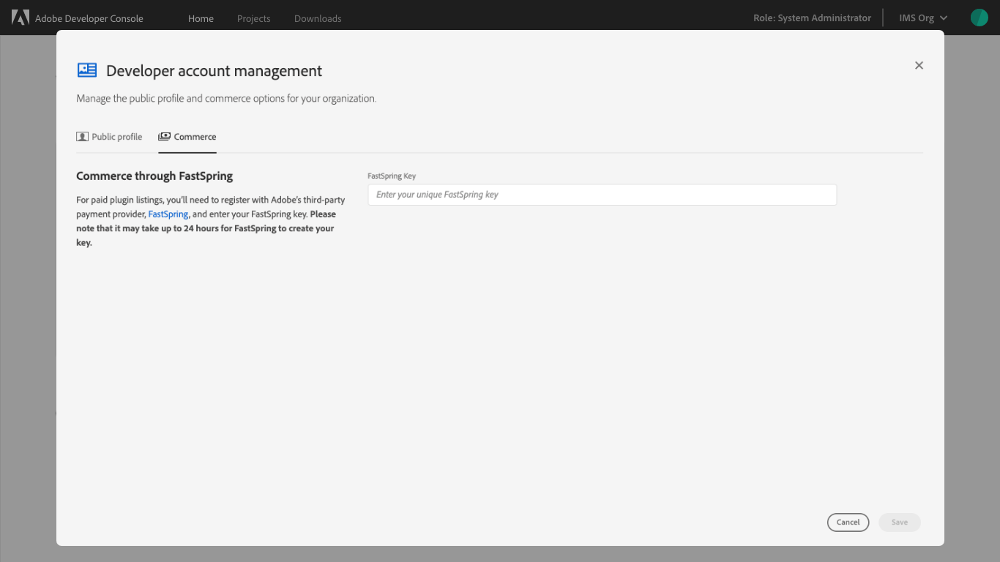
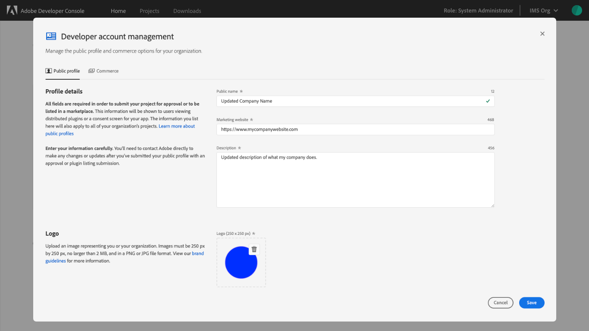
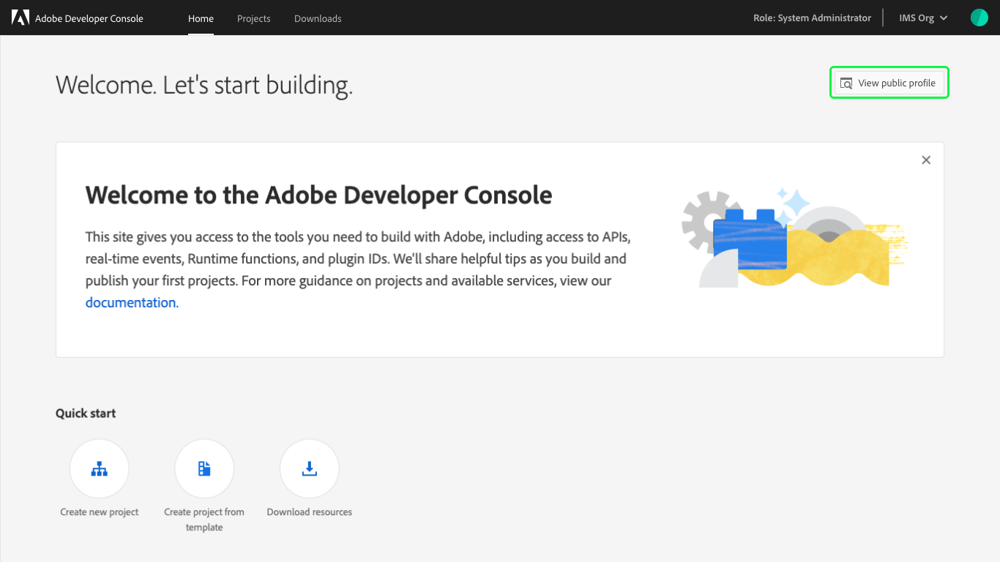
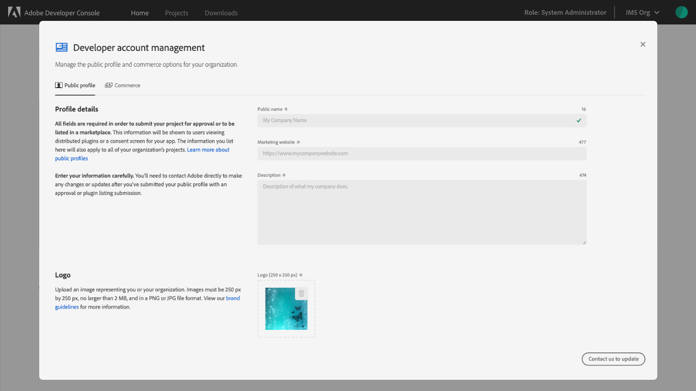

# Public profile overview

Adobe Developer Console requires all organizations to create a public profile that is included as part of any app approval or plugin listing submission. The information provided in the profile is shown to users viewing distributed plugins or a consent screen when installing your apps.

## Create a public profile

To begin creating a public profile for yourself or your organization, select **Edit public profile** on the home screen.

### Profile details

The **Developer account management** screen opens to the **Public profile** tab, where you are asked to fill in information about your organization.

All fields are required in order to submit a project for approval or to be listed in a marketplace. This information will be shown to users viewing distributed plugins or on a consent screen for your app. The information you list here will apply to ALL of your organization’s projects. [Learn more about public profiles](https://adobexdplatform.com/plugin-docs/distribution/how-to-submit-to-plugin-manager.html).

**Note:** Enter your information carefully. You will need to contact Adobe directly to make any changes or updates after you have submitted your public profile as part of an app approval or plugin listing submission.

* **Public name:** Enter your name or your company's name. This value must be unique.
* **Marketing website:** Enter the URL for your personal or company website, beginning with `https://`. This should be a website for you or the company as a whole, as it will be used for all project submissions.
* **Description:** Provide a description of the work that you, or your company, does. Again, this information will be used for all project submissions and should be generic to the company as a whole.
* **Logo:** Upload an image representing you or your organization. Images must be 250 px by 250 px, no larger than 2 MB, and in PNG or JPG file format. View the [brand guidelines](https://partners.adobe.com/content/dam/tep_assets/public/public_1/documents/Adobe-Creative-Cloud-Developer-Brand-Guide.pdf) for more information.

After all of the required fields are completed, you will be able to select **Save** to save your profile. You are not required to complete the steps on the **[Commerce](#commerce)** tab unless you plan to submit a paid plugin listing.

### Commerce

For paid plugin listings, you will be required to register with Adobe’s third-party payment provider, [FastSpring](https://fastspring.com/), and enter your FastSpring key on the **Commerce** tab. 

**Note:** After signing up, it may take up to 24 hours for FastSpring to create your key.

If you do not plan to submit paid plugin listings, you are not required to complete the commerce section of your public profile. Should you choose to create a paid plugin listing in the future, you can edit the commerce section at a later date.

## Edit your public profile

After your public profile has been created, you can update the profile information by selecting **Edit public profile** on the home screen. Editing can only be done if you have not submitted your public profile as part of an app approval or plugin listing submission.

When the **Developer account management** screen opens to the **Public profile** tab, you can update the information that you have provided for your organization, including: Profile name, Marketing website, Description, and Logo. Remember when updating your profile name, that it is required to be a unique value and will display an error if you attempt to change your profile name to something that is not unique.

If you have submitted your public profile as part of an app approval or plugin listing submission, you will need to contact Adobe directly to make any changes or updates. You will no longer see **Edit public profile** and will see **View public profile** instead. 

After selecting to view your public profile, the fields on the **Public profile** tab appear greyed out and the **Save** button has been replaced with **Contact us to update**. 

**Note:** You will still be able to add or update your FastSpring account information on the **Commerce** tab.

