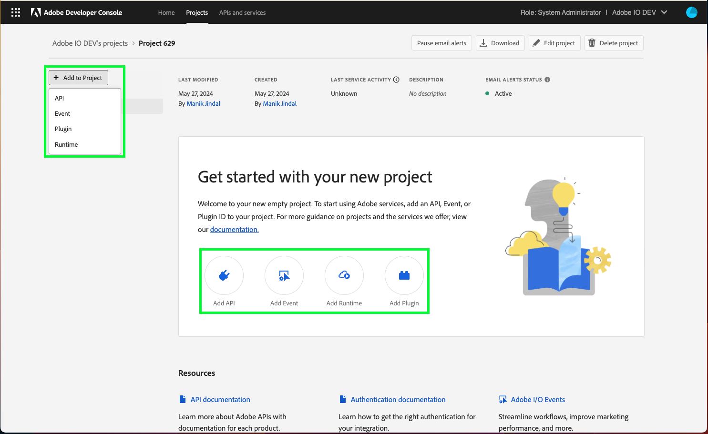

# Add API to project using API Key

Adding an API to an empty project is the same whether you are working in a personal or enterprise project. Adding an API to a templated project is similar, with one small variation: APIs are added to individual workspaces, not to the project as a whole.

To begin adding an API from within a templated project, first select the appropriate workspace to open the *Workspace overview*. Then, select **+ Add Service** in the left navigation and choose **API** from the dropdown. 

In an empty project, select **+Add to Project** in the left navigation of the *Project overview* and then choose **API**, or select **Add API** from the quick start buttons.

## Add an API

Using REST APIs allows your application to make calls to Adobe services and products. The *Add an API* dialog shows a list of available services with the default *View by* setting to show only those services available to you.

<InlineAlert slots="text"/>

Many services are only available through paid licenses or subscriptions. Licenses and subscriptions can refer to either your organization or your personal licenses if you are building a personal project. For this reason, if you select "All" from the *View by* dropdown, you may notice that several services appear greyed out in the list. If you believe that you should have access to one of these disabled services, please speak with your system administrator or Adobe sales representative.

Once you have found and chosen an API that you would like to add, select **Next** to begin configuring the API.

## Configure API

Some Adobe services require authorization but do not require authentication. In this case, they can be called anonymously and typically provide consistent results regardless of the application or user that made the request. 

An API key is the only client credential required for these services, and integrations don’t need to pass an access token with each request.

To configure an API using API key authorization, you must provide *Allowed domains*&mdash;a list of domains that are allowed to access this API, separated by commas.

The domains should be entered without the protocol (`http://` of `https://`), but should include `www`. For example:[www.domain1.com](http://www.domain1.com/), [www.domain2.com](http://www.domain2.com/).

Once the list of *Allowed domains* is complete, select **Save configured API** to complete the configuration.

## API overview

With the API configured, you are redirected to the API overview, providing links to documentation, the ability to download files in order to experiment with the API using Postman, and the *Credential details* showing the API key that you just generated.

You can also elect to remove the API on this screen using the *Remove API* button in the top-right corner.

## Credentials

Now that you have added an API, you can return to the *Project overview* (or *Workspace overview* in a templated project) at any time to view the details for that API and any other project services you may have added. 

You can select the specific API from the left navigation to view its details or remove the API using the **Remove API** button in the top-right corner.

You can also select the specific credential type from under *Credentials* in the left navigation to view the *Credential details* and perform other actions (view API key, etc.) as needed. For more information on accessing credentials, please read the [credentials overview](../credentials).

## Insights

Adobe Developer Console automatically generates valuable insights related to API usage for each enterprise project (or individual workspace when working in a templated project), as well as for each personal project, including XD Plugins.

To learn more about insights, begin by reading the [insights overview](../insights).

## Next steps

With an API successfully added, you can follow the same workflow steps to add additional APIs, or return to the [services overview](../services/) to select another type of service to add to your project.

If you have completed development on your project and are ready to submit your application for approval, please read the [project approval guide](../projects/approval) to get started.

