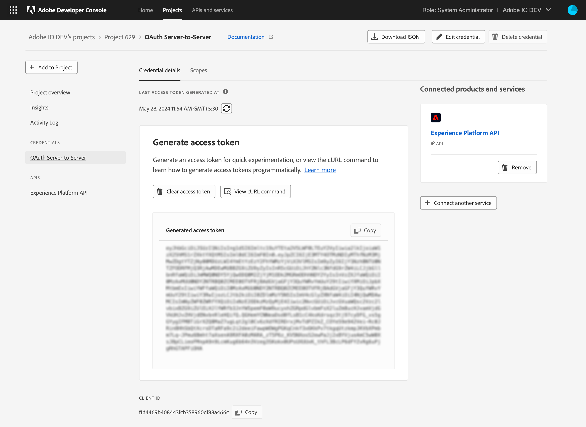
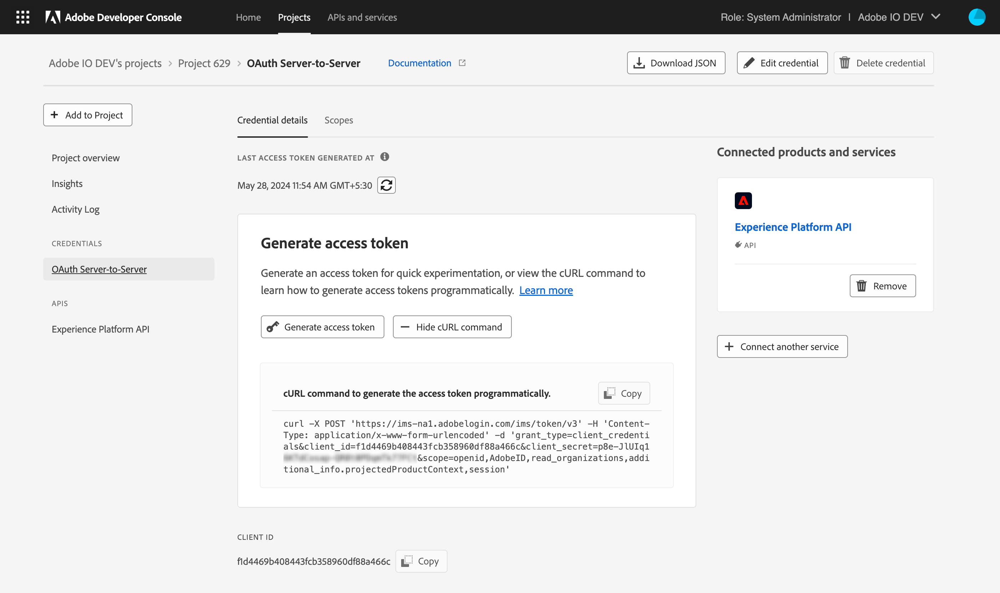
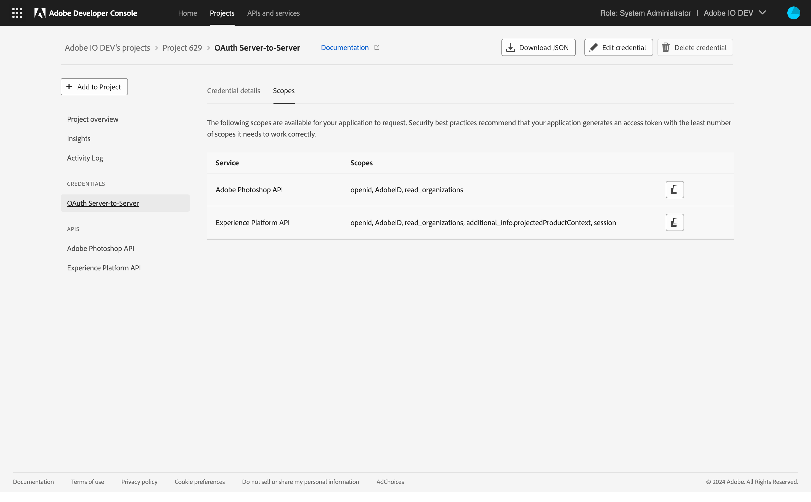

# Add API to project using OAuth Server-to-Server credential

Adding an API to an empty project is the same whether you are working in a personal or enterprise project. Adding an API to a templated project is similar, with one small variation: APIs are added to individual workspaces, not to the project as a whole.

To begin adding an API from within a templated project, first select the appropriate workspace to open the *Workspace overview*. Then, select **+ Add Service** in the left navigation and choose **API** from the dropdown. 

In an empty project, select **+Add to Project** in the left navigation of the *Project overview* and then choose **API**, or select **Add API** from the quick start buttons.

## Add an API

Using REST APIs allows your application to make calls to Adobe services and products. The *Add an API* dialog shows a list of available services with the default *View by* setting to show only those services available to you.

<InlineAlert slots="text"/>

Many services are only available through paid licenses or subscriptions. Licenses and subscriptions can refer to either your organization or your personal licenses if you are building a personal project. For this reason, if you select "All" from the *View by* dropdown, you may notice that several services appear greyed out in the list. If you believe that you should have access to one of these disabled services, please speak with your system administrator or Adobe sales representative.

Once you have found and chosen an API that you would like to add, select **Next** to begin configuring the API.

## Configure API

An OAuth Server-to-Server integration lets your application call Adobe services on its own behalf, or on the behalf of an enterprise organization. Learn more on Server to Server authentication [here](../authentication/ServerToServerAuthentication/). 

For this type of integration, your application can create an access token can be created by making a simple API call to Adobe IMS (see [implementation guide](../authentication/ServerToServerAuthentication/implementation)).

### Create a new OAuth Server-to-Server credential

OAuth Server-to-server credentials allow you to assign a credential name to them. This name appears in the Admin Console > Users > API Credentials. Choose a name for easy identification.

## Select product profiles

If necessary, you will continue configuring the API by choosing from a list of available product profiles. Your integration's service account will gain access to granular features of the Adobe product based on the product profiles that you select.

As product profiles are selected, they appear in the left navigation under *Product Profiles*. Once you have selected at least one profile, the **Save configured API** button will become available.

Continue selecting all required product profiles and, once complete, select **Save configured API** to complete the configuration.

## API overview

With the API configured, you are redirected to the API overview, providing links to documentation, the ability to download files in order to experiment with the API using Postman, and a dialog allowing you to generate an access token by providing your private key.

You can also elect to remove the API on this screen using the **Remove API** button or, if the API includes product profiles, edit the profiles selected during configuration.

You can click on generate access token button and it will lead you to the credential overview page. This page shows you all details about the credential you just created, including when this credential was last used to generate an access token. Furthermore it gives you an easy way to generate access tokens, view the cURL command you can use to generate access tokens programmatically, and  view scopes per service.

## Quota usage

Select APIs specify a quota, or fixed allowance, for usage. Often this is tied to trial programs that provide free credentials in order to test out a service. These trials provide a quota that is generous enough to get you up and running. Quota may also be tied to a specific agreement, outlining the amount of quota available and timelines for its use.

For APIs that provide a quota, a *Quota usage* section will appear at the top of the API overview when the API is selected in the left navigation.

For more information on quota usage, please visit the [quota usage overview](../quota).

## Generate token

To generate a token, click on the button "Generate access token"

You can also view the cURL command you could use to generate access tokens programmatically.

You can also view the scopes per service to generate an access token that only works for a subset of services in your project.

## Credentials

Now that you have added an API, you can return to the *Project overview* (or *Workspace overview* in a templated project) at any time to view the details for that API and any other project services you may have added. 

You can select the specific API from the left navigation to view its details or remove the API using the **Remove API** button in the top-right corner.

You can also select the specific credential type from under *Credentials* in the left navigation to view the *Credential details* and perform other actions (generate access tokens, copy credential details, retrieve client secrets, etc.) as needed. For more information on accessing credentials, please read the [credentials overview](../credentials).

## Insights

Adobe Developer Console automatically generates valuable insights related to API usage for each enterprise project (or individual workspace when working in a templated project), as well as for each personal project, including XD Plugins.

To learn more about insights, begin by reading the [insights overview](../insights).

## Next steps

With an API successfully added, you can follow the same workflow steps to add additional APIs, or return to the [services overview](../services/) to select another type of service to add to your project.

If you have completed development on your project and are ready to submit your application for approval, please read the [project approval guide](../projects/approval) to get started.