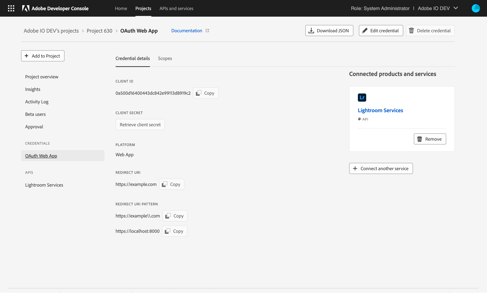

# Add API to project using OAuth User authentication credentials

Adding an API to an empty project is the same whether you are working in a personal or enterprise project. Adding an API to a templated project is similar, with one small variation: APIs are added to individual workspaces, not to the project as a whole.

To begin adding an API from within a templated project, first, select the appropriate workspace to open the *Workspace overview*. Then, select **+ Add Service** in the left navigation and choose **API** from the dropdown. 

In an empty project, select **+Add to Project** in the left navigation of the *Project overview* and then choose **API**, or select **Add API** from the quick start buttons.

## Add an API

Using REST APIs allows your application to make calls to Adobe services and products. The *Add an API* dialog shows a list of available services with the default *View by* setting to show only those services available to you.

<InlineAlert slots="text"/>

Many services are only available through paid licenses or subscriptions. Licenses and subscriptions can refer to either your organization or your personal licenses if you are building a personal project. For this reason, if you select "All" from the *View by* dropdown, you may notice that several services appear greyed out in the list. If you believe that you should have access to one of these disabled services, please speak with your system administrator or Adobe sales representative.

Once you have found and chosen an API that you would like to add, select **Next** to begin configuring the API.

## Configure API

OAuth User authentication credentials allows your end-users to sign in to your integration with an Adobe ID and your integration to receive an access token. With the access token, your integration will be able to call Adobe APIs and access content on behalf of the logged-in user. For more information, read the [OAuth User authentication credentials guide](../authentication/UserAuthentication/).

To configure an API using OAuth 2.0 User authentication, you must first select the platforms where you want to use this integration: Web App, Single Page App, or Native App. 

<InlineAlert slots="text"/>

Depending on the selected API, some of the platforms may not be available to be used with that API. Select the platform that best suits your application use case if more than one platform is available.

Depending on the platform(s) you select, you may be required to provide additional configuration information:

### Web App

The Web App platform is best suited for applications that have a backend server. The OAuth User authentication Web App credential requires the application to securely store a client secret on the backend server. The application can then fetch tokens using the client secret on the backend server, and therefore, not risk exposing the client secret or the tokens through the frontend application.

When setting up an OAuth User authentication Web App credential, you are required to provide:
1. [A Default Redirect URI](#oauth-20-default-redirect-uri) 
2. [A Redirect URI pattern](#oauth-20-redirect-uri-pattern)

<InlineAlert slots="text"/>

In OAuth 2.0 standard terminology, an OAuth User authentication Web App credential is a *confidential* client with an HTTPS redirect.

### Single Page App

The Single Page App platform is best suited for JavaScript-based applications that run in the browser and either do not have a backend server or want to fetch tokens on the frontend. OAuth User authentication Single Page Apps credential does not require the application to store a client secret, and therefore, the application must utilize the [OAuth 2.0 PKCE flow](https://oauth.net/2/pkce/) to obtain tokens securely.

When setting up an OAuth User authentication Single Page App credential, you are required to provide:
1. [A Default Redirect URI](#oauth-20-default-redirect-uri) 
2. [A Redirect URI pattern](#oauth-20-redirect-uri-pattern)

<InlineAlert slots="text"/>

In OAuth 2.0 standard terminology, an OAuth User authentication Single Page App credential is a *public* client with an HTTPS redirect.

### Native App

The Native App platform is best suited for applications that run natively on a device (Android, iOS, Windows, Mac, and others) and either do not have a backend server or want to fetch tokens on the frontend. OAuth User authentication Native Apps credential does not require the application to store a client secret, and therefore, the application must utilize the [OAuth 2.0 PKCE flow](https://oauth.net/2/pkce/) to obtain tokens securely.

<InlineAlert slots="text"/>

In OAuth 2.0 standard terminology, an OAuth User authentication Native App credential is a *public* client with a non-HTTPS redirect.

### OAuth 2.0 Default Redirect URI

A *Default redirect URI* is the URL of the page or script (usually at the root of your web app) that Adobe will access during the authentication process. It can contain a maximum of 256 characters and cannot be a regular expression.

<InlineAlert slots="text"/>

The *Default redirect URI* MUST be hosted on a secure server (HTTPS), even if it is only a localhost instance. For example, [https://redirect.com/uri/etc](https://redirect.com/uri/etc). 

### OAuth 2.0 Redirect URI pattern

When creating a new authorize request, the OAuth 2.0 framework allows your application to request a different redirect URI than the default Redirect URI. However, any requested redirect URI must match against the *Redirect URI pattern* you supply. The authorize request can be successfully completed only if the requested Redirect URI passes regex matching, 

A *Redirect URI pattern* is a URI path (or comma-separated list of paths) to which Adobe can redirect (if requested) when the login flow is complete. It must be within your application domain and is typically the root. It can contain a maximum of 512 characters.

<InlineAlert slots="text"/>
  
You must escape periods (**.**) with **\\**. For example, **https://example\\.com/**.

### Web

The OAuth credential for the Web platform has been deprecated in favor of the [Web App platform](#web-app). Furthermore, the new Web App platform credentials do not support the weaker OAuth implicit flow. Applications looking for a substitute for the OAuth implicit flow should use the more secure [Single Page App platform](#single-page-app).

### iOS

The OAuth credential for the iOS platform has been deprecated in favor of the [Native App platform](#native-app).
### Android

The OAuth credential for the Android platform has been deprecated in favor of the [Native App platform](#native-app).

## API overview

With the API configured, you are redirected to the API overview, providing links to documentation, the ability to download files in order to experiment with the API using Postman, and the *Credential details*, including the *Redirect URI* that you just provided.

You can also elect to remove the API on this screen using the **Remove API** button in the top-right corner.

## Credentials

Now that you have added an API, you can return to the *Project overview* (or *Workspace overview* in a templated project) at any time to view the details for that API and any other project services you may have added. 

You can select the specific API from the left navigation to view its details or remove the API using the **Remove API** button in the top-right corner.

You can also select the specific credential type from under *Credentials* in the left navigation to view the *Credential details* and perform other actions (view Client ID, retrieve client secret, etc.) as needed. For more information on accessing credentials, please read the [credentials overview](../credentials).

You can also view the scopes available to your credential on the scopes tab.

## Insights

Adobe Developer Console automatically generates valuable insights related to API usage for each enterprise project (or individual workspace when working in a templated project), as well as for each personal project, including XD Plugins.

To learn more about insights, begin by reading the [insights overview](../insights).

## Next steps

With an API successfully added, you can follow the same workflow steps to add additional APIs or return to the [services overview](../services/) to select another type of service to add to your project.

If you have completed development on your project and are ready to submit your application for approval, please read the [project approval guide](../projects/approval) to get started.

