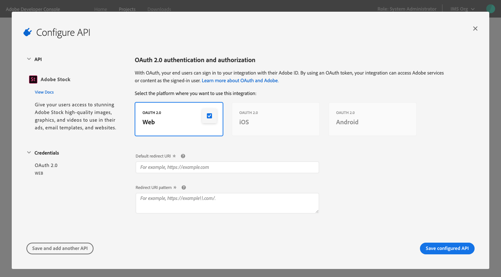
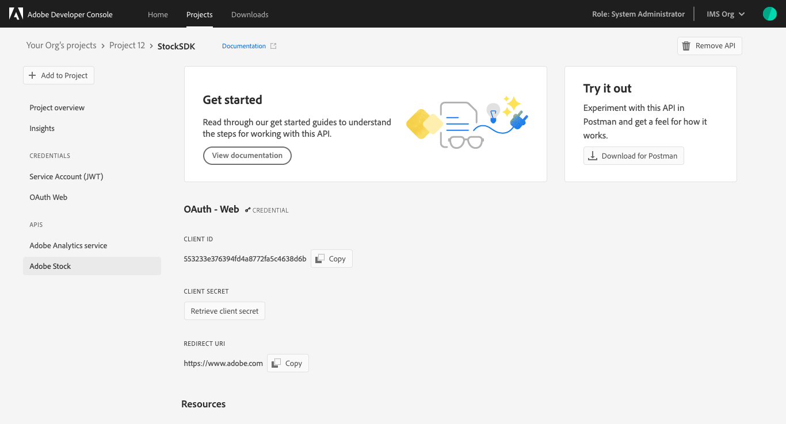

# Add API to project using OAuth

Adding an API to an empty project is the same whether you are working in a personal or enterprise project. Adding an API to a templated project is similar, with one small variation: APIs are added to individual workspaces, not to the project as a whole.

To begin adding an API from within a templated project, first select the appropriate workspace to open the *Workspace overview*. Then, select **+ Add Service** in the left navigation and choose **API** from the dropdown. 

In an empty project, select **+Add to Project** in the left navigation of the *Project overview* and then choose **API**, or select **Add API** from the quick start buttons.

## Add an API

Using REST APIs allows your application to make calls to Adobe services and products. The *Add an API* dialog shows a list of available services with the default *View by* setting to show only those services available to you.

<InlineAlert slots="text"/>

Many services are only available through paid licenses or subscriptions. Licenses and subscriptions can refer to either your organization or your personal licenses if you are building a personal project. For this reason, if you select "All" from the *View by* dropdown, you may notice that several services appear greyed out in the list. If you believe that you should have access to one of these disabled services, please speak with your system administrator or Adobe sales representative.

Once you have found and chosen an API that you would like to add, select **Next** to begin configuring the API.

## Configure API

User authentication using OAuth allows your end users to sign in to your integration with an Adobe ID. With an OAuth token, your integration will be able to access Adobe services and content on behalf of the logged in user. For more information, read the [OAuth Authentication and Authorization documentation](https://www.adobe.com/go/devs_oauth).

To configure an API using OAuth 2.0 authentication and authorization, you must first select the platforms where you want to use this integration: Web, iOS, or Android. 

<InlineAlert slots="text"/>

If more than one platform is available for the chosen API, you can select all necessary platforms and configure them all at the same time.

Depending on the platform(s) you select, you may be required to provide additional configuration information:

### Web

You are required to provide a *Default redirect URI*, which is the URL of the page or script (usually at the root of your web app) that Adobe will access during the authentication process. It can contain a maximum of 256 characters and cannot be a regular expression.

<InlineAlert slots="text"/>

The *Default redirect URI* must be hosted on a secure server (HTTPS), even if it is only a localhost instance. For example, **https://redirect.com/uri/etc**. 

For the Web platform, you must also provide a *Redirect URI pattern*. This is a URI path (or comma-separated list of paths) to which Adobe will attempt to redirect when the login flow is complete. It must be within your application domain, and is typically the root. It can contain a maximum of 512 characters.
 
<InlineAlert slots="text"/>
  
You must escape periods (**.**) with **\\**. For example, **https://example\\.com/**.

### iOS

You are required to provide a *URL Scheme*. This is a custom iOS URL scheme that allows external apps and websites to link to your app.

### Android

No additional configuration is required.

After completing any necessary configuration, you can then select **Save configured API** to complete the configuration.

## API overview

With the API configured, you are redirected to the API overview, providing links to documentation, the ability to download files in order to experiment with the API using Postman, and the *Credential details* including the *Redirect URI* that you just provided.

You can also elect to remove the API on this screen using the **Remove API** button in the top-right corner.

## Credentials

Now that you have added an API, you can return to the *Project overview* (or *Workspace overview* in a templated project) at any time to view the details for that API and any other project services you may have added. 

You can select the specific API from the left navigation to view its details or remove the API using the **Remove API** button in the top-right corner.

You can also select the specific credential type from under *Credentials* in the left navigation to view the *Credential details* and perform other actions (view Client ID, retrieve client secret, etc.) as needed. For more information on accessing credentials, please read the [credentials overview](../credentials.md).

## Insights

Adobe Developer Console automatically generates valuable insights related to API usage for each enterprise project (or individual workspace when working in a templated project), as well as for each personal project, including XD Plugins.

To learn more about insights, begin by reading the [insights overview](../insights.md).

## Next steps

With an API successfully added, you can follow the same workflow steps to add additional APIs, or return to the [services overview](../services/index.md) to select another type of service to add to your project.

If you have completed development on your project and are ready to submit your application for approval, please read the [project approval guide](../projects/approval.md) to get started.

