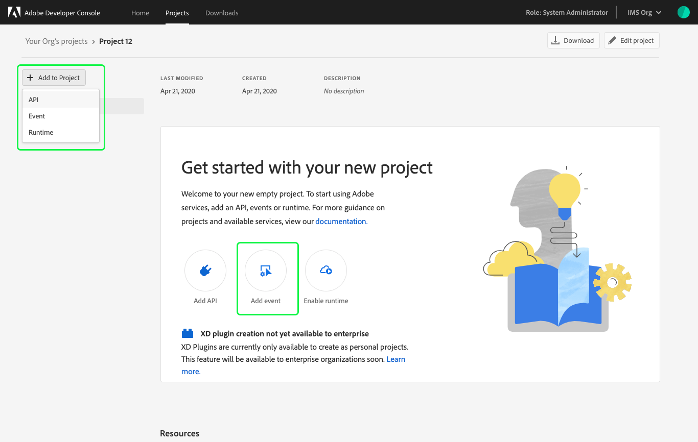
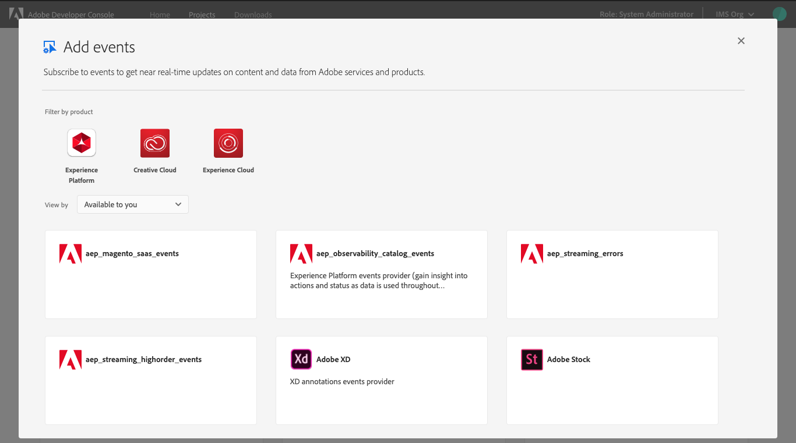
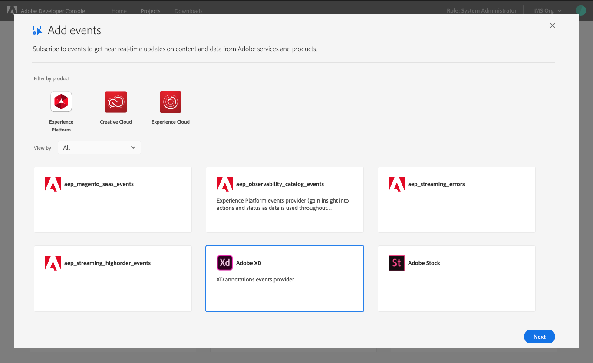
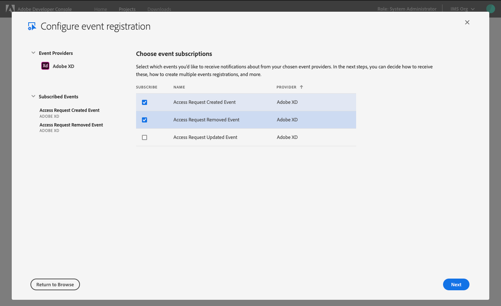
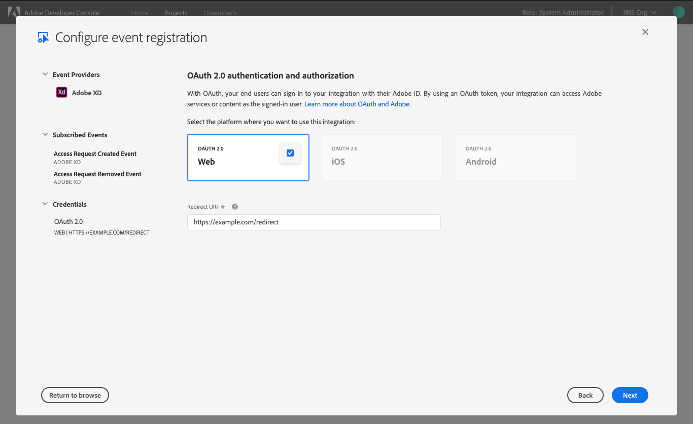
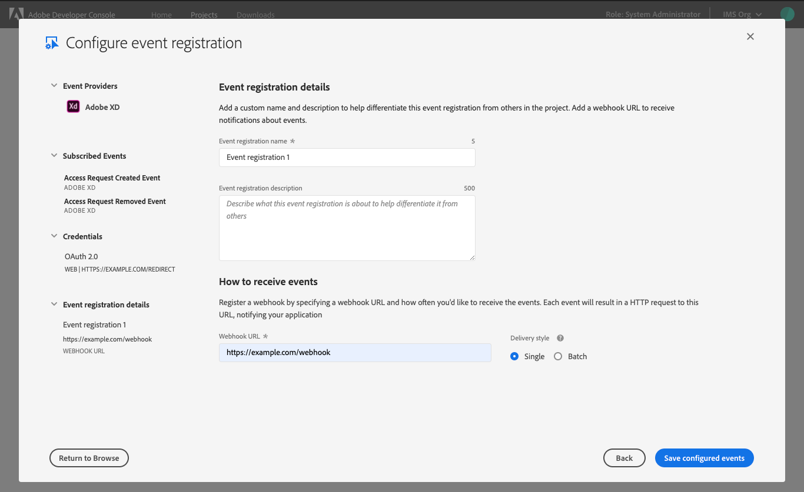
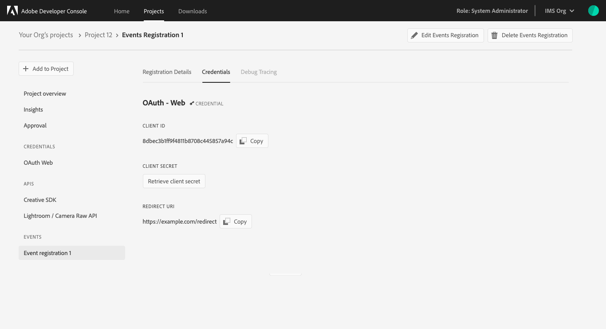
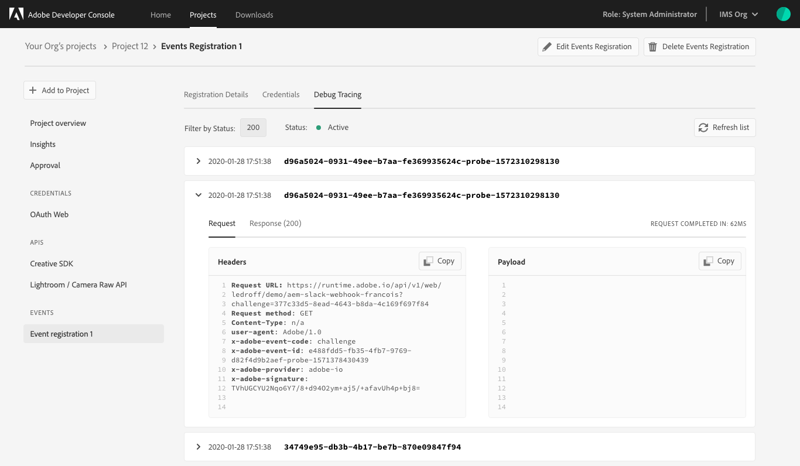

# Add Events to a project

Adobe I/O Events allow you to receive notifications of real-time events taking place in Adobe services. To add events to your project you must register a webhook, to which Adobe I/O Events sends HTTP POST requests containing the details of each event. Using Events, you can build event-driven applications that integrate with Adobe products and services.

To learn more about Adobe I/O Events, read the [events documentation](https://www.adobe.com/go/devs_events).

## Add events

To add events to your application, begin by navigating to the *Project overview* or *Workspace overview* if working in a templated project. You can then select **Add event** from the quick start menu or select **Event** from the *Add to Project* dropdown (or *Add Service* in a templated project).

The *Add events* dialog opens, providing a listing of Adobe event providers that can be filtered based on the products that are available to your organization.

Choose the event that you would like to add and select **Next** to begin configuring the events.

## Configure

The first step in configuration is to choose your event subscriptions. This requires you to select from the provided list which events you would like to receive notifications about from your chosen event providers. As events are chosen, they appear under *Subscribed Events* in the left navigation.

## Credentials

The next step in configuring your event registration is to configure the authentication credentials. This could be a OAuth Server-to-Server credential or OAuth User authentication credential, depending on the type of event being configured. The example in this document uses OAuth 2.0 user authentication credential.

<InlineAlert slots="text"/>

To learn more about authentication and available types, visit the [authentication documentation](../authentication/).

To configure an Event using OAuth 2.0 user authentication credential, you must first select the platform where you want to use this integration: Web App, Single Page App, or Native App. Please note, depending on the selected event provider not all platform choices may be available. 

Once you have selected a platform, you will be required to provide a *Redirect URI*, which is a fallback URI to be used if the authorization request contains a redirect URI which doesn't match the Redirect URI list or doesn't contain a `redirect_uri` parameter.

<InlineAlert slots="text"/>

The *Redirect URI* must use HTTPS (for example, [https://redirect.com/uri/et](https://redirect.com/uri/et)) and cannot be a regular expression.

After entering a redirect that matches the appropriate formatting, you can then select Next to proceed with event configuration.

## Registration details

To complete the configuration process, you must provide *Event registration details* including a custom name and description to differentiate this event registration from others in the project.

You must also register a webhook by providing a **Webhook URL** to receive notifications about events and specifying how often you would like to receive events. Each event results in an HTTP request to the webhook URL, notifying your application about events. You can select the **Delivery Style** you prefer, receiving one event at a time ("Single") or multiple events together ("Batch").

To learn more about webhooks, visit the [webhooks documentation](https://www.adobe.com/go/devs_webhooks).

After completing the *Event registration details* select **Save configured events** to complete the configuration.

## Event overview

Once events have been successfully configured, you will be taken to the event overview with tabs providing information regarding the *Registration Details*, *Credentials*, and *Debug Tracing*.

You can also remove an event registration from the event overview by selecting **Delete Events Registration** in the top-right corner.

## Credentials

The *Credentials* tab shows details related to the event authentication method, allowing you to perform actions such as copying a Client ID, retrieving the client secret, generating an access token, etc depending on the type of authentication used. 

## Debug Tracing

The *Debug Tracing* tab shows details related to recent requests and responses related to the registered events. This includes the date and time, event ID, and more.

## Next steps

Now that you have successfully added events to your project or workspace, you can follow this workflow again to add additional event registrations, or return to the [services overview](../services/) to select another type of service to add to your project.

If you have completed development on your project and are ready to submit your application for approval, please read the [project approval guide](../projects/approval) to get started.