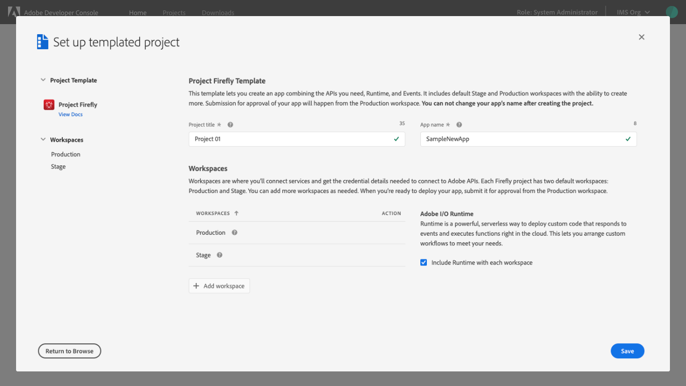

# Enable Runtime

Adobe I/O Runtime is Adobe’s serverless computing platform. Runtime enables you to execute functions from the cloud without deploying or configuring a server. This ability provides a flexible, on-demand computing resource that lets you easily access Adobe content, data, and services, orchestrate custom workflows, and respond to events from Adobe I/O Events to create powerful event-driven applications.

<InlineAlert slots="text"/>

Adobe I/O Runtime requires a license. Please contact your Adobe sales representative for more details.

## Enable Runtime for an empty project

Runtime can be enabled for an empty project from the **Project overview**. You can select **Runtime** from the **Add to Project** dropdown menu in the left navigation, or select **Enable runtime** from the quick start menu in the center or the screen. After selecting Runtime using one of these options, you will be taken to the Runtime overview where you can begin to configure Runtime, as shown in the [Get started with Runtime](#get-started-with-runtime) section found later in this document.

For more information on creating an empty project, please begin by reading the [projects overview](../projects/).

## Enable Runtime for a templated project

Runtime can be enabled for a template project during the project set up or by manually enabling Runtime for each individual workspace within the project. 

To automatically add Runtime during set up, ensure that the checkbox to "Include Runtime with each workspace" is checked before you select **Save** and complete the project set up.

Once your project has been saved, the **Project overview** will be visible, showing the project workspaces and that Runtime has been enabled for each. 

When you select a workspace you will be taken to the **Workspace overview** which will show the newly created Runtime instance. Selecting the Runtime instance will take you to the Runtime overview where you can begin to configure Runtime, as shown in the [Get started with Runtime](#get-started-with-runtime) section found later in this document.

For more information on creating a templated project, please begin by reading the [projects overview](../projects/).

## Enable Runtime for a workspace

When working on a templated project, you can add multiple workspaces depending on your project needs. Additional workspaces can be added during project set up, or can be added at any time by selecting **Add workspace** on the **Project overview**.

If you would like to enable Runtime for an additional workspace, ensure that **Include Runtime namespace** is checked before selecting **Save** on the **Add workspace to project** dialog.

For more information on adding workspaces to a templated project, please read the guide for [creating a templated project](../projects/projects-template).

Once added, the **Project overview** will display the new workspace, along with an indication that Runtime has been enabled. You can now select the workspace by choosing the card or using the **Workspaces** dropdown in the left navigation. 

This will open the **Workspace overview** which will show the newly created Runtime instance. Selecting the Runtime instance will take you to the Runtime overview where you can begin to configure Runtime, as shown in the [Get started with Runtime](#get-started-with-runtime) section found later in this document.

## Get started with Runtime

In order to get started with Adobe I/O Runtime, whether as part of an empty project or a templated project workspace, there are additional steps that must be completed outside of Developer Console. These steps include setting up your environment and deploying actions.

For detailed instructions on installing and configuring the tools you will need on your machine in order to create and run actions, please follow the steps provided in the [Runtime getting started guide](https://www.adobe.com/go/devs_Runtime_get_started).

## Remove Runtime from project or workspace

Currently it is not possible to remove Runtime from a project or workspace within a project. Please create a new project or workspace if you no longer require Runtime.

## Insights

Adobe Developer Console automatically generates valuable insights related to Runtime usage for each project or individual workspace within a templated project.

To learn more about insights, begin by reading the [insights overview](../insights).

## Next steps

With Runtime successfully added to your project or workspace, you can now return to the [services overview](../services/) to select another type of service to add to your project.

If you have completed development on your project and are ready to submit your application for approval, please read the [project approval guide](../projects/approval) to get started.